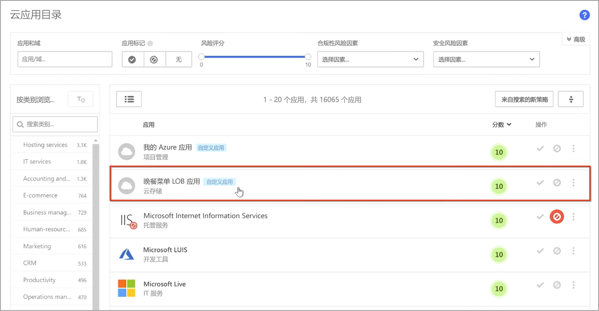
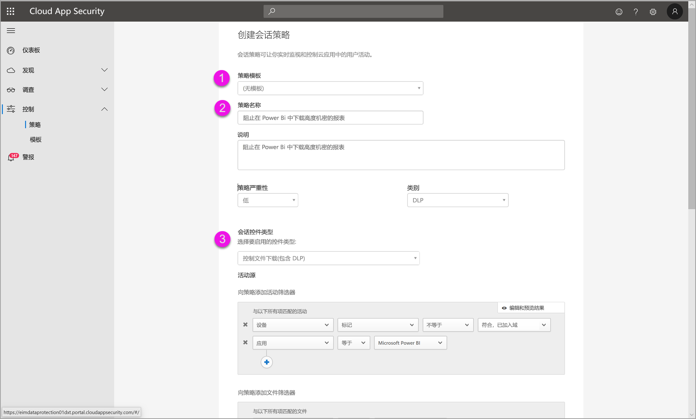
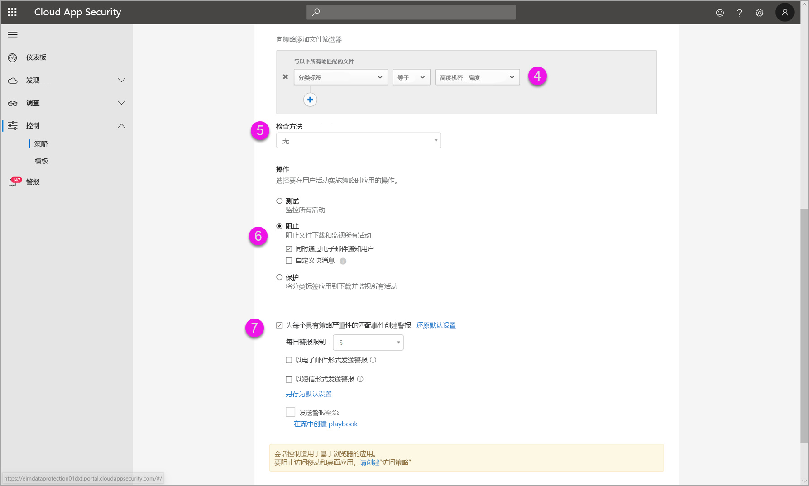

# 在 Power BI 中使用 Microsoft Cloud App Security 控件（预览版）

将 Microsoft Cloud App Security 与 Power BI 结合使用，可帮助保护 Power BI 报表、数据和服务免于意外泄露或违规。 使用 Cloud App Security，可以为组织的数据创建条件访问策略，使用 Azure Active Directory (Azure AD) 中的实时会话控件来帮助确保你的 Power BI 分析是安全的。 设置这些策略后，管理员可以监视用户访问和活动，执行实时风险分析，并设置标签特定的控件。 

可以为各种应用和服务（而不仅是 Power BI）配置 Microsoft Cloud App Security。 Cloud App Security 是一项 Microsoft 服务，可保护应用和设备，并通过其自己的仪表板进行管理。 需要将 Cloud App Security 配置为与 Power BI 配合使用，以便为你的 Power BI 数据和分析提供 Cloud App Security 保护。 有关 Cloud App Security 的详细信息（包括其工作原理、仪表板和应用风险评分的概述），请参阅 [Microsoft Cloud App Security](https://docs.microsoft.com/cloud-app-security/) 文档。

## 将 Microsoft Cloud App Security 与 Power BI 配合使用

若要将 Microsoft Cloud App Security 与 Power BI 配合使用，必须使用和配置相关的 Microsoft 安全服务，其中一些要在 Power BI 外部设置。

### Microsoft Cloud App Security 许可

若要在租户中拥有 Microsoft Cloud App Security，必须具有以下许可证之一：
* MCAS：为所有支持的应用（属于 EMS E5 和 M365 E5 套件）提供 OCAS 功能。
* CAS-D：仅提供 MCAS 发现。
* OCAS：仅为 Office 365（属于 Office E5 套件）提供 MCAS 功能。
* 可选：AAD P1 和 AIP P1，以便利用 Microsoft Cloud App Security 功能。

以下各节介绍了在 Power BI 中使用 Microsoft Cloud App Security 的步骤。

### 在 Azure Active Directory 中设置会话策略（必需）
在 Azure AD 和 Microsoft Cloud App Security 门户中完成设置会话控件所需的步骤。 在 Azure AD 门户中，可以为 Power BI 创建条件访问策略，并通过 Microsoft Cloud App Security 服务路由在 Power BI 中使用的会话。 

Microsoft Cloud App Security 使用反向代理体系结构运行，并且集成了 Azure AD 条件访问，可实时监视 Power BI 用户活动。 此处提供了以下步骤来帮助你了解该过程，并在以下每个步骤的链接内容中提供详细的分步说明。 还可以阅读此 [Cloud App Security 文章](https://docs.microsoft.com/cloud-app-security/proxy-deployment-aad)，其中介绍了整个过程。

1.  [创建 Azure AD 条件访问测试策略](https://docs.microsoft.com/cloud-app-security/proxy-deployment-aad#add-azure-ad)
2.  [使用策略范围内的用户登录到每个应用](https://docs.microsoft.com/cloud-app-security/proxy-deployment-aad#sign-in-scoped)
3.  [验证应用是否已配置为使用访问和会话控件](https://docs.microsoft.com/cloud-app-security/proxy-deployment-aad#portal)
4.  [测试部署](https://docs.microsoft.com/cloud-app-security/proxy-deployment-aad#step-4-test-the-deployment)

[会话策略](https://docs.microsoft.com/cloud-app-security/session-policy-aad)一文中详细介绍了设置会话策略的过程。 

### 设置异常情况检测策略来监视 PBI 活动（推荐）
可以定义独立确定范围的异常 Power BI 检测策略，以便仅将其应用于要在策略中包括和排除的用户和组。 [了解详细信息](https://docs.microsoft.com/cloud-app-security/anomaly-detection-policy#scope-anomaly-detection-policies)。

Cloud App Security 还有两个专用于 Power BI 的内置检测。 [参阅本文档接下来的部分以了解详细信息](#built-in-microsoft-cloud-app-security-detections-for-power-bi)。

### 使用 Microsoft 信息保护敏感度标签（推荐）

敏感度标签可对敏感内容进行分类，并帮助保护这些内容，以便组织中的用户可以与组织外的合作伙伴协作，同时注意敏感内容和数据。 

可以阅读有关 [Power BI 中的敏感度标签](../designer/service-security-apply-data-sensitivity-labels.md)的文章，其中详细介绍了如何使用 Power BI 的敏感度标签。 请参阅下面的[基于敏感度标签的 Power BI 策略的示例](#example)。

## Power BI 的内置 Microsoft Cloud App Security 检测

通过 Microsoft Cloud App Security 检测，管理员可以监视受监视应用的特定活动。 对于 Power BI，当前有两个专用的内置 Cloud App Security 检测： 

* **可疑的共享** - 检测用户与不熟悉的（组织外部）电子邮件共享敏感报表的行为。 敏感报表是将敏感度标签设置为“仅限内部”或更高级别的报表。 

* **批量共享报表** - 检测用户在单个会话中共享多个不同报表的行为。

在 Cloud App Security 门户中配置这些检测的设置。 [了解详细信息](https://docs.microsoft.com/cloud-app-security/anomaly-detection-policy#unusual-activities-by-user)。 

## Microsoft Cloud App Security 中的 Power BI 管理员角色

将 Microsoft Cloud App Security 与 Power BI 结合使用时，会为 Power BI 管理员创建新的角色。 以 Power BI 管理员身份登录到 [Cloud App Security 门户](https://portal.cloudappsecurity.com/)时，对 Power BI 相关的数据、警报、存在风险的用户、活动日志和其他信息的访问受到限制。

## 注意事项和限制 
将 Cloud App Security 与 Power BI 结合使用，可帮助保护组织的内容和数据，并提供用于监视用户会话及其活动的检测。 将 Cloud App Security 与 Power BI 结合使用时，应注意以下几个限制：

* Microsoft Cloud App Security 只能在 Excel、PowerPoint 和 PDF 文件上操作。
* 如果要在 Power BI 的会话策略中使用敏感度标签功能，则需要具有 Azure 信息保护高级版 P1 或高级版 P2 许可证。 Microsoft Azure 信息保护可以单独购买，也可以通过 Microsoft 许可套件之一购买。 有关详细信息，请参阅 [Azure 信息保护定价](https://azure.microsoft.com/pricing/details/information-protection/)。 此外，必须在 Power BI 资产上应用敏感度标签。

> [!CAUTION]
> * 应用 Excel 文件策略时，Microsoft Cloud App Security 上的“内容检查”策略目前在 Power BI 中不可用，因此请不要为 Power BI 设置此策略。
> * 在会话策略的“操作”部分，“保护”功能仅对不带标签的项有效。 如果标签已存在，则不会应用“保护”操作；无法在 Power BI 中替代已应用于项的现有标签。

## 示例

下面的示例演示如何结合使用 Power BI 和 Microsoft Cloud App Security 创建新的会话策略。

首先，创建新的会话策略。 从 Cloud App Security 门户的左侧菜单中选择“策略”。

在出现的窗口中，选择“创建策略”下拉列表。

从下拉列表中的选项列表中，选择“会话策略”。

在出现的窗口中，创建会话策略。 已编号的步骤描述了下图的设置。

  1. 在“策略模板”下拉列表中，选择“无模板”。
  2. 对于“策略名称”框，为会话策略提供相关名称。
  3. 对于“会话控制类型”，选择“已下载的控制文件(具有 DLP)”。

      对于“活动源”部分，选择相关阻止策略。 建议阻止非托管和不合规的设备。 选择会话在 Power BI 中时阻止下载。

        

        向下滚动时，可以看到更多选项。 下图显示了这些选项，还提供了其他示例。 

  4. 选择将“机密标签”设为“高度机密”，或选择最适合组织的设置。
  5. 将“检查方法”更改为“无”。
  6. 选择满足你需求的“阻止”选项。
  7. 请确保为此类操作创建警报。

        

        

  8. 最后，请确保选择“创建”按钮以创建会话策略。

        

> [!CAUTION]
> 请勿创建z很对 Power BI Excel 文件的“内容检查”策略。 这是此预览版的已知限制。

## 后续步骤
本文介绍了 Microsoft Cloud App Security 如何为 Power BI 提供数据和内容保护。 你可能还会对以下文章感兴趣，其中介绍了适用于 Power BI 的数据保护以及适用于允许使用数据保护的 Azure 服务的数据保护。

* [Power BI 中数据保护的概述](service-security-data-protection-overview.md)
* [在 Power BI 中启用数据敏感度标签](service-security-enable-data-sensitivity-labels.md)
* [在 Power BI 中应用数据敏感度标签](../designer/service-security-apply-data-sensitivity-labels.md)

你可能还会对以下 Azure 和安全文章感兴趣：

* [使用 Microsoft Cloud App Security 条件访问应用控制保护应用](https://docs.microsoft.com/cloud-app-security/proxy-intro-aad)
* [部署特色应用的条件访问应用控制](https://docs.microsoft.com/cloud-app-security/proxy-deployment-aad)
* [会话策略](https://docs.microsoft.com/cloud-app-security/session-policy-aad)
* [敏感度标签概述](https://docs.microsoft.com/microsoft-365/compliance/sensitivity-labels)