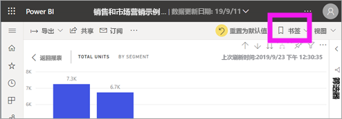
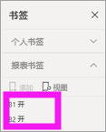
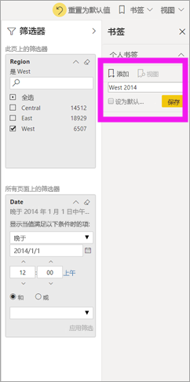
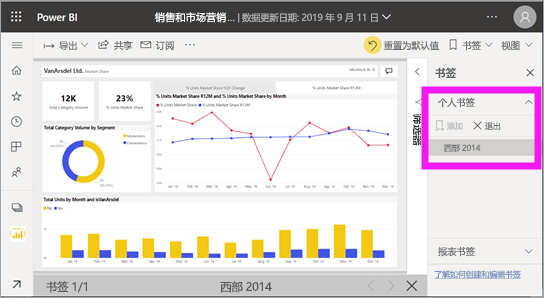
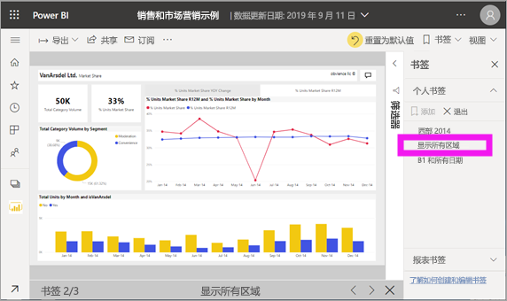

# 什么是书签？
书签可捕获报表页当前已配置的视图，其中包括筛选器、切片器和视觉对象状态。 选择书签时，Power BI 将返回到该视图。 书签有两种类型：自己创建的书签和由报表设计师创建的书签  。

## 在 Power BI 中使用书签共享见解和创建情景 
书签的用途有许多。 假设你发现了一个有趣的见解并想要将其保存，便可创建一个书签，以便稍后可以返回查看。 需要离开并想要保存当前工作，也可创建书签。 你甚至可以将书签设置为报表的默认视图，以便每次返回时，首先打开报表页的该视图。 

你也可以创建一系列书签，按所需的顺序对其进行排列，随后在演示文稿中逐个展示所有书签，以突出显示一系列讲述故事的见解。  

## 打开书签
若要打开“书签”窗格，请从菜单栏中选择“书签” > “显示多个书签”   。 要返回到报表的原始发布视图，请选择“重置为默认值”  。

### 报表书签
如果报表设计器包含报表书签，可在“报表书签”标题下找到它们   。 此报表页具有两个书签 B1 和 B2。 

选择要更改为该报表视图的书签。 

### 个人书签

创建书签时，以下元素将与书签一起保存：

* 当前页
* 筛选器
* 切片器（包括下拉列表或列表等切片器类型）和切片器状态
* 视觉对象选择状态（如交叉突出显示筛选器）
* 排序顺序
* 钻取位置
* 可见性（对象可见性，使用“选择”  窗格）
* 任何可见对象的“焦点”或“聚焦”  模式

配置报表页，确保它在书签中的显示效果符合自己的要求。 按照所需方式排列报表页和视觉对象后，选择“书签”  窗格中的“添加”  ，添加一个书签。 在此示例中，我们为区域和日期添加了一些筛选器。 

**Power BI** 会创建个人书签，并为其提供通用名称或输入的名称。 通过选择书签名称旁边的省略号，然后从出现的菜单中选择相应操作，即可*重命名*、*删除*或*更新*书签。

添加书签后，只需单击“书签”窗格中的书签，即可显示它  。 

<!--
## Arranging bookmarks
As you create bookmarks, you might find that the order in which you create them isn't necessarily the same order you'd like to present them to your audience. No problem, you can easily rearrange the order of bookmarks.

In the **Bookmarks** pane, simply drag-and-drop bookmarks to change their order, as shown in the following image. The yellow bar between bookmarks designates where the dragged bookmark will be placed.

The order of your bookmarks can become important when you use the **View** feature of bookmarks, as described in the next section. 

-->

## 以幻灯片形式放映书签
要显示或查看书签，请在“书签”窗格中选择“查看”以开始幻灯片放映   。

在“查看”  模式下，有几项功能值得注意：

- 书签名称显示在画布底部的书签标题栏中。
- 书签标题栏中的箭头可用于移到下一个或上一个书签。
- 可以退出“查看”  模式，具体方法为选择“书签”  窗格中的“退出”  ，或选择书签标题栏中的“X”  。

在“查看”  模式下，可以关闭“书签”  窗格（单击此窗格上的“X”），为演示文稿提供更多空间。 同时，在“查看”  模式下，所有视觉对象都可以进行交互和交叉突出显示，就像在其他情况下与它们交互时一样。 

<!--
## Visibility - using the Selection pane
With the release of bookmarks, the new **Selection** pane is also introduced. The **Selection** pane provides a list of all objects on the current page and allows you to select the object and specify whether a given object is visible. 

You can select an object using the **Selection** pane. Also, you can toggle whether the object is currently visible by clicking the eye icon to the right of the visual. 

When a bookmark is added, the visible status of each object is also saved based on its setting in the **Selection** pane. 

It's important to note that **slicers** continue to filter a report page, regardless of whether they are visible. As such, you can create many different bookmarks, with different slicer settings, and make a single report page appear very different (and highlight different insights) in various bookmarks.

## Bookmarks for shapes and images
You can also link shapes and images to bookmarks. With this feature, when you click on an object, it will show the bookmark associated with that object. This can be especially useful when working with buttons; you can learn more by reading the article about [using buttons in Power BI](desktop-buttons.md). 

To assign a bookmark to an object, select the object, then expand the **Action** section from the **Format Shape** pane, as shown in the following image.

Once you turn the **Action** slider to **On** you can select whether the object is a back button, a bookmark, or a Q&A command. If you select bookmark, you can then select which of your bookmarks the object is linked to.

There are all sorts of interesting things you can do with object-linked bookmarking. You can create a visual table of contents on your report page, or you can provide different views (such as visual types) of the same information, just by clicking on an object.

When you are in editing mode you can use ctrl+click to follow the link, and when not in edit mode, simply click the object to follow the link. 

## Bookmark groups

Beginning with the August 2018 release of **Power BI Desktop**, you can create and use bookmark groups. A bookmark group is a collection of bookmarks that you specify, which can be shown and organized as a group. 

To create a bookmark group, hold down the CTRL key and select the bookmarks you want to include in the group, then click the ellipses beside any of the selected bookmarks, and select **Group** from the menu that appears.

**Power BI Desktop** automatically names the group *Group 1*. Fortunately, you can just double-click on the name and rename it to whatever you want.

With any bookmark group, clicking on the bookmark group's name only expands or collapses the group of bookmarks, and does not represent a bookmark by itself. 

When using the **View** feature of bookmarks, the following applies:

* If the selected bookmark is in a group when you select **View** from bookmarks, only the bookmarks *in that group* are shown in the viewing session. 

* If the selected bookmark is not in a group, or is on the top level (such as the name of a bookmark group), then all bookmarks for the entire report are played, including bookmarks in any group. 

To ungroup bookmarks, just select any bookmark in a group, click the ellipses, and then select **Ungroup** from the menu that appears. 

Note that selecting **Ungroup** for any bookmark from a group takes all bookmarks out of the group (it deletes the group, but not the bookmarks themselves). So to remove a single bookmark from a group, you need to **Ungroup** any member from that group, which deletes the grouping, then select the members you want in the new group (using CTRL and clicking each bookmark), and select **Group** again. 
-->

## 限制和注意事项
这一版“书签”功能有一些限制和注意事项  。

* 大多数自定义视觉对象应该能够与书签很好地配合使用。 如果在使用书签和自定义视觉对象时遇到问题，请与该自定义视觉对象的创建者联系，并要求他们向视觉对象添加书签支持。 
* 如果在创建书签后在报表页上添加视觉对象，此视觉对象将以默认状态显示。 也就是说，如果在之前创建书签的页面中引入切片器，此切片器将在默认状态下运行。
* 通常，如果报表设计师更新或重新发布报表，都不会对书签产生任何影响  。 但是，如果设计师对报表进行了重大更改（例如，删除书签所使用的字段），则在你下次尝试打开该书签时，你将收到一条错误消息。 

<!--
## Next steps
spotlight?
-->
