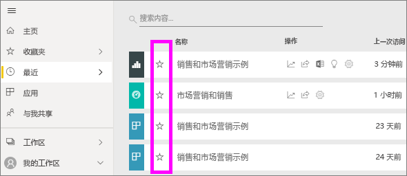
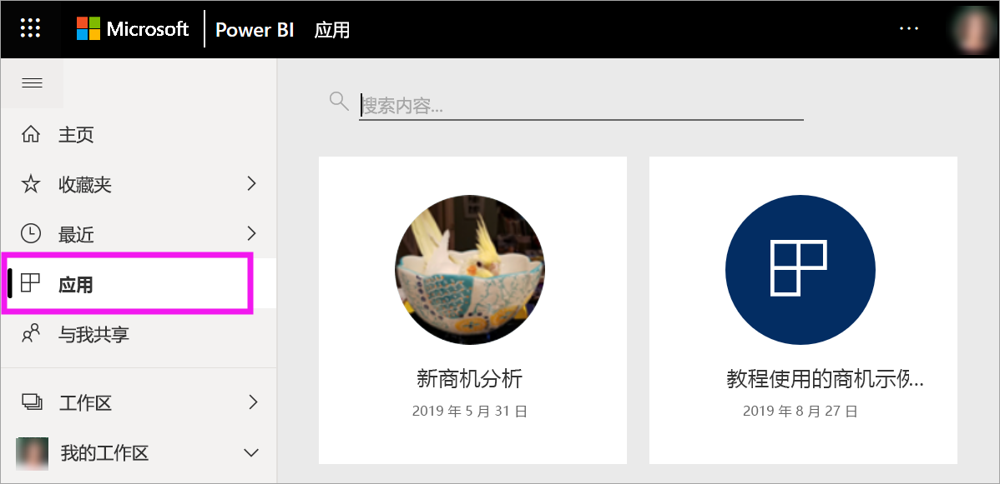
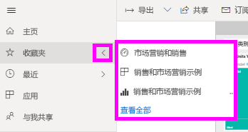
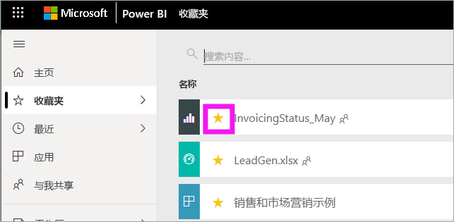

# 在 Power BI 服务中收藏仪表板、报表和应用
将内容设为“收藏”时，你将能够从“收藏夹”内容列表以及从“Power BI 主页” > “收藏夹和最常访问”中快速访问该内容     。  收藏夹通常是最常访问的内容，并且标有黄色星标。

   

   

还可以选择单个仪表板作为 Power BI 服务中的[精选仪表板](end-user-featured.md)。

## 将仪表板或报表添加到收藏夹 

1. 打开经常使用的仪表板或报表。 即使是与你共享的内容也可以加入收藏夹  。

2. 在 Power BI 服务的上方菜单栏中，选择“收藏”  或星形图标。
   
   
   
   你还可以在看到星形图标的任意位置（例如，“主页”、“最近”、“应用”和“与我共享”）收藏仪表板或报表。 
   
   

## 收藏应用 

1. 在导航窗格中，选择“应用”  。

   

2. 将鼠标悬停在应用上，显示更多详细信息。  选择星形   图标设置为收藏。
   
   

## 使用*收藏夹*
1. 要访问收藏夹，请选择“收藏夹”右侧的浮出控件箭头  。  在此处可以选择一个收藏来打开它。 最多列出五个收藏项（按字母顺序排列）。 如果收藏数量超过五个，可选择“查看全部”，打开收藏内容列表（请参阅下面的第 2 点）  。 
   
   
2. 要查看已添加为收藏的所有内容，请在导航窗格中选择“收藏夹”或“收藏夹” 图标   。  
   
    
   
   在此处可以进行的操作：打开、确定所有者，甚至与同事共享。

## 取消收藏内容
不再像以前那样频繁地使用报表？  你可以取消收藏。 取消收藏内容时，会从“收藏夹”列表（而不是 Power BI 中）删除该内容。

1. 在左侧导航窗格中，选择“收藏夹”  以打开“收藏夹”  屏幕。
   
   
2. 选择此内容旁边的黄色星号可取消收藏。

> [!NOTE]
> 还可以取消收藏仪表板、报表或应用本身。 只需打开并取消选中黄色图标。   
> 
> 
## 限制和注意事项
目前可以收藏应用，并自动收藏该应用的所有报表和仪表板。 无法收藏单个应用报表或仪表板。 

## 后续步骤
[Power BI - 基本概念](end-user-basic-concepts.md)

更多问题？ [尝试参与 Power BI 社区](http://community.powerbi.com/)

