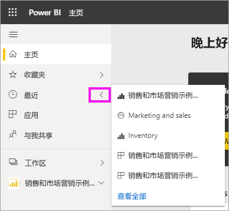

# Power BI 服务中**最近访问的**内容
最近访问内容指上次在 Power BI 服务中访问的项目，最多显示 20 个项目。  其中包括：仪表板、报表、应用和工作簿。

请观看下面的视频，Amanda 将演示如何填充 Power BI 服务“最新动态”  内容列表。然后，按照视频下方的分步说明操作，自行进行尝试。

<iframe width="560" height="315" src="https://www.youtube.com/embed/G26dr2PsEpk" frameborder="0" allowfullscreen></iframe>

> [!NOTE]
> 此视频使用较旧版本的 Power BI 服务。

## 显示最近访问的内容
若要查看最近访问的五个项目，在导航窗格中选择“最近访问”右侧的箭头  。  你可以在此处选择最近访问的内容来打开它。 仅列出最近访问的五个项目。

如果最近访问的项目超过五个，请选择“查看全部”以打开“最近访问”屏幕  。 还可从导航窗格中选择“最近访问”，或“最近访问”图标  。

## **最近访问**内容列表中的可用操作
可供使用的操作取决于内容*设计者*分配的设置。 一些选项可能包括：
* 选择星形图标以[将仪表板、报表或应用添加到收藏夹](end-user-favorite.md) 。
* 可重新共享某些仪表板和报表  。
* [在 Excel 中打开报表](end-user-export.md)  
* [查看](end-user-insights.md) Power BI 在数据中发现的见解 。
* 另外，如果列表过长，请[使用搜索字段和排序找到所需的仪表板](end-user-search-sort.md)。 若要确定是否可以对列进行排序，请将鼠标悬停以查看是否显示箭头。 在此示例中，将鼠标悬停在**上次访问**上时会显示一个箭头 - 可以按访问日期对最近访问的内容进行排序。 

    

## 后续步骤
[Power BI 服务应用](end-user-apps.md)

更多问题？ [尝试参与 Power BI 社区](http://community.powerbi.com/)

