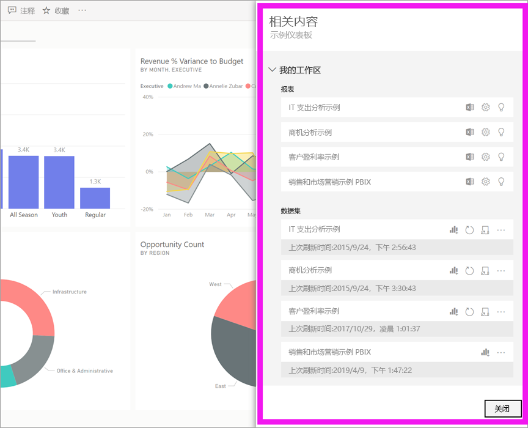
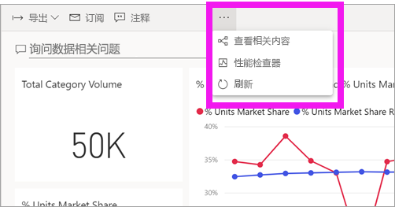
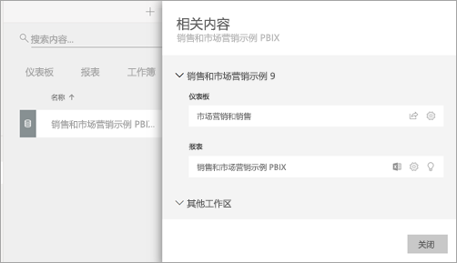

# 查看 Power BI 服务中的相关内容

[!INCLUDE [power-bi-service-new-look-include](../includes/power-bi-service-new-look-include.md)]

“相关内容”  窗格显示了 Power BI 服务内容（仪表板、报表和数据集）的互连方式。 此外，“相关内容”  窗格还是执行某个操作的启动面板。 可以在这里执行以下操作：打开仪表板、打开报表、生成见解、分析 Excel 中分析数据等。  

在 Power BI 中，报表是在数据集的基础之上生成，报表视觉对象固定到仪表板中，仪表板视觉对象可以链接回报表。 不过，如何知道哪些仪表板在托管“市场营销”报表中的视觉对象？ 如何查找这些仪表板？ “采购”仪表板是否在使用多个数据集中的视觉对象？ 如果是，这些数据集的名称是什么？该如何打开并编辑这些数据集？ “人力资源”数据集是否用于任何报表或仪表板？ 能否移动此数据集，而又不断开任何链接？ 所有这些问题全都可以在“相关内容”  窗格中找到答案。  在此窗格中，不仅可以查看相关内容，还可以对内容执行操作，并轻松地在相关内容之间进行导航。

> [!NOTE]
> “相关内容”功能不适用于流数据集。
> 
> 

## 查看仪表板或报表的相关内容
观看 Will 查看仪表板的相关内容。 然后，按照视频下方的分步说明操作，用“采购分析”示例数据集自己尝试。

<iframe width="560" height="315" src="https://www.youtube.com/embed/B2vd4MQrz4M#t=3m05s" frameborder="0" allowfullscreen></iframe>

打开仪表板或报表，选择菜单栏中的“更多选项”(…)，然后从下拉列表选择“查看相关项”   。

此时，“相关内容”  窗格会打开。 对于仪表板，它显示将可视化效果固定到此仪表板的所有报表及其关联的数据集。 对于此仪表板，有多个仅从一个报表固定的可视化效果，并且该报表仅基于一个数据集。 

在此窗格中，可以直接对相关内容执行操作。  例如，选择报表或仪表板名称即可将其打开。  对于列出的报表，选择一个图标以[在 Excel 中分析](../service-analyze-in-excel.md)或[获取见解](end-user-insights.md)。 对于数据集，可以查看上次刷新日期和时间、[在 Excel 中分析](../service-analyze-in-excel.md)以及[获取见解](end-user-insights.md)。  

## 查看数据集的相关内容
至少要拥有对数据集的查看  权限，才能打开“相关内容”  窗格。 在此示例中，我们使用的是[“采购分析”示例](../sample-procurement.md)。

在导航窗格中，找到“工作区”  标题，并从列表选择一个工作区。 如果工作区中包含数据，它将显示在右侧的画布中。 

在工作区中，选择“数据集”选项卡，然后找到“相关视图”图标 。  

选择此图标，可以打开“相关内容”  窗格。

在此窗格中，可以直接对相关内容执行操作。 例如，选择仪表板或报表名称即可打开仪表板或报表。  对于列出的任何仪表板，可以选择用于[与其他用户共享仪表板](../service-share-dashboards.md)的图标，也可以打开仪表板的“设置”  窗口。 对于报表，可以选择用于[在 Excel 中分析](../service-analyze-in-excel.md)、[重命名](../service-rename.md)或[获取见解](end-user-insights.md)的图标。  

## 限制和疑难解答
* 若未看到“相关视图”，则改为查找。 选择此图标，可以打开“相关内容”  窗格。
* 必须在[阅读视图](end-user-reading-view.md)中打开报表，才能打开“相关内容”窗格。
* “相关内容”功能不适用于流数据集。

## 后续步骤
* [Power BI 服务入门](../service-get-started.md)
* 更多问题？ [尝试参与 Power BI 社区](https://community.powerbi.com/)

