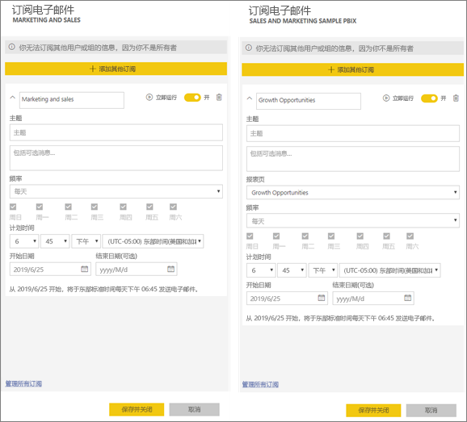

# 在 Power BI 服务中订阅报表或仪表板 

[!INCLUDE [power-bi-service-new-look-include](../includes/power-bi-service-new-look-include.md)]

现在，及时更新最重要的仪表板和报表，比以前更加轻松。 订阅最重要的报表页和仪表板，Power BI 将会通过电子邮件将快照发送到收件箱。 告知 Power BI 所需的电子邮件接收频率：每天、每周或是在数据刷新时。 甚至可以为 Power BI 发送电子邮件设置特定时间或立即运行此操作。  总共可以为每个报表或仪表板设置最多 24 个不同的订阅。  

电子邮件和快照将使用在 Power BI 设置中设置的语言（请参阅 [Power BI 的支持语言和国家/地区](../supported-languages-countries-regions.md)）。 如果未定义任何语言，Power BI 会根据当前浏览器中的区域设置使用语言。 要查看或设置语言首选项，请选择齿轮图标  > “设置”>“常规”>“语言”  。 

收到的电子邮件中包含“转到报表或仪表板”链接。 在安装了 Power BI 应用的移动设备上，选择此链接将启动应用（而不是执行在 Power BI 网站上打开报表或仪表板这样的默认操作）。

## 要求
必须有 Power BI Pro 许可证，才能为你自己创建  订阅。 在 Premium 工作区或应用中查看内容的用户，即使没有 Power BI Pro 许可证，也可以订阅其中的内容。 订阅其他内容  仅适用于仪表板所有者。 

## 订阅仪表板或报表页
无论是订阅仪表板还是报表页，订阅过程都类似。 使用同一按钮，即可订阅 Power BI 服务仪表板和报表。
 
。

1. 打开仪表板或报表。
2. 在顶部菜单栏中，选择“订阅”  或信封图标 。
   
   

   
    
    在处于某个仪表板上并选择“订阅”  时，左侧屏幕会出现。 在处于某个报表页上并选择“订阅”  时，右侧屏幕会出现。 要订阅报表中的多个页，请选择“添加其他订阅”并选择另一页  。 

4. 使用黄色滑块可启用和禁用订阅。  将滑块设置为“关”不会删除订阅。 若要删除订阅，请选择垃圾桶图标。

5. （可选）添加主题和电子邮件详细信息。 

5. 选择订阅的“频率”  。  可以选择“每天”、“每周”或“数据刷新后(每天)”。  若要仅在某些天接收订阅电子邮件，请选择“每周”  ，然后选择要在哪几天接收电子邮件。  例如，若要仅在工作日收到订阅电子邮件，请选择“每周一次”  作为频率，并取消选中“周六”和“周日”对应的框。   

6. 通过对频率选择“每天”或“每周”，并为订阅输入“计划时间”   ，来计划发送电子邮件的时间。  此次是订阅作业开始时。 某些情况下，可能需要几分钟才能将电子邮件传送到收件箱。    

7. 通过在日期字段中输入日期来计划开始和结束日期。 默认情况下，订阅的开始时间会是创建它的日期，而结束日期会是一年后。 当订阅达到结束日期时，它会停止，直到重新启用。  你会在计划结束日期之前收到通知，询问是否要延长它。     

8. 若要查看你的订阅并进行测试，请选择“立即运行”  。  它将立即向你发送电子邮件。 

8. 如果看起来一切正常，请选择“保存并关闭”，保存订阅  。 你会按照所设置的计划收到仪表板或报表的电子邮件和快照。 频率设置为“数据刷新后”的所有订阅都只会在该天的第一次计划刷新之后发送电子邮件  。
   
   
   
    刷新报表页不会刷新数据集。 只有数据集所有者能够手动刷新数据集。 若要查找基础数据集的所有者名称，请从顶部菜单栏中选择“查看相关”或查看原始订阅电子邮件  。
   
    

## 管理订阅
只有你可以管理你所创建的订阅。 再次选择“订阅”  ，然后选择左下角的“管理所有订阅”  （见上面的屏幕截图）。 

如果 Pro 许可证到期、所有者删除仪表板或报表，或用于创建订阅的用户帐户被删除，那么订阅将结束。

## 注意事项和疑难解答
* 具有超过 25 个固定磁贴或四个固定活动报表页面的仪表板可能无法完全呈现在发送给用户的订阅电子邮件中。 我们建议你联系并要求磁贴设计者将固定磁贴减少到 25 个以下，并将固定活动报表固定为少于 4 个，以确保电子邮件正确呈现。  
* 对于仪表板电子邮件说明，如果任何磁贴应用了行级别安全性 (RLS)，则不会显示这些磁贴。  对于报表电子邮件说明，如果数据集使用 RLS，则无法创建订阅。
* 如果电子邮件中的链接（指向内容）停止工作，则可能是该内容已被删除。 在电子邮件的屏幕截图下方，你可以查看自己或其他人是否订阅了你的邮件。 如果是其他人，请让该同事取消电子邮件或重新订阅。
* 报表页订阅与报表页面的名称是相关联的。 如果你订阅一个报表页，而后将其重命名，则必须重新创建订阅。
* 如果无法使用订阅功能，请与系统管理员联系。 你的组织可能禁用了此功能。  
* 电子邮件订阅不支持大多数[自定义视觉对象](../developer/power-bi-custom-visuals.md)。  已经过[认证](../developer/power-bi-custom-visuals-certified.md)的自定义视觉对象除外。  
* 目前电子邮件订阅不支持 R 驱动的自定义视觉对象。  
* 对于仪表板订阅，具体来说，尚不支持某些类型的磁贴。  其中包括流磁贴、视频磁贴、自定义 Web 内容磁贴。     
* 由于电子邮件大小限制，可能无法订阅包含极大图像的仪表板或报表。    
* 如果超过两个月一直没有人访问仪表板和报表，那么 Power BI 会自动暂停刷新与它们关联的数据集。  不过，如果添加对仪表板或报表的订阅，即使无人访问，也不会暂停刷新。
* 在极少数情况下，电子邮件订阅可能需要超过 15 分钟才能发送到收件人。  如果发生这种情况，请在不同时间运行数据刷新和电子邮件订阅，以确保及时交付。  如果问题仍然存在，请联系 Power BI 支持。

## 后续步骤

[对内容进行搜索和排序](end-user-search-sort.md)
