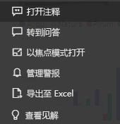
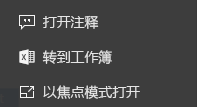
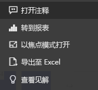

# Power BI 中的仪表板磁贴

[!INCLUDE [power-bi-service-new-look-include](../includes/power-bi-service-new-look-include.md)]

磁贴是数据的快照，由“设计者”固定到仪表板  。 设计者  可以从报表、数据集、仪表板、问答问题框、Excel 和 SQL Server Reporting Services (SSRS) 等位置创建磁贴。  此屏幕截图显示了固定到仪表板的许多不同的磁贴。

除了从报表中固定磁贴，“设计者”可以使用“添加磁贴”直接在仪表板上添加独立磁贴   。 独立磁贴包含：文本框、图像、视频、流数据和 Web 内容。

是否需要了解构成 Power BI 的构建块的帮助？  请参阅 [Power BI - 基本概念](end-user-basic-concepts.md)。

## 与仪表板上的磁贴进行交互

1. 将鼠标悬停在磁贴上以显示省略号。
   
    
2. 选择省略号以打开磁贴操作菜单。 可用选项不尽相同，具体取决于视觉对象类型和用于创建图块的方法。 以下是你可能看到的几个示例。

    - 使用问答创建的磁贴
   
        

    - 从工作簿创建的磁贴
   
        

    - 从报表创建的磁贴
   
        
   
    此处你可以：
   
   * [打开用于创建此磁贴的报表](end-user-reports.md)   
   
   * [打开用于创建此磁贴的问答问题](end-user-reports.md)   
   

   * [打开用于创建此磁贴的工作簿](end-user-reports.md)   
   * [在焦点模式下查看磁贴](end-user-focus.md)   
   * [查看见解](end-user-insights.md) 
   * [添加评论并开始讨论](end-user-comment.md) 
   * [管理仪表板磁贴上设置的警报](end-user-alerts.md) 
   * [在 Excel 中打开数据](end-user-export.md) 

3. 若要关闭操作菜单，请在画布中选择空白区域。

### 选择（单击）磁贴
选择磁贴时，下一步会发生什么情况取决于创建该磁贴的方式以及其是否有[自定义链接](../service-dashboard-edit-tile.md)。 如果它有自定义链接，则选择该磁贴将转到该链接。 否则，选择磁贴将转到报表、Excel 联机工作簿、本地 SSRS 报表或用于创建该磁贴的问答问题。

> [!NOTE]
> 这对在仪表板上直接使用“添加磁贴”  创建的视频磁贴不适用。 选择视频磁贴（以这种方式创建的）将导致视频直接在仪表板上播放。   
> 
> 

## 注意事项和疑难解答
* 如果未保存用于创建可视化效果的报表，则选择磁贴将不会产生任何操作。
* 如果该磁贴从 Excel Online 中的工作簿创建，并且你甚至不具有此工作薄的读取权限，则选择该磁贴将不会在 Excel Online 中打开工作簿。
* 对于使用**添加磁贴**直接在仪表板上创建的磁贴，如果已经设置了自定义超链接，则选择标题、副标题或磁贴都将打开该 URL。  或者，默认情况下，选择直接在仪表板上创建的磁贴的图像、Web 代码或文本框都不会产生任何操作。
* 如果没有 SSRS 内的报表的权限，选择从 SSRS 创建的磁贴将出现一个页面，指示你没有访问权限 (rsAccessDenied)。
* 如果你没有 SSRS 服务器所在网络的访问权限，选择从 SSRS 创建的磁贴将出现一个页面，指示找不到服务器 (HTTP 404)。 你的设备需要具有对报表服务器的网络访问权限才能查看该报表。
* 如果原始可视化效果用于创建磁贴更改，则磁贴不会更改。  例如，如果“设计者”从报表固定一个折线图，然后将折线图更改为条形图，则仪表板磁贴将继续显示为折线图  。 数据将会刷新，但可视化效果类型不会。

## 后续步骤
[数据刷新](../refresh-data.md)

[Power BI - 基本概念](end-user-basic-concepts.md)
