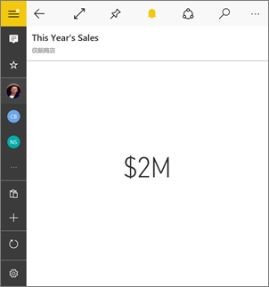

# 在 Power BI 移动应用中设置数据警报
适用于：

|  |  |  |  |  |
|:--- |:--- |:--- |:--- |:--- |
| iPhone |iPad |Android 手机 |Android 平板电脑 |Windows 10 设备 |

可以在 Power BI 移动应用和 Power BI 服务中的仪表板上设置警报。 当磁贴中的数据更改超出设置的限制时，警报会通知你。 警报适用于包含单一数字的磁贴（如卡和仪表），但不适用于包含流数据的磁贴。 你可以在移动设备上设置数据警报，并在 Power BI 服务中查看，反之亦然。 即使你共享了仪表板或磁贴的快照，也只有你可以看到自己设置的数据警报。

如果拥有 Power BI Pro 许可证，或者共享仪表板采用高级容量，则可以在磁贴上设置警报。 

> [!WARNING]
> 数据驱动的警报通知提供有关数据的信息。 如果设备被盗，我们建议你转到 Power BI 服务，关闭所有数据驱动的警报规则。 
> 
> 详细了解[管理 Power BI 服务中的数据警报](../../service-set-data-alerts.md)。
> 
> 

## iPhone 或 iPad 上的数据警报
### 在 iPhone 或 iPad 上设置警报
1. 点击仪表板中的数字或仪表盘磁贴以焦点模式打开该磁贴。  
   
   
2. 点击钟形图标  添加警报。  
3. 点击“添加警报规则”  。
   
   
4. 选择在大于或小于某个值时接收警报，然后设置值。
   
   
5. 决定是否要每小时或每天接收警报，以及是否要在收到警报的同时也接收电子邮件。
   
   > [!NOTE]
   > 不会每小时或每天都收到一次警报，除非数据确实在那时进行了刷新。
   > 
   > 
6. 也可以更改警报标题。
7. 点击**保存**。
8. 单个的磁贴可以有超过或低于阈值的值的警报。 在“管理警报”  中，点击“添加警报规则”  。
   
   

### 在 iPhone 或 iPad 上管理警报
可以在移动设备上管理单个警报，或 [在 Power BI 服务中管理所有警报](../../service-set-data-alerts.md)。

1. 在仪表板中，点击具有警报的数字或仪表盘磁贴。  
   
   

2. 点击钟形图标 。  
3. 点击该警报名称以对其进行编辑，点击滑块以关闭电子邮件警报，或点击垃圾回收删除该警报。
   
    

## Android 设备上的数据警报
### 在 Android 设备上设置警报
1. 在 Power BI 仪表板中，点击数字或仪表磁贴打开它。  
2. 点击钟形图标  添加警报。  
   
   
3. 点击加号图标 (+)。
   
   
4. 选择在大于或小于某个值时接收警报，然后键入值。
   
   
5. 点击“**完成**”。
6. 决定是否要每小时或每天接收警报，以及是否要在收到警报的同时也接收电子邮件。
   
   > [!NOTE]
   > 不会每小时或每天都收到一次警报，除非数据确实在那时进行了刷新。
   > 
   > 
7. 也可以更改警报标题。
8. 点击**保存**。

### 在 Android 设备上管理警报
你可以在 Power BI 移动应用中管理单个警报，或[在 Power BI 移动应用中管理所有警报](../../service-set-data-alerts.md)。

1. 在仪表板中，点击具有警报的卡片或仪表盘磁贴。  
2. 点击实心铃图标 。  
3. 点击该警报以更改值或将其关闭。
   
    
4. 点击加号图标（+），向同一磁贴添加其他警报。
5. 若要完全删除警报，请点击垃圾箱图标 。

## Windows 设备上的数据警报
### 在 Windows 设备上设置数据警报
1. 点击仪表板中的数字或仪表盘磁贴以打开该磁贴。  
2. 点击钟形图标  以添加警报。  
   
   
3. 点击加号图标 (+)。
   
   
4. 选择在大于或小于某个值时接收警报，然后键入值。
   
   
5. 决定是否要每小时或每天接收警报，以及是否要在收到警报的同时也接收电子邮件。
   
   > [!NOTE]
   > 不会每小时或每天都收到一次警报，除非数据确实在那时进行了刷新。
   > 
   > 
6. 也可以更改警报标题。
7. 点击复选标记。
8. 单个的磁贴可以有超过或低于阈值的值的警报。 在“管理警报”  中，点击加号 (+)。
   
   

### 在 Windows 设备上管理警报
你可以在 Power BI 移动应用中管理单个警报，或[在 Power BI 移动应用中管理所有警报](../../service-set-data-alerts.md)。

1. 在仪表板中，点击具有警报的卡片或仪表盘磁贴。  
2. 点击钟形图标 。  
   
   
3. 点击该警报以更改值或将其关闭。
   
    
4. 若要完全删除该警报，请单击右键或点击并按住 >“删除”  。

## 接收警报
在移动设备上或在 Power BI 服务中的 Power BI [通知中心](mobile-apps-notification-center.md) 中接收警报，以及关于他人与你共享的新仪表板的通知。

虽然可以更频繁地刷新数据源，但是通常将其设置为每天刷新。 当仪表板中的数据刷新时，如果被跟踪的数据到达其中一个你所设定的阈值时，将发生下列情况。

1. Power BI 会检查自最后一个警报发出是否已超过 1 个小时或 24 个小时（具体取决于所选择的选项）。
   
   只要数据超过了阈值，则每 1 小时或每 24 小时你将会收到一个警报。
2. 如果你已设置警报向你发送电子邮件，则你将在收件箱中找到如下内容。
   
   
3. Power BI 将消息添加到[通知中心](mobile-apps-notification-center.md)，并在标题栏上的钟形图标 （iOS 和 Android）或全局导航按钮 （Windows 10 设备）上添加黄点。

4. 点击钟形图标  或全局导航按钮 [，打开“通知中心”](mobile-apps-notification-center.md)并查看警报详细信息  。
   
     

> [!NOTE]
> 警报仅适用于刷新的数据。 数据刷新时，Power BI 会查看是否为该数据设置了警报。 如果数据已达到了警报的阈值，则会触发警报。
> 
> 

## 提示和故障排除
* 警报当前对于 Bing 磁贴或带有日期/时间度量值的卡片磁贴不受支持。
* 警报仅适用于数字数据。
* 警报仅适用于刷新的数据。 它们不适用于静态数据。
* 警报不适用于包含流数据的磁贴。

## 后续步骤
* [在 Power BI 服务中管理警报](../../service-set-data-alerts.md)
* [Power BI 移动通知中心](mobile-apps-notification-center.md)
* 是否有任何问题? [尝试咨询 Power BI 社区](https://community.powerbi.com/)

