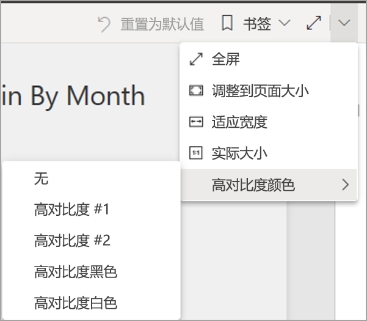
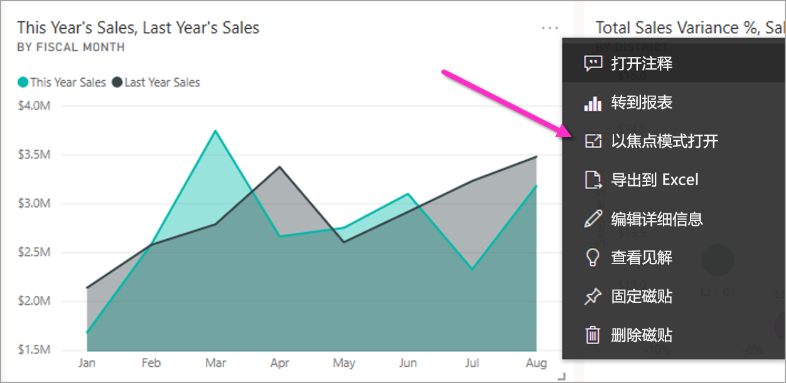
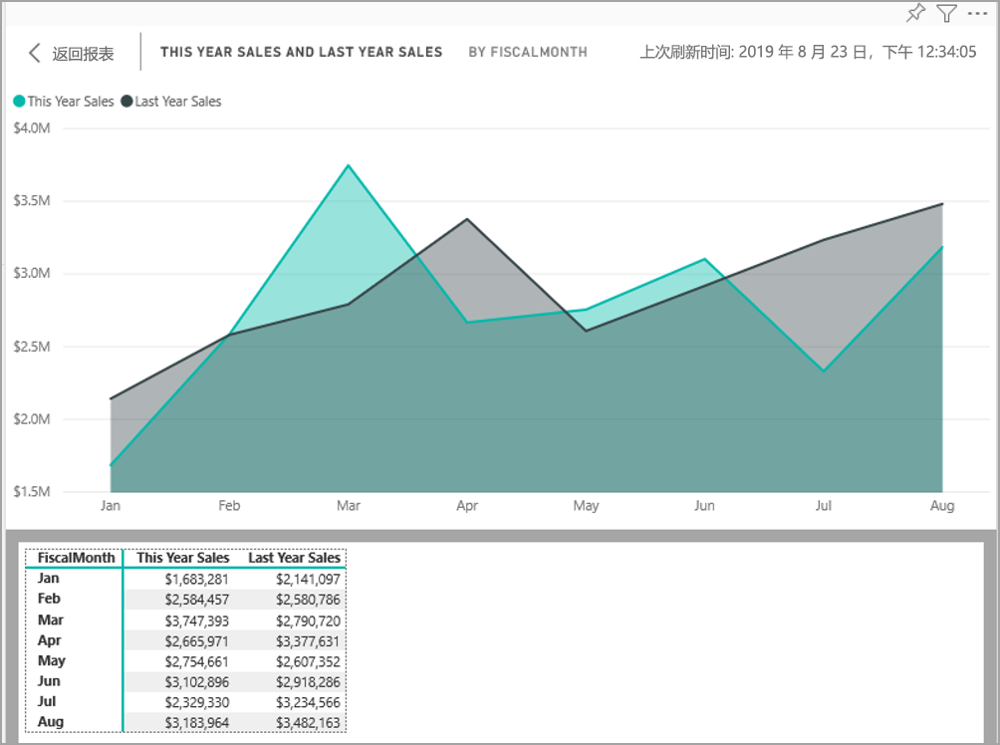
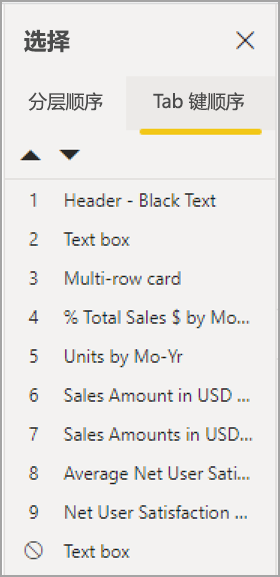
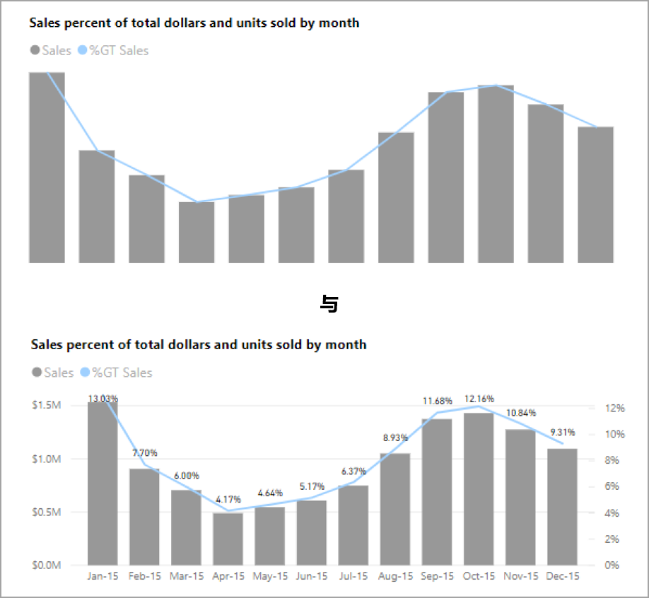
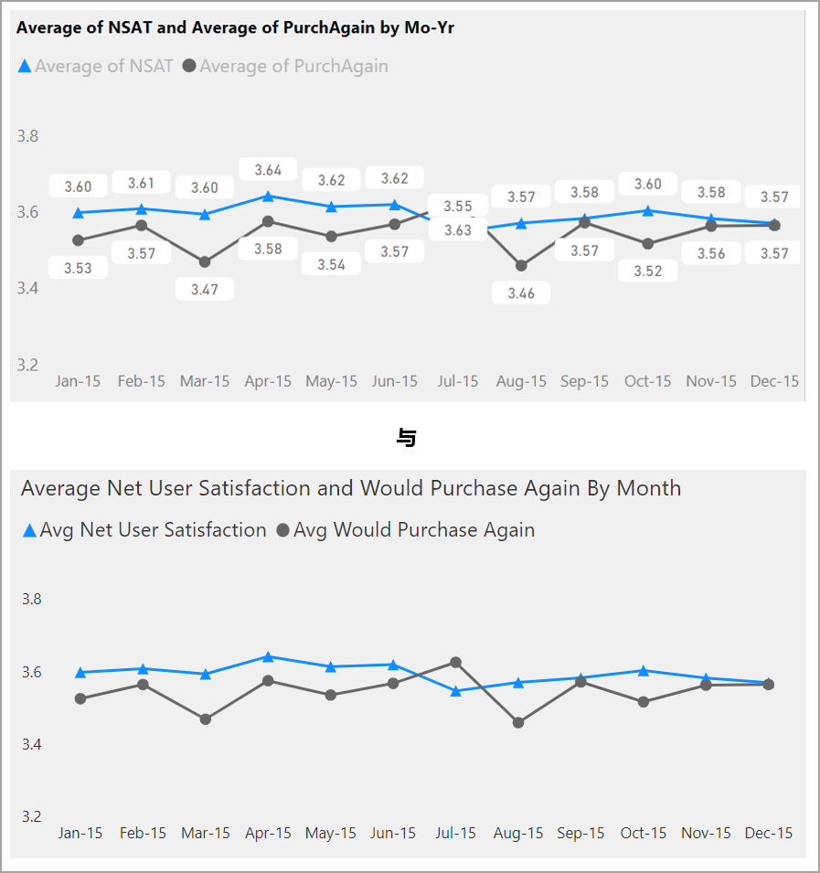
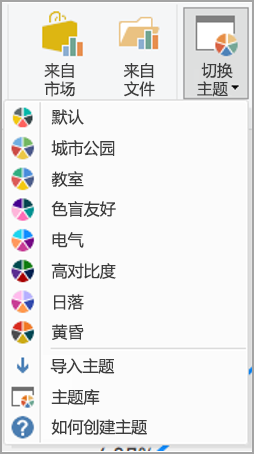

# 在 Power BI 中创建可访问的报表
你可以设计和创建引人注目的报表，同时也可以针对可访问性进行设计。 无论何时构建报表，无论受众是谁，你都应该创建一个可供尽可能多的人使用的报表，而不需要使报表套用某种特殊的设计。

本文介绍用于在 Power BI 中创建可访问的报表的辅助功能和工具。

若要改进使用屏幕阅读器创建报表的过程，可以使用上下文菜单。 菜单允许在“字段”列表中向上或向下移动井中的字段  。 该菜单还允许将字段移动到其他井，例如“图例”、“值”等   。

## 辅助功能类型

Power BI 提供了创建可访问报表的功能，但作为报表作者，你可以将这些功能合并到报表中。 本文介绍三种类型的辅助功能：

* 内置辅助功能（无需配置）
* 内置辅助功能（需要配置）
* 其他提示和注意事项

我们将在以下各节中讨论每个类别。

## 内置辅助功能

Power BI 在产品中内置了无需报表作者进行任何配置的辅助功能。 这些功能如下：

* 键盘导航
* 屏幕读取器兼容性
* 高对比度颜色视图
* 焦点模式
* 显示数据表

还有一些功能可有助于优化报表使用体验。 描述这些功能的文章可在本文末尾的[后续步骤](#next-steps)部分获取。

接下来，让我们依次看看这些内置辅助功能。 

### 键盘导航

作为报表作者，你无须担心使用者是否可以使用其键盘浏览报表。 Power BI 视觉对象都是可通过键盘导航的，报表使用者可以浏览视觉对象中的数据点、在页选项卡间切换，还可以访问交互功能，包括交叉突出显示、筛选和切片。

当报表使用者在报表中导航时，焦点会显示出来，指示用户在报表中的位置。 根据所使用的浏览器，焦点模式可能会以不同方式呈现。

要访问最常用的键盘快捷方式，可以按“?”  以显示键盘快捷方式对话框。 要了解详细信息，请参阅本文末尾的[后续步骤](#next-steps)部分中有关可访问使用体验和键盘快捷方式的文章。

### 屏幕读取器兼容性

通常情况下，Power BI 中支持键盘导航的每个对象也与屏幕阅读器兼容。 当报表使用者导航到某个视觉对象时，屏幕阅读器将朗读其标题、视觉对象类型和任何替换文字（如果已设置）。

### 高对比度颜色视图

Power BI 提供对报表的高对比度支持。 如果在 Windows 中使用高对比度模式，Power BI Desktop 将自动检测 Windows 中使用的高对比度主题，并将这些设置应用到报表。 报表发布到 Power BI 服务或其他位置时，这些高对比度颜色也会随报表显示。

Power BI 服务还尝试检测 Windows 选择的高对比度设置，但该检测的有效性和准确性取决于用于 Power BI 服务的浏览器。 如果要在 Power BI 服务中手动设置主题，可在右上角选择“视图”>“高对比度颜色”，然后选择要应用于报表的主题  。

### 焦点模式
如果报表使用者正在查看仪表板中的某个视觉对象，则他们可以导航到该视觉对象的上下文菜单并选择“在焦点模式下打开”，从而展开该视觉对象以进一步填充屏幕  。

### 显示数据表
报表使用者还可以按 Alt+Shift+F11，以表格格式查看视觉对象中的数据  。 此表类似于在视觉对象的上下文菜单中按“显示数据”所显示的表，但它显示的是适合屏幕阅读器的表  。

## 需要配置的内置辅助功能

Power BI 在产品中内置了需要报表作者进行配置的辅助功能。  这些功能包括：

* 替换文本
* Tab 键顺序
* 标题和标签
* 标记
* 报表主题

## 替换文本

替换文字（替换文字说明）用于描述向屏幕阅读器用户显示的报表页面上的视觉对象和图像的外观和功能。 报表作者应向每个对象添加替换文字，这些文字需传达报表中有意义的信息。 提供替换文字可确保报表使用者了解你想通过视觉对象表达的信息，即使他们看不见视觉对象、图像、形状或文本框。 在“可视化效果”窗格中选中对象（例如视觉对象、形状等），选择“格式”部分，展开“常规”，然后滚动到底部并填写“替换文字”文本框，可为 Power BI Desktop 报表上的任何对象提供“替换文字”     。 “替换文字”文本框的限制为 250 个字符  。

替换文字应包括有关你希望报表使用者从视觉对象中获取的见解的信息。 由于屏幕阅读器会读出视觉对象的标题和类型，因此你只需填写说明即可。 以下视觉对象的替换文字示例如下所示：按所售产品颜色划分，再按产品类别进一步细分的净用户满意度。 

请记住，由于 Power BI 中的数据是动态的，因此见解或特定数据点可能并非是输入静态替代文字框的最佳内容。 如果要使用动态替换文字，请参阅下一节，该节介绍替换文字的条件格式。

### 替换文字的条件格式设置

Power BI 如此引人注目的一个特征是它的数据是动态的。 你可以使用 DAX 度量值和条件格式来创建动态替换文字。 屏幕阅读器随后可以读出特定于报表使用者正在查看的数据的值。

### Tab 键顺序
设置 Tab 键顺序可以帮助键盘用户以与其可视化处理报表的方式相匹配的顺序来导航报表。 如果要在报表中包含装饰性的形状和图像，则应该将它们从 Tab 键顺序中删除。 

要设置 Tab 键顺序，请选择功能区中的“视图”选项卡，然后选择“选择窗格”按钮以显示选择窗格   。

在“选择窗格”中，选择“Tab 键顺序”将显示报表的当前 Tab 键顺序   。 你可以选择一个对象，然后使用向上和向下箭头按钮在层次结构中移动该对象，也可以使用鼠标选择一个对象并将其拖到列表中所需的位置。 单击对象旁边的数字将在 Tab 键顺序中隐藏该对象。

### 标题和标签
视觉对象和报表页标题是引导报表使用者的重要辅助功能。 请避免在报表标题中使用首字母缩略词或专门术语。如果将报表共享给新用户或组织外部人员，他们可能不知道这些术语或缩略词的含义。 下图左侧显示的是一个标题中带有首字母缩略词的视觉对象，而右侧显示了该视觉对象的更清晰的标题。

在一个视觉对象中，请确保任何标题、轴标签、图例值和数据标签都易于阅读和理解。 比较下面的图像，其中第一个图像只有很少的数字或数据描述，第而第二个图像有很多。

使用数据标签，你甚至可以选择在视觉对象中对每个系列启用或禁用标签，或者将它们置于系列的上方或下方。 尽管 Power BI 尽其所能将数据标签置于折线的上方或下方，但有时并不十分清楚。 在下面的视觉对象中，数据标签杂乱无章，不易于阅读。

将数据标签置于系列的上方或下方会有所帮助，尤其是在使用多行折线图时。 经过一些调整，数据标签现在看起来好多了。

### 标记

最好避免使用颜色（包括功能条件格式）作为传达信息的唯一方法。 而你可以使用标记来表示不同的系列。

对于“折线图”、“分区图”、“组合图”、“散点图”和“气泡图”视觉对象，你可以启用标记，并对每行使用不同的标记形状。

要启用“标记”，可在“可视化效果”窗格中选择“格式”部分，展开“形状”部分，然后向下滚动找到“显示标记”切换键，并将其切换为“开”，如下图所示    。 

还可以使用“自定义系列”，从“形状”部分中的下拉列表框中选择每条折线或每个分区（如果使用的是分区图）的名称  。 在下拉列表下方，可以调整用于所选行的标记的许多方面，包括其形状、颜色和大小。

虽然我们建议报告作者启用数据标签和标记，但对于每个视觉对象都启用它们可能会分散注意力，并使报告更难以理解。 在下图中，你可以看到一个同时启用数据标签和标记的视觉效果，和一个禁用了数据标签的视觉效果。相比之下，后者更易于理解。

如果不确定视觉对象或报表是否太繁杂，可执行一个 [以测试是否存在该情况](https://chrome.google.com/webstore/detail/the-squint-test/gppnipfbappicilfniaimcnagbpfflpg)。  如果你的眼睛更多地被数据标签吸引而不是被数据点吸引，请禁用数据标签。

### 主题、对比度和色盲友好颜色

应确保报表中文本和任意背景颜色之间有足够的对比度。 WCAG 2.1 成功标准 1.4.3 规定文本和背景色的对比度至少应为 4.5:1。 可以使用 [Colour Contrast Analyser](https://developer.paciellogroup.com/resources/contrastanalyser/)（颜色对比度分析程序）、[WebAIM](https://webaim.org/resources/contrastchecker/) 和 [Accessible Colors](http://accessible-colors.com/)（可访问颜色）等多种工具检查报表颜色。

还应考虑某些报表查看者可能患有颜色视觉缺陷。 [Coblis](http://www.color-blindness.com/coblis-color-blindness-simulator/) 和 [Vischeck ](http://www.vischeck.com/vischeck/vischeckImage.php) 等工具可模拟患有不同色觉缺陷的报表查看者所看到的内容。  在报表中使用较少的颜色或单色调色板可帮助减少创建的报表难以理解的情况。

某些颜色组合对于患有色觉缺陷的用户而言尤其难以区分。 这包括下列组合： 

* 绿色和红色
* 绿色和棕色
* 蓝色和紫色
* 绿色和蓝色
* 淡绿色和黄色
* 蓝色和灰色
* 绿色和灰色
* 绿色和黑色

避免在图表或同一报表页上同时使用这些颜色。 Power BI 提供了一些内置主题来帮助使报表更容易理解，但最佳做法是使用本文中建议的一些附加工具来检查报表。

## 提示和注意事项
本节提供了在创建具有可访问性的报表时需要牢记的一些指导、提示和注意事项。

### 了解受众的需要

创建报表是一个迭代过程。 在开始将视觉对象置于页面上前，请与一些报表使用者进行交流，以便更好地了解他们希望从报表获取的信息以及希望如何查看这些信息。  

在实现可访问性的前提下进行构建应是此过程的一部分。 你可能会发现，你希望报表达到的效果并不是报表使用者想要的。 在你准备好报表的初稿后，将其展示给报表使用者，并收集更多反馈。 作为报表作者，收集反馈可以帮助减少未来来自不满意的报表使用者的更改请求。

### 使报表保持简单一致

使报表尽可能简单。 人们常会试图将过多的内容置于一个视觉对象中。 通常，将其分成多个视觉对象会更简单、更易于理解。 以下情况下可考虑使用多个视觉对象：如果它们显示数据的不同方面，并使用筛选器或视觉交互来创建丰富的体验。 同时，将页面上视觉对象的数量控制在最少。 尽量避免不必要的冗余和页面混乱。 无需使用两个视觉对象来显示同样的内容。 报表使用者可能会因为过多视觉对象中提供的大量信息而感到无从下手，或者他们保持注意力的时间可能有限并因此而分心。 这样做可以使报表更易于使用，而且页面上的视觉对象过多会降低报表的性能。

通过对报表中的视觉对象元素使用相同的字体颜色和样式，保持报表的一致性。 对所有视觉对象标题使用相同的字号，对于数据标签和轴标题也应该如此。 如果要在多个报表页上使用切片器，请将它们置于报表的每一页上的同一位置。

### 弱视测试

要测试弱视使用者所看到的报表外观，一种快速方法是调低屏幕或移动设备的亮度。  可以使用浏览器加载项来协助执行 Squint 测试。

## 报表辅助功能清单

除了提供辅助功能工具和功能外，Power BI 还提供了在创建报表时可使用的以下清单。 在发布报表之前，此清单可帮助确保你的报表可访问，并可供最广泛的受众使用。 

### 所有视觉对象

* 确保标题、轴标签和数据标签文本的颜色对比度至少为 4.5:1。
* 避免使用颜色作为传达信息的唯一方法。 使用文本或图标来补充或替换颜色。
* 替换不必要的专门术语或首字母缩略词。
* 确保向页面上的所有非装饰性视觉对象添加替换文字  。
* 检查报表页是否适用于患有色觉缺陷的用户。

### 切片器
* 如果报表页上有多个切片器，请确保你对它们的设计在页面之间是一致的。 尽可能使用相同的字体、颜色和空间位置。

### 文本框
* 确保字体和背景的颜色对比度至少为 4.5:1。
* 确保在“替换文字”框中输入文本内容，以便屏幕阅读器可以阅读它们  。

### 视觉对象交互
* 关键信息只有通过交互才能获取？ 如果是这样，请重新排列视觉对象，以便对其进行预先筛选，使重要的结论更为明显。
* 是否使用书签进行导航？ 尝试使用键盘在报表中导航，以确保仅使用键盘的用户可以接受这种体验。

### 排序顺序
* 是否有意在页面上设置每个视觉对象的排序顺序？ 可访问的“显示数据”表按照在视觉对象上设置的排序顺序显示数据  。

### 工具提示
* 请勿使用工具提示来传达重要信息。 患有运动功能问题的用户和不使用鼠标的用户将很难访问它们。
* 请将工具提示作为辅助信息添加到图表。 对于每个视觉对象，它都包含在可访问的“显示数据”  表中。

### 视频
* 避免视频在呈现页面时自动播放。
* 请确保视频中有字幕或提供口述文本。

### 音频
* 避免音频在呈现页面时自动播放。
* 提供任何音频的口述文本。

### 形状
* 确保所有装饰性形状都在 Tab 键顺序中标记为隐藏，这样屏幕阅读器就不会朗读它们。
* 避免使用太多装饰性形状，以免分散注意力。
* 使用形状来突出显示数据点时，请使用替换文字解释要突出显示的内容  。

### 图像
* 使用图像来突出显示数据点时，请使用替换文字解释要突出显示的内容  。
* 请确保所有装饰性图像都在 Tab 键顺序中标记为隐藏，这样屏幕阅读器就不会朗读它们。
* 避免使用太多装饰性图像，以免分散注意力。

### 自定义视觉对象
* 查看可访问的“显示数据”表  以获取自定义视觉对象。 如果显示的信息不足，请查找其他视觉对象。
* 如果使用“播放轴”自定义视觉对象，请确保它不会自动播放  。 请注意，用户必须按播放/暂停按钮才能启动/停止更改值。

### 跨页面的视觉对象
* 对任何装饰性项设置 Tab 键顺序并关闭 Tab 键顺序（将该项标记为隐藏）。

## 注意事项和限制
辅助功能存在一些已知问题和限制。 以下列表列出了这些问题和限制：

* 通过 Power BI Desktop 使用屏幕阅读器时，如果在 Power BI Desktop 中打开任何文件前打开所选屏幕阅读器，则将获得最佳体验   。

## 后续步骤

Power BI 辅助功能的文章集合如下所示：

* [Power BI 中的辅助功能概览](desktop-accessibility-overview.md) 
* [使用辅助功能工具使用 Power BI 报表](desktop-accessibility-consuming-tools.md)
* [使用辅助功能工具创建 Power BI 报表](desktop-accessibility-creating-tools.md)
* [适用于 Power BI 报表的辅助功能键盘快捷方式](desktop-accessibility-keyboard-shortcuts.md)
* [报表辅助功能清单](#report-accessibility-checklist)
