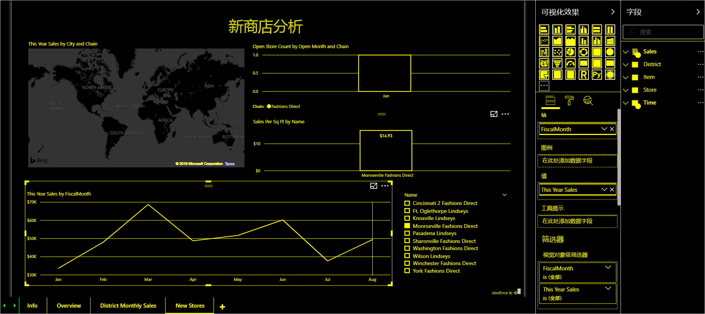

# Power BI 中的辅助功能概览
使用 Power BI 时，需要考虑到可能与报表交互的不同类型的用户。 创建和展示易于通过键盘或屏幕阅读器浏览和理解的报表，这样可使具有视觉或身体缺陷的用户接收到同等信息。

本文提供 Power BI 和辅助功能的概述。 可参阅其他文章获取相关指导和工具，了解如何使用辅助功能创建出色报表。

## 通用设计

通用设计是指可供尽可能多的人使用的产品设计，且无需特殊调整或专门的设计。 在 Power BI 中创建报表或体验时，必须考虑用户的需求。 设计易于获取的体验不仅能使有听力、运动、认知或视觉障碍的最终用户受益。 还可帮助组织中的所有最终用户。 Power BI 提供用于创建和使用可访问报表的工具。 报表创建者可以使用这些工具来改进每个人的体验。

## 辅助功能标准

Power BI 符合以下辅助功能标准。  这有助于确保你的 Power BI 可供尽可能多的人访问。

### WCAG 2.1
Power BI 遵循 Web 内容辅助功能 (WCAG) 2.1 准则。 WCAG 有三个主要原则：

1. 可感知 - 信息和用户界面组件必须以用户可感知的方式呈现给用户  。
2. 可操作 - 用户界面组件和导航必须可操作  。
3. 可理解 - 用户界面的信息和操作必须易于理解  。

### US Section 508

US Section 508 这一标准要求政府和联邦机构的电子和信息技术要让残疾人士能够访问和使用。

### EN 301 549
EN 301 549 是面向 ICT 产品和服务的辅助功能欧洲统一标准要求。  

## 后续步骤

Power BI 辅助功能的文章集合如下所示：

* [创建可访问 Power BI 报表](desktop-accessibility-creating-reports.md) 
* [使用辅助功能工具使用 Power BI 报表](desktop-accessibility-consuming-tools.md)
* [使用辅助功能工具创建 Power BI 报表](desktop-accessibility-creating-tools.md)
* [适用于 Power BI 报表的辅助功能键盘快捷方式](desktop-accessibility-keyboard-shortcuts.md)
* [报表辅助功能清单](desktop-accessibility-creating-reports.md#report-accessibility-checklist)

