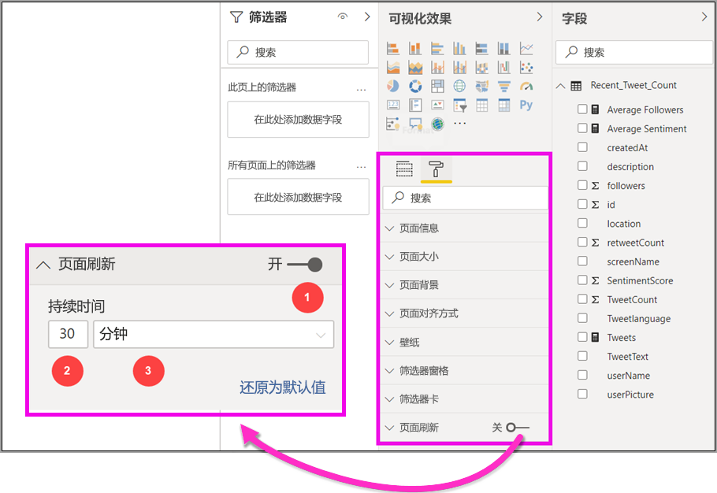
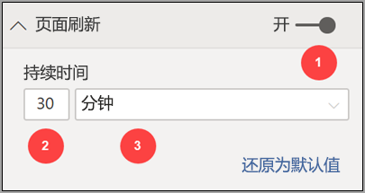
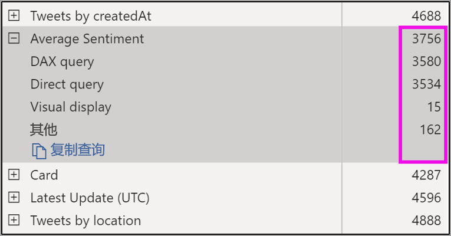
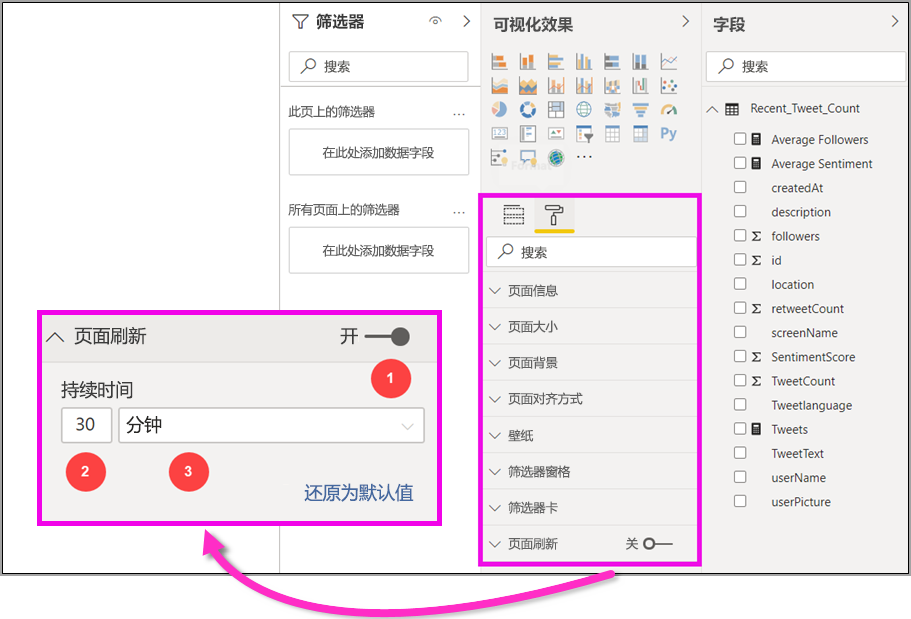

# Power BI Desktop 中的自动页面刷新（预览）

当监视关键事件时，请务必在源数据更新后尽快刷新数据。 例如，在制造行业，需要了解机器何时出现故障或即将出现故障，这一点很重要。

借助 Power BI 中的自动页面刷新 (APR) 功能，活动报表页能够以预定义的频率针对 [DirectQuery 源](https://docs.microsoft.com/power-bi/desktop-directquery-about)查询新数据。

## 使用自动页面刷新

对于此预览版本，必须在 Power BI Desktop 中启用自动页面刷新功能。 转到“文件”>“选项和设置”  ，选择“选项”  ，然后从左侧窗格中选择“预览功能”  。 通过选中“自动页面刷新”  旁边的复选框来启用此功能。 自动页面刷新仅适用于 DirectQuery 数据源。

若要使用自动页面刷新，请选择要为其启用刷新的报表页面。 在“可视化效果”  窗格中，选择“格式设置”  图标（油漆滚筒），然后在接近窗格底部的位置找到“页面刷新”  。 

下图显示“页面刷新”  卡片。 下面几个段落中介绍了对带编号元素的说明：

1.  自动页面刷新滑块 - 启用或禁用页面刷新
2.  页面刷新间隔值 - 刷新间隔的数字值
3.  页面刷新间隔单位 - 页面刷新的间隔单位

可在此处启用页面刷新并选择刷新持续时间。 默认值为 30 分钟，最小刷新间隔为 1 秒。 报表将按设置的间隔开始刷新。 

## 确定页面刷新间隔

启用自动页面刷新时，Power BI Desktop 会不断向 DirectQuery 源发送查询。 发送查询与获得返回数据之间会有延迟，因此，对于较短的刷新间隔，应确认查询在配置的间隔内成功返回查询的数据。 如果在该间隔内未返回数据，说明视觉对象更新频率低于配置频率。

最佳做法是，刷新间隔应至少符合预期的新数据到达频率：

* 如果新数据以 20 分钟的间隔频率到达源，那么刷新间隔不能小于 20 分钟。 

* 如果新数据每秒到达一次，应将间隔设置为 1 秒。 

对于低刷新间隔（例如 1 秒），还应考虑直接查询数据源的类型、在其中创建查询的负载、报表查看器与容量数据中心之间的距离等。 

可以在 Power BI Desktop 中使用性能分析器来估算上述因素，这样就可以确认每个视觉对象查询是否有足够的时间返回来自源的结果，以及时间花在哪些地方。 根据性能分析器的结果，可以对数据源进行调整和更改，也可以在报表中试用其他视觉对象和度量值。

下图显示了性能分析器中 DirectQuery 的结果：

我们思考一下有关此数据源的一些其他特征。 

1.  数据以两秒的频率到达。 
2.  性能分析器显示最大查询 + 显示时间大约为 4.9 秒（4688 毫秒）。 
3.  数据源配置为每秒处理大约 1000 个并发查询。 
4.  预计大约 10 个用户可以同时查看报表。

这会得出以下结果：

* **5 个视觉对象 x 10 个用户 = 大约 50 个查询**

此计算结果显示负载比数据源可以支持的负载要多得多。 数据以 2 秒的速率到达，因此此值应为刷新频率。 但是，由于查询大约需要 5 秒钟才能完成，因此应将其设置为超过 5 秒。 

另请注意，在将报表发布到服务时，此结果可能会不同，因为报表会使用云中托管的 Analysis Services 实例。 可能需要相应地调整刷新频率。 

考虑到查询和刷新计时，Power BI 只有在所有剩余刷新查询全部完成后，才会运行下一个刷新查询。 因此，即使刷新间隔时间短于处理查询所用的时间，Power BI 也只会在剩余查询完成后才再次刷新。 

接下来，我们来看看如何才能以容量管理员的身份检测和诊断性能问题。 还可以查看本文后面的“自动页面刷新常见问题解答”  部分，以获取有关性能和故障排除的更多问题和答案。

## Power BI 服务中的自动页面刷新

还可以为已在 Power BI Desktop 中创作的报表设置自动页面刷新间隔，并将其发布到 Power BI 服务。 

配置 Power BI 服务中的报表的自动页面刷新的步骤与 Power BI Desktop 中的配置步骤类似。 在 Power BI 服务中配置时，自动页面刷新还支持[嵌入式 Power BI](developer/embedding.md) 内容。 下图显示了 Power BI 服务的“页面刷新”  配置：

1.  自动页面刷新滑块 - 启用或禁用页面刷新
2.  页面刷新间隔值 - 刷新间隔的数字值，必须是整数
3.  页面刷新间隔单位 - 页面刷新的间隔单位

### 页面刷新间隔

Power BI 服务中允许的页面刷新间隔受报表的工作区类型影响。 这适用于以下所有报表：

* 将报表发布到启用了自动页面刷新的工作区
* 编辑工作区中已有的页面刷新间隔
* 直接在服务中创建报表

Power BI Desktop 对刷新间隔没有限制；其刷新间隔可以是 1 秒。 但是，在将报表发布到 Power BI 服务时，会应用某些限制，这在以下部分中进行了介绍。

### 对刷新间隔的限制

在 Power BI 服务中，基于工作区以及是否使用高级服务等因素应用自动页面刷新限制。

为了阐明其工作原理，我们先了解一些容量和工作区背景知识：

容量  是一个 Power BI 核心概念，表示用于托管和交付 Power BI 内容的一组资源（存储、处理器和内存）。 容量可以是共享容量，也可以是专用容量。 共享容量  与其他 Microsoft 客户共享，而专用容量  则完全委派给单个客户。 [管理高级容量](service-premium-capacity-manage.md)一文中介绍了专用容量。

在共享容量中，工作负载可在与其他客户共享的计算资源上运行。 由于容量必须共享资源，因此会施加限制以确保“公平竞争”  ，如设置最大模型大小 (1 GB) 和每日最大刷新频率（每天 8 次）。

Power BI 工作区  驻留在容量内，它们代表安全、协作和部署容器。 每个 Power BI 用户都有一个称为“我的工作区”的个人工作区  。 可创建其他工作区以启用协作和部署，这些工作区称为“工作区”  。 默认情况下，工作区（包括个人工作区）在共享容量中创建  。

下面介绍了两个工作区方案的一些详细信息：

**共享工作区** - 对于常规工作区（不属于高级容量的工作区），自动页面刷新的最小间隔为 30 分钟（允许的最小间隔）。

**高级工作区** - 自动页面刷新在高级工作区中的可用性取决于高级管理员为 Power BI Premium 容量设置的工作负载设置。 有两个变量可能会影响你对自动页面刷新的设置：

 1. *功能启用/禁用*：如果容量管理员已决定禁用该功能，你将无法在已发布的报表中设置任何类型的页面刷新。

 2. *最小刷新间隔*：启用此功能时，容量管理员必须设置最小刷新间隔。 如果你的间隔低于最小值，Power BI 服务将覆盖你的间隔，以遵循容量管理员设置的最小间隔。

下表详细介绍了提供此功能的位置，以及针对每种容量类型和[存储模式](service-dataset-modes-understand.md)的限制

| 存储模式 | 专用容量 | 共享容量 |
| --- | --- | --- |
| 直接查询 | **支持** - 是。  **最小刷新间隔** - 1 秒  **容量管理员覆盖** - 是。 | **支持** - 是。  **最小刷新间隔** - 30 分钟  **容量管理员覆盖**  - 否。 |
| 导入 | **支持** - 否。  **最小刷新间隔** - 不适用。  **容量管理员覆盖**  - 不适用。 | **支持** - 否。  **最小刷新间隔** - 不适用。  **容量管理员覆盖**  - 不适用。 |
| 混合模式（DQ + 其他） | **支持** - 是。  **最小刷新间隔** - 1 秒  **容量管理员覆盖** - 是。 | **支持** - 是。  **最小刷新间隔** - 30 分钟  **容量管理员覆盖**  - 否。 |
| 实时连接 AS | **支持** - 否。  **最小刷新间隔** - 不适用。  **容量管理员覆盖**  - 不适用。 | **支持** - 否。  **最小刷新间隔** - 不适用。  **容量管理员覆盖**  - 不适用。 |
| 实时连接 PBI | **支持** - 否。  **最小刷新间隔** - 不适用。  **容量管理员覆盖**  - 不适用。 | **支持** - 否。  **最小刷新间隔** - 不适用。  **容量管理员覆盖**  - 不适用。 |

> [!NOTE]
> 将启用了自动页面刷新的报表从 Power BI Desktop 发布到服务时，必须在“数据集设置”菜单中为 DirectQuery 数据源提供凭据。

## 注意事项和限制

在 Power BI Desktop 或 Power BI 服务中使用自动页面刷新时，需要注意几点。

* 自动页面刷新不支持导入、LiveConnect 和推送存储模式。  
* 支持具有至少一个 DirectQuery 数据源的复合模型。
* Power BI Desktop 对刷新间隔没有限制，刷新间隔可以是 1 秒。 将报表发布到 Power BI 服务时，会应用某些限制，如本文档前面所述。

### 性能诊断

自动页面刷新适用于监视方案和浏览快速变化的数据。 但是，这有时可能会对容量或数据源施加过多负载。

为了防止数据源上的负载过大，Power BI 具有以下安全措施：

1. 所有自动页面刷新查询都以较低  的优先级运行，以确保交互式查询（如页面负载和交叉筛选视觉对象）优先。
2. 如果查询未在下一个刷新周期之前完成，Power BI 不会发出新的刷新查询，直到上一个查询完成为止。 例如，如果刷新间隔为 1 秒，并且查询平均 4 秒执行一次，则 Power BI 每隔 4 秒才会有效地发出一次查询。

在以下两个方面仍会遇到性能瓶颈：

1. **可用容量：** 查询首先会命中高级容量，高级容量将折叠从报表可视化效果生成的 DAX 查询并将其评估为源查询。
2. **直接查询数据源：** 然后，上一步中的已转换查询将针对源运行。 源会是 SQL Server、SAP Hana 源等。

使用管理员可用的[高级指标应用](service-admin-premium-monitor-capacity.md)，可以可视化低优先级查询使用的容量大小。

低优先级查询包括自动页面刷新查询和模型刷新查询。 目前没有办法区分来自自动页面刷新和模型刷新查询的负载。

如果你注意到使用低优先级查询时容量过载，可以执行以下几个操作：

1. 请求更大的高级 SKU。
2. 与报表所有者联系，要求减少刷新间隔时间。
3. 在容量管理门户中，可以：
  1. 禁用该容量的自动页面刷新
  2. 增加最小刷新间隔时间，这将对该容量中的所有报表产生影响。

### 常见问题解答

本部分提供了有关以下情形的常见问题和回答 

1. 我是报表作者。 我在 Desktop 上将报表刷新间隔定义为 1 秒，但在发布报表后，未在服务中刷新。

    * 检查是否为该页面启用了自动页面刷新。 由于此设置是针对每个页面的，因此需要确保报表中要刷新的每个页面上都启用了此设置。
    * 检查是否已上传到具有附加高级容量的工作区，如果未上传，刷新间隔将锁定在 30 分钟。
    * 如果报表位于高级工作区中，请与管理员联系，确保已为附加容量启用了此功能。 此外，请确保容量的最小刷新间隔小于或等于报表刷新间隔。

2. 我是容量管理员。我更改了自动页面刷新间隔设置，但此设置未反映出来。 换句话说，报表未按预期频率进行刷新，或者不刷新，即使我启用了自动页面刷新也是如此。

    * 在容量管理 UI 中所做的自动页面刷新设置更改需要 5 分钟的时间才能传播到报表中。
    * 除了为容量启用自动页面刷新外，还需要为要查看的报表页面启用自动页面刷新。

3. 我的报表在混合模式（DQ + 导入）下运行。 不是所有视觉对象都会刷新。

    * 如果视觉对象引用“导入”表，那么这是预期结果。 “导入”不支持自动页面刷新。
    * 请参阅本部分中的问题 1。

4. 我的报表在服务中正常刷新，随后突然停止。

    * 尝试刷新页面，查看问题是否能自行解决。
    * 与容量管理员联系，因为他们可能已禁用该功能或触发了最小刷新间隔（请参阅问题 2）

5. 我是报表作者。 我的视觉对象未按我设置的频率刷新。 它们的刷新频率更慢。

    * 如果查询执行时间较长，刷新间隔将会延迟。 自动页面刷新会等待所有查询运行完成，然后才会运行新查询。
    * 容量管理员设置的最小刷新间隔值可能大于你为报表设置的该值。 联系你的容量管理员，要求降低此值。

6. 是否从缓存中执行自动页面刷新查询？

    * 不会，所有自动页面刷新查询将绕过任何缓存的数据。

## 后续步骤

有关详细信息，请参阅以下文章：

* [在 Power BI 中使用 DirectQuery](desktop-directquery-about.md)
* [使用性能分析器检查报表元素性能](desktop-performance-analyzer.md)
* [部署和管理 Power BI Premium 容量](whitepaper-powerbi-premium-deployment.md)
* [Power BI Desktop 中的数据源](desktop-data-sources.md)
* [使用 Power BI Desktop 调整和合并数据](desktop-shape-and-combine-data.md)
* [通过 Power BI Desktop 连接到 Excel 工作簿](desktop-connect-excel.md)   
* [直接将数据输入到 Power BI Desktop 中](desktop-enter-data-directly-into-desktop.md)   
