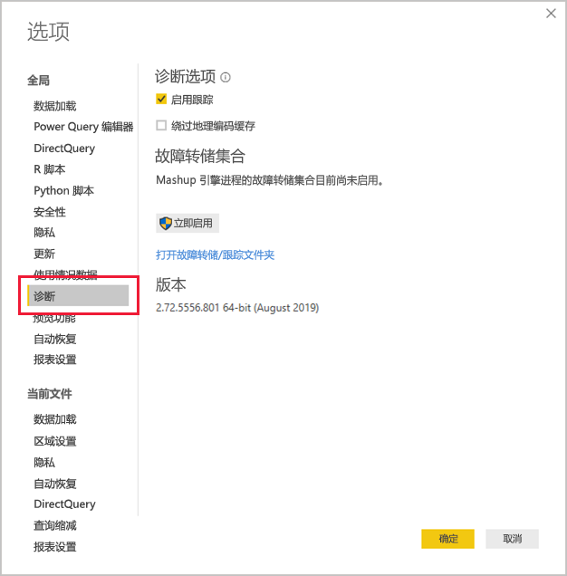
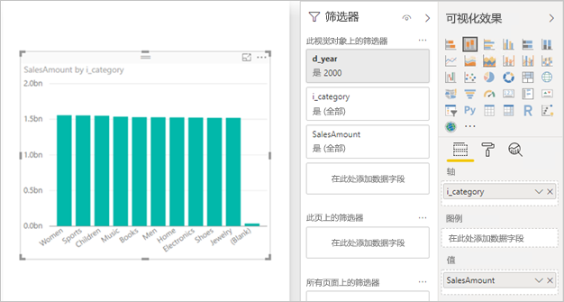

# <a name="directquery-model-troubleshooting-in-power-bi-desktop"></a>Power BI Desktop 中的 DirectQuery 模型疑难解答

本文面向使用 Power BI Desktop 或 Power BI 服务开发 Power BI DirectQuery 模型的数据建模者。 本文介绍如何诊断性能问题、如何获取更详细的信息以优化报表。

## <a name="performance-analyzer"></a>性能分析器

强烈建议在 Power BI Desktop 而不是 Power BI （服务或 Microsoft Power BI 报表服务器）中诊断任何性能问题。 通常情况下，性能问题只取决于基础数据源的性能水平，因此，在 Power BI Desktop 更加独立的环境中就更容易识别和诊断这些问题，并且可以一开始就消除某些组件（如 Power BI 网关）。 只有在 Power BI Desktop 中未发现性能问题时，调查才应关注 Power BI 中的报表细节。 [性能分析器](desktop-performance-analyzer.md)是一个有用工具，可在整个过程中识别问题。

同样，建议先尝试隔离单个视觉对象的任何问题，而不是调查页面上多个视觉对象的问题。

假设已完成这些步骤（如本主题中前面段落所述）- 现在 Power BI Desktop 页面中单个视觉对象仍然缓慢。 要确定 Power BI Desktop 向基础数据源发送哪些查询，可以使用性能分析器。 还可以查看基础数据源可能发出的跟踪/诊断信息。 此类跟踪还可能包含关于如何执行查询的详细信息以及如何改进的有用信息。

此外，即使数据源中没有这类跟踪，也可以查看 Power BI 发送的查询及其执行时间，如下所述。

## <a name="review-trace-files"></a>查看跟踪文件

默认情况下，Power BI Desktop 会在给定会话期间将事件记录到名为 FlightRecorderCurrent.trc 的跟踪文件中  。

对于某些 DirectQuery 数据源，此日志文件包含发送到基础数据源的所有查询（将来会支持其余的 DirectQuery 数据源）。 将查询写入日志的源如下所示：

- SQL Server
- Azure SQL 数据库
- Azure SQL 数据仓库
- Oracle
- Teradata
- SAP HANA

当前用户的 AppData 文件夹中可以找到的跟踪文件  ： _\\\<User>\AppData\Local\Microsoft\Power BI Desktop\AnalysisServicesWorkspaces_

下面是获取此文件夹的简单办法：在“Power BI Desktop”中，选择 _“文件”>“选项和设置”>“选项”_ ，然后选择“诊断”页  。 将显示以下对话框窗口：



在“故障转储集合”下，选择“打开故障转储/跟踪文件夹”链接时，会打开以下文件夹  ： _\\\<User>\AppData\Local\Microsoft\Power BI Desktop\Traces_

导航到该文件夹的父文件夹将显示包含 _AnalysisServicesWorkspaces_ 的文件夹，该文件包含每个打开的 Power BI Desktop 实例的工作区子文件夹。 这些子文件夹名称中带有整数后缀，例如 AnalysisServicesWorkspace2058279583  。

该文件夹内是一个 \Data 子文件夹，其中包含当前 Power BI 会话的跟踪文件 FlightRecorderCurrent.trc  。 相关联的 Power BI Desktop 会话结束时，将删除相应的工作区文件夹。

跟踪文件可以使用 SQL Server Profiler 工具打开，该工具作为 SQL Server Management Studio 的一部分可以免费下载。 可以从[此处](/sql/ssms/download-sql-server-management-studio-ssms?view=sql-server-2017)获取。

下载并安装 SQL Server Management Studio 后，运行 SQL Server Profiler。


若要打开跟踪文件，请执行以下步骤：

1. 在 SQL Server Profiler 中，选择“文件”>“打开”>“跟踪文件” 
2. 输入当前打开的 Power BI 会话的跟踪文件路径，如： _\\\<User>\AppData\Local\Microsoft\Power BI Desktop\AnalysisServicesWorkspaces\AnalysisServicesWorkspace2058279583\Data_
3. 打开 FlightRecorderCurrent.trc 

将显示当前会话的所有事件。 注释示例如下所示，其中突出显示了事件组。 每个组具有以下内容：

- 一个 Query Begin 和一个 Query End 事件，分别表示 UI（例如，从视觉对象，或从在筛选器 UI 中填充值的列表）生成的 DAX 查询的开始和结束  
- 一对或多对 DirectQuery Begin 和 DirectQuery End 事件，表示发送到基础数据源的查询（作为评估 DAX 查询的一部分）  

请注意，可以并行执行多个 DAX 查询，因此来自不同组的事件可能互相交错。 ActivityID 值可以用于确定属于同一个组的具体事件。


其他较重要的列如下所示：

- **TextData：** 事件的文本详细信息。 对于“Query Begin/End”事件，该内容会是 DAX 查询  。 对于“DirectQuery Begin/End”事件，该内容会是发送到基础数据源的 SQL 查询  。 当前选中事件的 TextData 值也显示在底部区域中  。
- **EndTime：** 事件完成的时间。
- **Duration：** 执行 DAX 或 SQL 查询的持续时间，以毫秒为单位。
- **Error：** 指示是否发生了错误（发生错误时，该事件显示为红色）。

在上图中，缩小了部分重要性较低的列，以便更容易看到重要性较高的列。

建议使用以下方法捕获跟踪以帮助诊断潜在性能问题：

- 打开单个 Power BI Desktop 会话（避免多个工作区的文件夹产生混淆）
- 在 Power BI Desktop 执行一组意向操作。 再执行一些额外的操作，确保将意向操作事件刷新到跟踪文件中。
- 打开 SQL Server Profiler 并检查跟踪，如前面所述。 请记住，关闭 Power BI Desktop 时将删除跟踪文件。 此外，在 Power BI Desktop 中的进一步操作将不会立刻显示 - 应关闭跟踪文件并重新打开以查看新事件。
- 保持较短的单个会话时间（10 秒的操作时间，而不是数百秒的操作时间），使跟踪文件更容易解释（并且因为跟踪文件的大小有限制，因此在时间长的会话中可能会丢弃早期事件）。

## <a name="understand-the-form-of-query-sent-by-power-bi-desktop"></a>了解 Power BI Desktop 发送的查询的形式

Power BI Desktop 生成和发送的查询的一般格式会对每个引用的表使用子查询，其中子查询由 Power Query 查询定义。 例如，假设 SQL Server 关系数据库中有以下 TPC-DS 表：


请考虑以下视觉对象及其配置，注意 SalesAmount  度量值是用以下表达式定义的：

```dax

SalesAmount = SUMX(Web_Sales, [ws_sales_price] * [ws_quantity])

```



刷新该视觉对象将生成下一段所示的 T-SQL 查询。 如你所见，有针对 Web_Sales、Item 和 Date_dim 模型表的三个子查询    。 每个表都将返回所有模型表列，但视觉对象实际上只引用了四列。 这些子查询（灰显）是 Power Query 查询的定义。 对于目前 DirectQuery 支持的数据源，尚未发现以这种方式使用子查询会影响性能。 SQL Server 等数据源优化了对未使用列的引用。

Power BI 使用此模式原因之一是，你可以定义 Power Query 查询来使用特定的查询语句。 因此，“按提供的形式”使用它，而不会试图重写它。 注意，此模式限制使用使用公共表表达式 (CTE) 和存储过程的查询语句。 这些语句不能用于子查询。


## <a name="gateway-performance"></a>网关性能

有关网关性能故障排除的信息，请参阅[对网关进行排除故障 - Power BI](service-gateway-onprem-tshoot.md) 一文。

## <a name="next-steps"></a>后续步骤

有关 DirectQuery 的详细信息，请查看以下资源：

- [在 Power BI Desktop 中使用 DirectQuery](desktop-use-directquery.md)
- [Power BI Desktop 中的 DirectQuery 模型](desktop-directquery-about.md)
- [Power BI Desktop 中的 DirectQuery 模型指导](guidance/directquery-model-guidance.md)
- 是否有任何问题? [尝试咨询 Power BI 社区](https://community.powerbi.com/)
