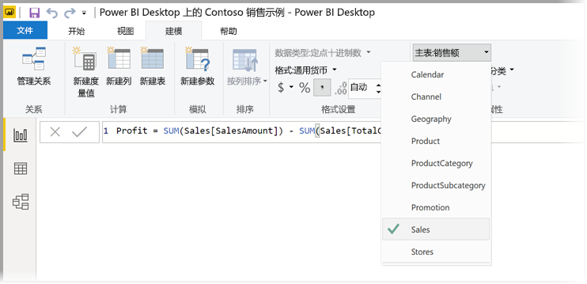

# <a name="create-measures-for-data-analysis-in-power-bi-desktop"></a>在 Power BI Desktop 中创建用于数据分析的度量值

Power BI Desktop 可帮助你只通过点击几次鼠标，便深入了解你的数据。 但有时候，这些数据并不包含解决某些重要问题所需的所有内容。 度量值可以帮助你解决该问题。

度量值用于一些最常见的数据分析。 简单汇总（如总和、平均值、最小值、最大值和计数）可以通过“字段”框进行设置  。 度量值的计算结果也始终随着你与的报表的交互而改变，以便进行快速和动态的临时数据浏览。 让我们仔细了解下。 有关详细信息，请参阅[创建计算度量值](/learn/modules/model-data-power-bi/4b-create-calculated-measures)。

## <a name="understanding-measures"></a>了解度量值

在 Power BI Desktop 中，可以在“报表视图”或“数据视图”中创建和显示度量值   。 你自己创建的度量值将显示在带有计算器图标的“字段”列表中  。 你可以随心所欲地为你的度量值命名，并将它们添加到新的或现有的可视化效果中，就如其他字段一样。


> [!NOTE]
> 你可能还会对快速度量值感兴趣，它们是可以在对话框中选择的现成度量值  。 既是快速创建度量值的绝佳方法，也是学习数据分析表达式 (DAX) 语法的绝佳方法，因为可以查看快速度量值自动创建的 DAX 公式。 有关详细信息，请参阅[快速度量值](desktop-quick-measures.md)。
> 
> 

## <a name="data-analysis-expressions"></a>数据分析表达式

度量值将计算表达式公式的结果。 在创建自己的度量值时，将使用[数据分析表达式](/dax/) (DAX) 公式语言。 DAX 包括一个超过 200 个函数、运算符和构造的库。 这个库为创建度量值提供了巨大的灵活性，几乎可以计算任何数据分析所需的结果。

DAX 公式与 Excel 公式非常相似。 DAX 甚至具有许多与 Excel 相同的函数，例如 `DATE`、`SUM` 和 `LEFT`。 但是，DAX 函数用于处理关系数据，类似于 Power BI Desktop 中的关系数据。

## <a name="lets-look-at-an-example"></a>我们来看一个示例

Jan 是 Contoso 的销售经理。 Jan 接到要求，要提供下一个会计年度的经销商销售预测。 Jan 决定根据去年的销售额做出预测，并加上根据未来六个月计划的各种促销结果预估的六个百分点的年增长率。

为了报告这些估计值，Jan 将上一年的销售数据导入了 Power BI Desktop 中。 在“Reseller Sales”表中，Jan 找到了“SalesAmount”字段   。 由于导入的数据仅包含上一年的销售额，Jan 将“SalesAmount”字段重新命名为“Last Years Sales”   。 然后，Jan 将“Last Years Sales”拖动到报表画布上  。 该字段在图表可视化效果中显示为去年所有经销商销售额总和的单一值。

Jan 注意到，即使不指定计算，系统也已经自动提供了一种计算。 Power BI Desktop 通过对“Last Years Sales”中的值进行求和，创建其自己的度量值  。

但是，Jan 需要度量值来计算明年的销售预测，即基于去年的销售额乘以 1.06，以代表预期为 6% 的业务增长。 对于此计算，Jan 将创建一个度量值。 使用新建度量值功能，Jan 可以创建新的度量值，然后输入下面的 DAX 公式  ：

```sql
    Projected Sales = SUM('Sales'[Last Years Sales])*1.06
```

接着将新“Projected Sales”度量值拖动到图表中。


只需要最小的工作量，Jan 很快就拥有了用于计算预测销售额的度量值。 通过筛选特定的经销商或将其他字段添加到报表中，Jan 可以进一步分析预测。

## <a name="data-categories-for-measures"></a>度量值的数据类别

还可以为度量值选取数据类别。

此外，数据类别可让你使用度量值来动态创建 URL，并将数据类别标记为 Web URL。

可以创建以 Web URL 的形式显示度量值的表，并能够单击根据所做选择创建的 URL。 想要使用 [URL 筛选器参数](service-url-filters.md)链接到其他 Power BI 报表时，此方法特别有用。

## <a name="organizing-your-measures"></a>组织度量值

度量值具有定义它们在字段列表中的位置的主表  。 可以通过从模型中的表选择位置来更改其位置。



还可以将表中的字段组织到显示文件夹  中。 从 Power BI Desktop 的左边缘选择“模型”  。 在“属性”窗格中，选择要从可用字段列表中移动的字段  。 在“显示文件夹”中输入新文件夹的名称以创建文件夹  。 创建文件夹会将所选字段移动到该文件夹中。


可以使用反斜杠字符创建子文件夹。 例如 Finance\Currencies 会创建 Finance 文件夹，并在其中创建 Currencies 文件夹    。

可以通过使用分号分隔文件夹名称，使字段出现在多个文件夹中。 例如，Products\Names;Departments  会使字段出现在 Products  文件夹内的 Departments  文件夹以及 Products  文件夹中。

可以创建仅包含度量值的特殊表。 该表始终显示在“字段”顶部  。 为此，请创建一个仅包含一列的表。 可以使用“输入数据”  创建该表。 然后将度量值移动到该表。 最后，隐藏所创建的列（而不是表）。 选择“字段”顶部的箭头关闭并重新打开字段列表以查看更改  。


## <a name="learn-more"></a>了解详细信息

我们仅在此处提供了度量值简介。 还有很多资料可帮助你了解如何创建自己的度量值。 有关详细信息，请参阅[教程：在 Power BI Desktop 中创建你自己的度量值](desktop-tutorial-create-measures.md)。 你可以下载示例文件并获取有关如何创建更多度量值的逐步课程。  

若要更深入了解 DAX，请参阅 [Power BI Desktop 中的 DAX 基本概念](desktop-quickstart-learn-dax-basics.md)。 [数据分析表达式参考](/dax/)提供了有关每个函数、语法、运算符和命名约定的详细文章。 DAX 出现在 Excel 的 Power Pivot 和 SQL Server Analysis Services 中已经有数年时间了。 还有许多其他有用的资源可供使用。 请务必查看 [DAX 资源中心 Wiki](https://social.technet.microsoft.com/wiki/contents/articles/1088.dax-resource-center.aspx)，其中有影响力的 BI 社区成员将会分享他们的 DAX 知识。
