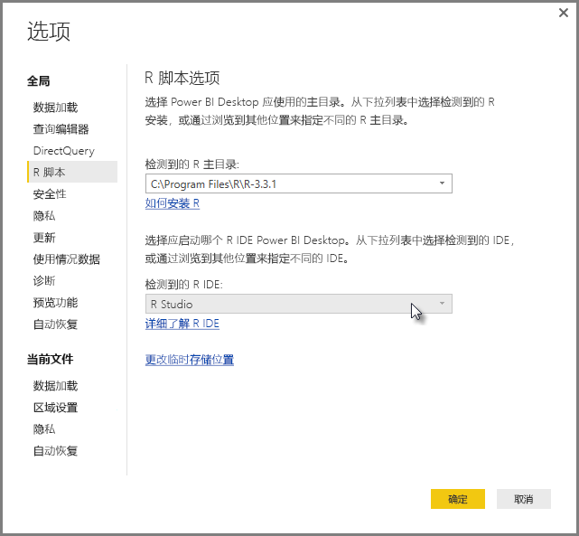
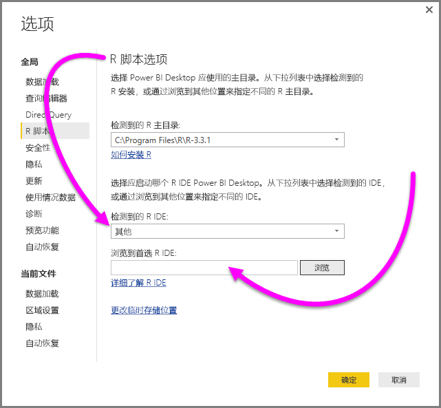
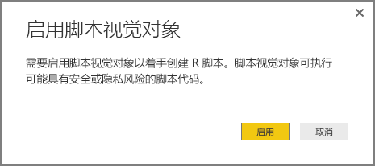
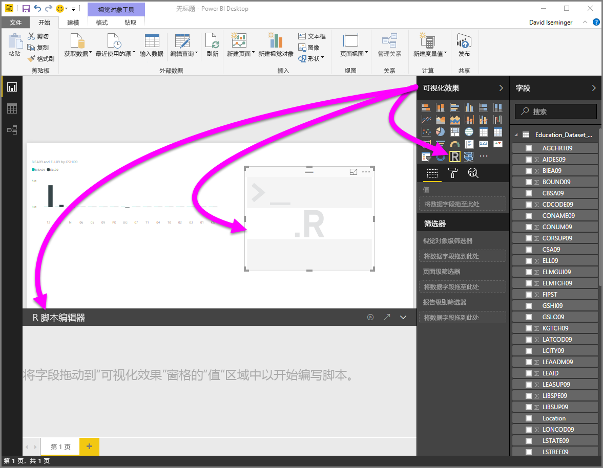
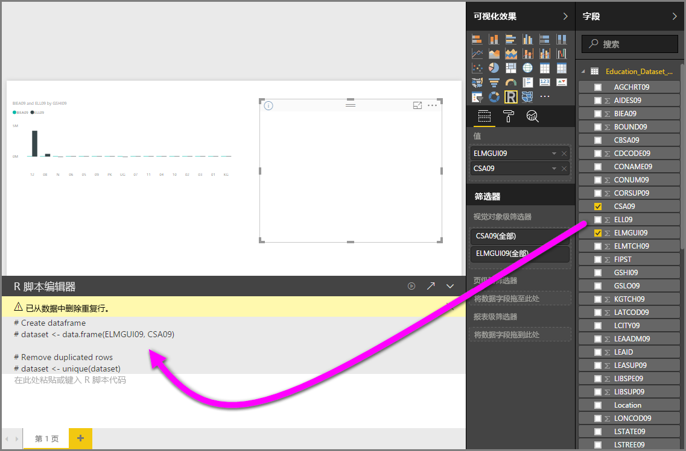
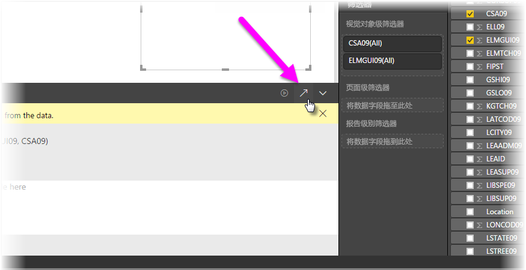
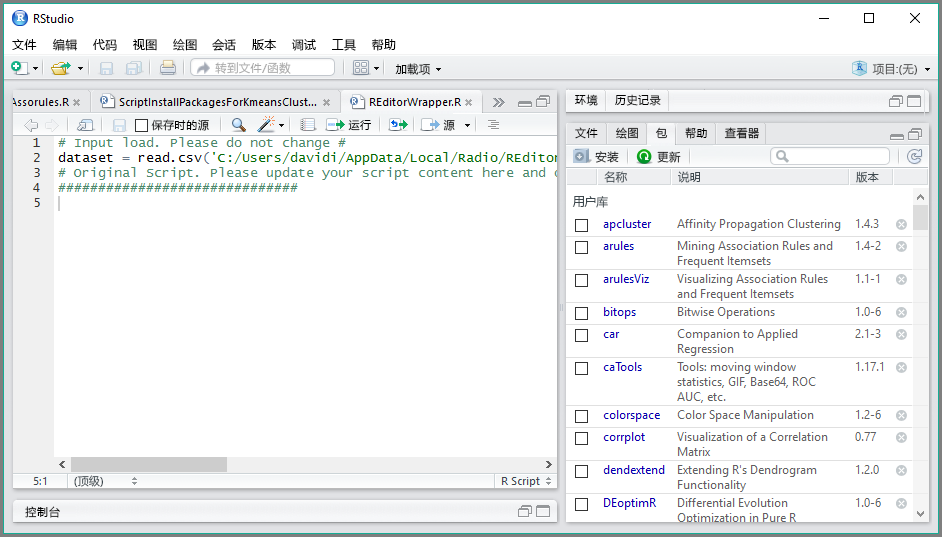

# 将外部 R IDE 与 Power BI 一起使用
借助 **Power BI Desktop**，可以使用外部的 R IDE（集成开发环境）创建并优化 R 脚本，然后将这些脚本用于 Power BI 中。

## 启用外部 R IDE
在这之前，需使用 **Power BI Desktop** 中的 R 脚本编辑器创建并运行 R 脚本。 借助此版本，可以从 **Power BI Desktop** 启动外部 R IDE，然后自动导入数据并显示在 R IDE 中。 之后，可以修改此外部 R IDE 中的脚本，然后将其重新粘贴至 **Power BI Desktop** 中来创建 Power BI 视觉对象和报表。

从 **Power BI Desktop**（版本 2.39.4526.362）的 2016 年 9 月发行版开始，你可以指定使用哪个 R IDE，并使其在 **Power BI Desktop** 中自动启动。

### 要求
要使用此功能，需要在本地计算机上安装 **R IDE**。 Power BI Desktop  不包含 R 引擎，也不部署和安装该引擎，因此必须在本地计算机上单独安装 R  。 通过以下选项，你可以选择使用哪个 R IDE：

* 你可以安装最喜欢的 R IDE，其中大部分都是免费的，例如 [Revolution Open 下载页面](https://mran.revolutionanalytics.com/download/) 和 [CRAN 存储库](https://cran.r-project.org/bin/windows/base/)。
* **Power BI Desktop** 还支持 [R Studio](https://www.rstudio.com/) 和具有 [*R Tools for Visual Studio*](https://beta.visualstudio.com/vs/rtvs/) 编辑器的 **Visual Studio 2015**。
* 此外，还可以安装不同的 R IDE，并通过执行以下任一操作，使 **Power BI Desktop** 启动相应 **R IDE**：
  
  * 可以将 **.R** 文件与 **Power BI Desktop** 要启动的外部 IDE 相关联。
  * 通过从“ **选项** ”对话框的“ **R 脚本选项** ”部分中选择“ *其他* ”，你可以指定 **Power BI Desktop** 应启动的 .exe。 通过转到 **“文件”>“选项和设置”>“选项”** ，你可以打开“**选项**”对话框。
    
    

如果安装了多个 R Ide，则通过在“ **选项** ”对话框中“ *检测到的 R Ide* ”下拉列表中进行选择就可以指定要启动哪个 R Ide。

默认情况下，**Power BI Desktop** 将启动 **R Studio** 作为外部 R IDE（如果它已安装在本地计算机上）；如果未安装 **R Studio**，而是安装了具有 **R Tools for Visual Studio** 的 **Visual Studio 2015**，则将启动 Visual Studio 2015。 如果这些 R IDE 均未安装，则将启动与 **.R** 文件关联的应用程序。

如果 **.R** 文件不存在任何关联，则可以在“ **选项** ”对话框的“ *浏览到你的首选 R IDE* ”部分中指定自定义 IDE 的路径。 通过选择 **Power BI Desktop** 中“**启动 R IDE**”箭头图标旁边的“**设置**”齿轮图标，你还可以启动不同的 R IDE。

## 通过 Power BI Desktop 启动 R IDE
要通过 Power BI Desktop  启动 R IDE，请执行以下步骤：

1. 将数据加载至 **Power BI Desktop**。
2. 从“**字段**”窗格选择要使用的字段。 如果尚未启用脚本视觉对象，则会提示你完成此操作。
   
   
3. 启用脚本视觉对象后，可以从“**可视化效果**”窗格中选择 R 视觉对象，此操作将创建空白的 R 视觉对象来显示脚本结果。 同时也会显示“**R 脚本编辑器**”窗格。
   
   
4. 现在你可以选择要用于 R 脚本的字段。 选择字段后，“**R 脚本编辑器**”字段会基于所选的字段自动创建脚本代码。 可在“R 脚本编辑器”  窗格中直接创建（或粘贴）R 脚本，也可将其留空。
   
   
   
   > [!NOTE]
   > R 视觉对象的默认聚合类型是“不汇总”  。
   > 
   > 
5. 现在可以直接从 **Power BI Desktop** 中启动 R IDE。 如下图所示，从“**R 脚本编辑器**”标题栏的右侧找到并选中“**启动 R IDE**”按钮。
   
   
6. 如下图所示，Power BI Desktop 将启动特定的 R IDE（在该图中，**RStudio** 是默认 R IDE）。
   
   
   
   > [!NOTE]
   > Power BI Desktop  会添加脚本的前三行，这样一旦运行该脚本，就可以从  Power BI Desktop 中导入数据。
   > 
   > 
7. 在 **Power BI Desktop** 的 **R 脚本编辑器窗格**中创建的任何脚本都会从 R IDE 的第 4 行开始显示。 此时，可在 R IDE 中自行创建 R 脚本。 在 R IDE 中完成 R 脚本后，必须将其复制并重新粘贴至 **Power BI Desktop** 的 **R 脚本编辑器** 窗格中，注意 *不包括*  **Power BI Desktop** 自动生成的前三行脚本。 请勿将脚本的前三行复制到 **Power BI Desktop**，这三行仅用于将数据从 **Power BI Desktop** 导入到 R IDE。

### 已知限制
直接从 Power BI Desktop 中启动 R IDE 具有部分限制：

* 不支持自动将脚本从 R IDE 中导出到 **Power BI Desktop**。
* 不支持 **R 客户端**编辑器 (RGui.exe)，因为该编辑器自身不支持打开文件。

## 后续步骤
查看以下更多信息，了解有关 Power BI 中的 R。

* [在 Power BI Desktop 中运行 R 脚本](desktop-r-scripts.md)
* [使用 R 创建 Power BI 视觉对象](desktop-r-visuals.md)

