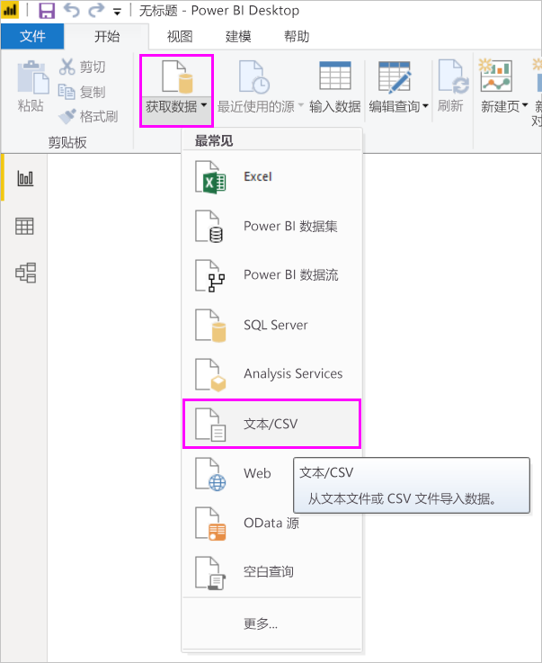

# <a name="use-r-in-query-editor"></a>在查询编辑器中使用 R

[**R**](https://mran.microsoft.com/documents/what-is-r) 是一种功能强大的编程语言，许多统计学家、数据科学家和数据分析师都在使用。 可以在 Power BI Desktop 的查询编辑器中使用 R 来执行以下操作   ：

* 准备数据模型

* 创建报表

* 进行数据清理、高级数据定形和数据集分析，包括缺失数据补全、预测、聚类分析等。  

## <a name="install-r"></a>安装 R

可以从 [Revolution Open 下载页](https://mran.revolutionanalytics.com/download/)以及 [CRAN 存储库](https://cran.r-project.org/bin/windows/base/)免费下载 R  。

### <a name="install-mice"></a>安装 mice

必须在 R 环境中安装 [mice](https://www.rdocumentation.org/packages/mice/versions/3.5.0/topics/mice) 库  。 没有 mice，示例脚本代码无法正常运行  。 mice 包实现了一种处理缺失数据的方法  。

安装 mice  ：

1. 启动 R.exe 程序（例如 C:\Program Files\Microsoft\R Open\R-3.5.3\bin\R.exe）  

2. 运行安装命令：

   ``` 
   >  install.packages('mice') 
   ```

## <a name="use-r-in-query-editor"></a>在查询编辑器中使用 R

为演示在查询编辑器中使用 R，我们将使用 .csv 文件中包含的示例股票市场数据集，并完成以下步骤   ：

1. [下载EuStockMarkets_NA.csv 文件](http://download.microsoft.com/download/F/8/A/F8AA9DC9-8545-4AAE-9305-27AD1D01DC03/EuStockMarkets_NA.csv)  。 记下此文件的保存位置。

1. 将文件加载到 Power BI Desktop：在“主页”功能区中，选择“获取数据”>“文本/CSV”    。

   

1. 选择文件，然后选择“打开”  。 CSV 数据显示在“文本/CSV 文件”对话框中  。

   

1. 加载数据后，你可以在“字段”窗格中看到它  。

   

1. 若要打开“查询编辑器”，请在“主页”功能区中选择“编辑查询”    。

   

1. 在“转换”功能区中，选择“运行 R 脚本”   。 随即显示“运行 R 脚本”编辑器  。  

   第 15 行和第 20 行包含缺失的数据，图像中没有显示的其他行也是。 以下步骤介绍 R 如何为你补全这些行。

   

1. 此示例中，请输入以下脚本代码。 请务必将“&lt;你的文件路径&gt;”替换为本地文件系统上的 EuStockMarkets_NA.csv 路径，例如，C:/Users/John Doe/Documents/Microsoft/EuStockMarkets_NA.csv 

    ```r
       dataset <- read.csv(file="<Your File Path>/EuStockMarkets_NA.csv", header=TRUE, sep=",")
       library(mice)
       tempData <- mice(dataset,m=1,maxit=50,meth='pmm',seed=100)
       completedData <- complete(tempData,1)
       output <- dataset
       output$completedValues <- completedData$"SMI missing values"
    ```

7. 选择“确定”  后，“查询编辑器”  将显示与数据隐私相关的警告。

   
8. 为使 R 脚本在 Power BI 服务中正常工作，需要将所有的数据源都设置为“公开”  。 有关隐私设置及其含义的详细信息，请参阅[隐私级别](desktop-privacy-levels.md)。

   

   选择“保存”后，脚本将运行  。 请注意“字段”  窗格中的名为 completedValues  的新列。 注意，有一些行缺少数据元素，如第 15 和 18 行。 下一节中将介绍 R 如何处理该问题。

   只需要五行 R 脚本，**查询编辑器**就能用预测模型填写丢失的值。

## <a name="create-visuals-from-r-script-data"></a>根据 R 脚本数据创建视觉对象

现在，可创建视觉对象，以查看 R 脚本代码如何使用 mice  库补全缺少的值，如下图所示：


可以将所有已完成的视觉对象保存在一个 Power BI Desktop .pbix 文件中，并在 Power BI 服务中使用数据模型及其 R 脚本  。

> [!NOTE]
> 完成所有步骤后，可以[下载一个 .pbix 文件](http://download.microsoft.com/download/F/8/A/F8AA9DC9-8545-4AAE-9305-27AD1D01DC03/Complete%20Values%20with%20R%20in%20PQ.pbix)。

将 .pbix 文件上传到 Power BI 服务后，需要采取其他步骤来启用服务数据刷新和更新后的视觉对象：  

* 为数据集启用计划刷新 - 若要使用 R 脚本为包含数据集的工作簿启用计划刷新，请参阅[配置计划刷新](refresh-scheduled-refresh.md)，其中还包括有关个人网关的信息。  

* 安装个人网关 - 需要在文件和 R 所在的计算机上安装个人网关    。 Power BI 服务访问该工作簿并重新呈现所有更新后的视觉对象。 有关详细信息，请参阅[安装和配置个人网关](service-gateway-personal-mode.md)。

## <a name="limitations"></a>限制

对包括 R 脚本，在**查询编辑器**中创建的查询有一些限制：

* 所有 R 数据源设置都必须设置为“公开”  。 查询编辑器  查询中的其他所有步骤也必须是公开的。 若要获取数据源设置，请在 **Power BI Desktop** 中选择 **“文件”>“选项和设置”>“数据源设置”** 。

  

  在“数据源设置”对话框中，选择数据源，然后选择“编辑权限...”   。将“隐私级别”设置为“公开”   。

      
* 若要启用 R 视觉对象或数据集的计划更新，需要启用“计划更新”，并且在包含工作簿和 R 的计算机上安装个人网关。    有关这两方面的详细信息，请参阅本文中的之前章节，其中提供了链接可了解每个方面的详细信息。

通过 R 和自定义查询你能进行各种各样的操作，因此你可以按照你想要显示的方式来探索和分析你的数据。

## <a name="next-steps"></a>后续步骤

* [R 简介](https://mran.microsoft.com/documents/what-is-r) 

* [在 Power BI Desktop 中运行 R 脚本](desktop-r-scripts.md) 

* [将外部 R IDE 与 Power BI 一起使用](desktop-r-ide.md) 

* [Power BI 服务中的 R 程序包](service-r-packages-support.md)
