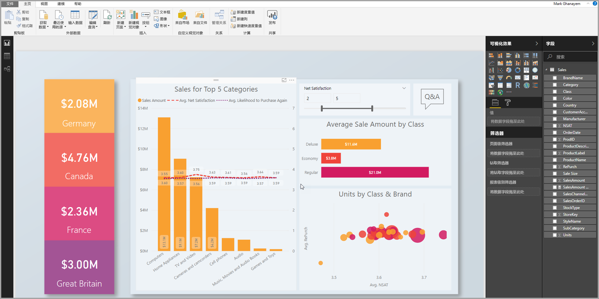
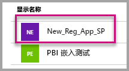
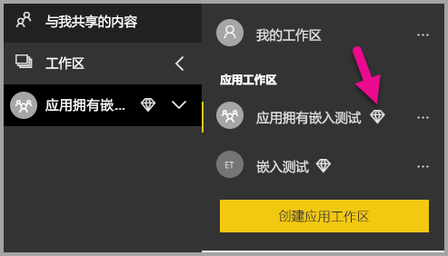

# <a name="tutorial-embed-power-bi-content-into-an-application-for-your-customers"></a>教程：为客户将 Power BI 内容嵌入应用中

借助 Azure 中的 Power BI Embedded 或 Office 中嵌入的 Power BI，可以使用“应用拥有数据”将报表、仪表板或磁贴嵌入到应用程序中   。 **应用拥有数据**是指将使用 Power BI 的应用程序作为其嵌入式分析平台。 ISV 或开发者可以创建 Power BI 内容以便在完全集成并交互的应用程序中显示报表、仪表板或磁贴，用户无需 Power BI 许可证   。 本教程演示如何使用 Power BI .NET SDK 以及 Power BI JavaScript API 将报表集成到应用程序中。


在本教程中，了解如何：
> [!div class="checklist"]
> * 在 Azure 中注册应用程序。
> * 将 Power BI 报表嵌入到应用程序。

## <a name="prerequisites"></a>先决条件

若要开始使用，则需要具有：

* [Power BI Pro 帐户](../service-self-service-signup-for-power-bi.md)（包含用户名和密码的主帐户，用于登录 Power BI Pro 帐户），或[服务主体（仅限应用的令牌）](embed-service-principal.md)。
* 需要设置自己的 [Azure Active Directory 租户](create-an-azure-active-directory-tenant.md)。

如果未注册 Power BI Pro  ，请在开始之前[注册以获得免费试用](https://powerbi.microsoft.com/pricing/)。

## <a name="set-up-your-embedded-analytics-development-environment"></a>设置嵌入式分析开发环境

开始将报表、仪表板或磁贴嵌入应用前，需要先确保环境允许通过 Power BI 进行嵌入。

你可通过完成[嵌入安装工具](https://aka.ms/embedsetup/AppOwnsData)，快速开始并下载可帮助你逐步创建环境和嵌入报表的示例应用程序。

但是，如果选择手动设置环境，则可以继续进行下面的操作。

### <a name="register-an-application-in-azure-active-directory-azure-ad"></a>在 Azure Active Directory (Azure AD) 中注册应用程序

向 Azure Active Directory [注册应用程序](register-app.md)，以允许应用程序访问 [Power BI REST API](https://docs.microsoft.com/rest/api/power-bi/)。 通过注册应用，可以建立应用标识，并指定对 Power BI REST 资源的权限。 根据你想要使用主帐户还是[服务主体](embed-service-principal.md)，确定如何开始注册应用程序。

根据所采用的方法，影响 Azure 中注册的应用程序类型。

如果继续使用主帐户，则通过注册本机应用继续  。 由于使用非交互式登录，因此使用本机应用。

但如果继续使用服务主体，则需要通过注册“服务器端 Web 应用程序”应用继续  。 注册服务器端 Web 应用程序以创建应用程序密码。

## <a name="set-up-your-power-bi-environment"></a>设置 Power BI 环境

### <a name="create-a-workspace"></a>创建工作区

如果为客户嵌入报表、仪表板或磁贴，则必须将内容放在工作区中。 具有可以设置的不同类型工作区：[传统工作区](../service-create-workspaces.md)或[新工作区](../service-create-the-new-workspaces.md)。 如果使用的是主帐户，则所用工作区类型并不重要  。 然而，如果使用[服务主体](embed-service-principal.md)登录应用程序，则需要使用新工作区  。 在任一方案中，主帐户或服务主体必须是应用程序有关的工作区的管理员   。

### <a name="create-and-publish-your-reports"></a>创建并发布报表

可使用 Power BI Desktop 创建报表和数据集，然后将这些报表发布到工作区。 可通过两种方式完成此任务：作为最终用户，可以使用主帐户（Power BI Pro 许可证）将报表发布到传统工作区。 如果使用服务主体，则可以使用 [Power BI REST API](https://docs.microsoft.com/rest/api/power-bi/imports/postimportingroup) 将报表发布到新工作区。

以下步骤介绍如何将 PBIX 报表发布到 Power BI 工作区。

1. 从 GitHub 下载示例[博客演示](https://github.com/Microsoft/powerbi-desktop-samples)。

    

2. 在 Power BI Desktop 中打开示例 PBIX 报表  。

   

3. 发布到“工作区”  。 根据是否使用主帐户（Power Pro 许可证）或服务主体，此过程有所不同。 如果使用主帐户，则可以通过 Power BI Desktop 发布报表。  现在，如果使用服务主体，则必须使用 Power BI REST API。

## <a name="embed-content-using-the-sample-application"></a>使用示例应用程序嵌入内容

为了便于演示，故意采用简单的示例。 应该由你或开发人员保护应用程序密码或主帐户凭据。

请按照以下步骤，使用示例应用程序开始嵌入内容。

1. 下载 [Visual Studio](https://www.visualstudio.com/)（2013 版或更高版本）。 请务必下载最新版 [NuGet 包](https://www.nuget.org/profiles/powerbi)。

2. 从 GitHub 下载[应用拥有数据示例](https://github.com/Microsoft/PowerBI-Developer-Samples)。

    

3. 在示例应用程序中打开 Web.config 文件  。 必须填写以下字段，才能运行应用程序。 可以对 AuthenticationType 选择 MasterUser 或 ServicePrincipal    。 你需要填充不同的字段，具体视选择的身份验证方法类型而定。

    > [!Note]
    > 本示例中的默认 AuthenticationType 是 MasterUser  。

    <center>

    | **MasterUser** <br> （Power BI Pro 许可证） | **ServicePrincipal** <br> （仅限应用的令牌）|
    |---------------|-------------------|
    | [applicationId](#application-id) | [applicationId](#application-id) |
    | [workspaceId](#workspace-id) | [workspaceId](#workspace-id) |
    | [reportId](#report-id) | [reportId](#report-id) |
    | [pbiUsername](#power-bi-username-and-password) |  |
    | [pbiPassword](#power-bi-username-and-password) |  |
    |  | [applicationsecret](#application-secret) |
    |  | [tenant](#tenant) |

   </center>

    

### <a name="application-id"></a>应用程序 ID

这两种 AuthenticationType（主帐户和[服务主体](embed-service-principal.md)）均需要此属性。

将 Azure  中的“应用 ID”  填入“applicationId”  字段。 应用使用“applicationId”  对你向其请求获取权限的用户标识自身。

若要获取“applicationId”  ，请按以下步骤操作：

1. 登录到 [Azure 门户](https://portal.azure.com)。

2. 在左侧导航窗格中，依次选择“所有服务”和“应用注册”   。

    

3. 选择需要 applicationId 的应用程序  。

    

4. 存在列为 GUID 的“应用程序 ID”  。 使用此“应用 ID”  作为应用的“applicationId”  。

    

### <a name="workspace-id"></a>工作区 ID

这两种 AuthenticationType（主帐户和[服务主体](embed-service-principal.md)）均需要此属性。

使用 Power BI 中的“工作区(组) GUID”填写“workspaceId”信息  。 登录 Power BI 服务或使用 Powershell 时，可获得该信息。

URL <br>


PowerShell <br>

```powershell
Get-PowerBIworkspace -name "App Owns Embed Test"
```

   

### <a name="report-id"></a>报表 ID

这两种 AuthenticationType（主帐户和[服务主体](embed-service-principal.md)）均需要此属性。

使用 Power BI 中的“报表 GUID”填写“reportId”信息  。 登录 Power BI 服务或使用 Powershell 时，可获得该信息。

URL<br>


PowerShell <br>

```powershell
Get-PowerBIworkspace -name "App Owns Embed Test" | Get-PowerBIReport
```


### <a name="power-bi-username-and-password"></a>Power BI 用户名和密码

仅主帐户 AuthenticationType 需要这些属性。

如果使用[服务主体](embed-service-principal.md)进行身份验证，则无需填写用户名或密码属性。

* 使用 Power BI 主帐户填写“pbiUsername”  。
* 使用 Power BI 主帐户的密码填写“pbiPassword”  。

### <a name="application-secret"></a>应用程序密码

仅[服务主体](embed-service-principal.md) AuthenticationType 需要此属性。

将 Azure  的“应用注册”  部分中的“密钥”  部分信息填入“ApplicationSecret”  字段。  使用[服务主体](embed-service-principal.md)时，此属性适用。

若要获取“ApplicationSecret”  ，请按以下步骤操作：

1. 登录 [Azure 门户](https://portal.azure.com)。

2. 在左侧导航窗格中，依次选择“所有服务”和“应用注册”   。

    

3. 选择需要使用“ApplicationSecret”  的应用。

    

4. 在“管理”下选择“证书和密码”   。

5. 选择“新的客户端密码”  。

6. 在“说明”框中输入一个名称并选择持续时间。  然后选择“保存”为应用程序获取“值”。   如果在保存密钥值后关闭“密钥”窗格，  值字段会仅显示为隐藏状态。 此时，你无法检索密钥值。 如果忘记了密钥值，请在 Azure 门户中新建密钥值。

    

### <a name="tenant"></a>租户

仅[服务主体](embed-service-principal.md) AuthenticationType 需要此属性。

使用 Azure 租户 ID 填写“租户”信息  。 登录 Power BI 服务后通过 [Azure AD 管理中心](/onedrive/find-your-office-365-tenant-id)或使用 Powershell 可以获得该信息。

### <a name="run-the-application"></a>运行应用程序

1. 在“Visual Studio”  中选择“运行”  。

    

2. 然后，选择“嵌入报表”  。 根据你选择测试使用的内容（报表、仪表板或磁贴），在应用程序中选择该选项。

    

3. 现在，可以在示例应用程序查看报表。

    

## <a name="embed-content-within-your-application"></a>在应用程序中嵌入内容

即使已使用 [Power BI REST API](https://docs.microsoft.com/rest/api/power-bi/) 完成嵌入内容的步骤，也可使用 .NET SDK 编写本文中所述的示例代码  。

客户在应用程序中嵌入内容时，需要从 Azure AD 获取主帐户或[服务主体](embed-service-principal.md)的访问令牌   。 必须为 Power BI 应用程序获取 [Azure AD 访问令牌](get-azuread-access-token.md#access-token-for-non-power-bi-users-app-owns-data)，然后才能对 [Power BI REST API](https://docs.microsoft.com/rest/api/power-bi/) 进行调用。

若要使用访问令牌  创建 Power BI 客户端，不妨创建便于与 [Power BI REST API](https://docs.microsoft.com/rest/api/power-bi/) 进行交互的 Power BI 客户端对象。 使用 Microsoft.Rest.TokenCredentials   对象包装 AccessToken，以创建 Power BI 客户端对象。

```csharp
using Microsoft.IdentityModel.Clients.ActiveDirectory;
using Microsoft.Rest;
using Microsoft.PowerBI.Api.V2;

var tokenCredentials = new TokenCredentials(authenticationResult.AccessToken, "Bearer");

// Create a Power BI Client object. it's used to call Power BI APIs.
using (var client = new PowerBIClient(new Uri(ApiUrl), tokenCredentials))
{
    // Your code to embed items.
}
```

### <a name="get-the-content-item-you-want-to-embed"></a>获取要嵌入的内容项

可使用 Power BI 客户端对象检索对要嵌入的项的引用。

下面的代码示例展示了如何从给定工作区检索首个报表。

[示例应用程序](https://github.com/Microsoft/PowerBI-Developer-Samples)的 Services\EmbedService.cs 文件中提供了获取内容项的示例，内容项包括报表、仪表板和希望嵌入的磁贴。 

```csharp
using Microsoft.PowerBI.Api.V2;
using Microsoft.PowerBI.Api.V2.Models;

// You need to provide the workspaceId where the dashboard resides.
ODataResponseListReport reports = await client.Reports.GetReportsInGroupAsync(workspaceId);

// Get the first report in the group.
Report report = reports.Value.FirstOrDefault();
```

### <a name="create-the-embed-token"></a>创建嵌入令牌
生成嵌入令牌，能够通过 JavaScript API 使用此令牌。 有两种类型的 API，第一组包含五个 API，每个 API 生成特定项的嵌入令牌。 第二组仅包含一个 API，生成一个可用于嵌入多个项的令牌。

用于生成特定项的嵌入令牌的 API 

使用这些 API 创建的嵌入令牌特定于要嵌入的项。 无论何时使用这些 API 嵌入 Power BI 项（例如报表、仪表板或磁贴），都需要为其创建新的嵌入令牌。
* [仪表板 GenerateTokenInGroup](https://docs.microsoft.com/rest/api/power-bi/embedtoken/dashboards_generatetokeningroup)
* [数据集 GenerateTokenInGroup](https://docs.microsoft.com/rest/api/power-bi/embedtoken/datasets_generatetokeningroup)
* [报表 GenerateTokenForCreateInGroup](https://docs.microsoft.com/rest/api/power-bi/embedtoken/reports_generatetokenforcreateingroup)
* [报表 GenerateTokenInGroup](https://docs.microsoft.com/rest/api/power-bi/embedtoken/reports_generatetokeningroup)
* [磁贴 GenerateTokenInGroup](https://docs.microsoft.com/rest/api/power-bi/embedtoken/tiles_generatetokeningroup)

[示例应用程序](https://github.com/Microsoft/PowerBI-Developer-Samples)中的以下文件提供了为报表、仪表板或磁贴创建嵌入令牌的示例。
* Services\EmbedService.cs
* Models\EmbedConfig.cs
* Models\TileEmbedConfig.cs

下面是使用报表 GenerateTokenInGroup 嵌入令牌 API 的代码示例。
```csharp
using Microsoft.PowerBI.Api.V2;
using Microsoft.PowerBI.Api.V2.Models;

// Generate Embed Token.
var generateTokenRequestParameters = new GenerateTokenRequest(accessLevel: "view");
EmbedToken tokenResponse = client.Reports.GenerateTokenInGroup(workspaceId, report.Id, generateTokenRequestParameters);

// Generate Embed Configuration.
var embedConfig = new EmbedConfig()
{
    EmbedToken = tokenResponse,
    EmbedUrl = report.EmbedUrl,
    Id = report.Id
};
```

用于生成多个项的嵌入令牌的 API<a id="multiEmbedToken"></a> 

[生成令牌](https://docs.microsoft.com/rest/api/power-bi/embedtoken/generatetoken)嵌入 API 会生成一个令牌，该令牌可用于嵌入多个项。

还可用于在嵌入报表时动态选择数据集。 有关此 API 用法的详细信息，请参阅[动态绑定](embed-dynamic-binding.md)。


下面是使用此 API 的示例。
 
```csharp
using Microsoft.PowerBI.Api.V2;
using Microsoft.PowerBI.Api.V2.Models;

var reports = new List<GenerateTokenRequestV2Report>()
{ 
    new GenerateTokenRequestV2Report()
    {
        AllowEdit = false,
        Id = report1.Id
    },
    new GenerateTokenRequestV2Report()
    {
        AllowEdit = true,
        Id = report2.Id
    }
};

var datasets= new List<GenerateTokenRequestV2Dataset>()
{
    new GenerateTokenRequestV2Dataset(dataset1.Id),
    new GenerateTokenRequestV2Dataset(dataset2.Id),
    new GenerateTokenRequestV2Dataset(dataset3.Id),
};

var targetWorkspaces = new List<GenerateTokenRequestV2TargetWorkspace>()
{
    new GenerateTokenRequestV2TargetWorkspace(workspace1.Id),
    new GenerateTokenRequestV2TargetWorkspace(workspace2.Id),
};

var request = new GenerateTokenRequestV2()
{
    Datasets = datasetsRequestDetails ?? null,
    Reports = reportsRequestDetails,
    TargetWorkspaces = targetWSRequestdetials ?? null,
};

var token = client.GetClient().EmbedToken.GenerateToken(request);
```

### <a name="load-an-item-using-javascript"></a>使用 JavaScript 加载项

可以使用 JavaScript 将报表加载到网页上的 div 元素中。

有关使用 JavaScript API 的完整示例，可以使用[演练工具](https://microsoft.github.io/PowerBI-JavaScript/demo)。 操场工具是演练不同类型的 Power BI Embedded 示例的快速方法。 还可以通过访问 [PowerBI JavaScript wiki](https://github.com/Microsoft/powerbi-javascript/wiki) 页，获取有关 JavaScript API 的详细信息。

此示例对报表使用 EmbedConfig 模型和 TileEmbedConfig 模型及视图   。

[示例应用程序](#embed-content-using-the-sample-application)的 Views\Home\EmbedReport.cshtml、Views\Home\EmbedDashboard.cshtml 或 Views\Home\Embedtile.cshtml 文件中提供了为报表、仪表板或磁贴添加视图的示例  。

```javascript
<script src="~/scripts/powerbi.js"></script>
<div id="reportContainer"></div>
<script>
    // Read embed application token from Model
    var accessToken = "@Model.EmbedToken.Token";

    // Read embed URL from Model
    var embedUrl = "@Html.Raw(Model.EmbedUrl)";

    // Read report Id from Model
    var embedReportId = "@Model.Id";

    // Get models. models contains enums that can be used.
    var models = window['powerbi-client'].models;

    // Embed configuration used to describe what and how to embed.
    // This object is used when calling powerbi.embed.
    // This also includes settings and options such as filters.
    // You can find more information at https://github.com/Microsoft/PowerBI-JavaScript/wiki/Embed-Configuration-Details.
    var config = {
        type: 'report',
        tokenType: models.TokenType.Embed,
        accessToken: accessToken,
        embedUrl: embedUrl,
        id: embedReportId,
        permissions: models.Permissions.All,
        settings: {
            filterPaneEnabled: true,
            navContentPaneEnabled: true
        }
    };

    // Get a reference to the embedded report HTML element
    var reportContainer = $('#reportContainer')[0];

    // Embed the report and display it within the div container.
    var report = powerbi.embed(reportContainer, config);
</script>
```

## <a name="move-to-production"></a>移动到生产环境

至此，你已完成应用程序的开发，接下来请回到工作区了解专用容量。 

> [!Important]
> 移动到生产环境需要专用容量。 必须向所有工作区（包含报表或仪表板的工作区以及包含数据集的工作区）分配容量。

### <a name="create-a-dedicated-capacity"></a>创建专用容量

通过创建专用容量，可以利用好客户的专用资源。 有两种类型的容量供你选择：
* **Power BI Premium** 是租户级别的 Office 356 订阅，可在两个 SKU 系列（EM 和P）中使用   。嵌入 Power BI 内容时，此解决方案称为“Power BI 嵌入”  。 有关此订阅的详细信息，请参阅[什么是 Power BI Premium？](../service-premium-what-is.md)
* **Azure Power BI Embedded** - 可以从 [Microsoft Azure 门户](https://portal.azure.com)购买专用容量。 此订阅使用 A SKU  。 有关如何创建 Power BI Embedded 容量的详细信息，请参阅[在 Azure 门户中创建 Power BI Embedded 容量](azure-pbie-create-capacity.md)。
> [!NOTE]
> 使用 A SKU 时，无法使用免费的 Power BI 许可证访问 Power BI 内容。

下表介绍了每个 SKU 的资源和限制。 若要确定最能满足你需求的容量，请参阅[应该为我的方案购买哪一个 SKU](https://docs.microsoft.com/power-bi/developer/embedded-faq#power-bi-now-offers-three-skus-for-embedding-a-skus-em-skus-and-p-skus-which-one-should-i-purchase-for-my-scenario) 表。

| 容量节点 | 总虚拟核心 | 后端 V 核心 | RAM (GB) | 前端 V 核心 | DirectQuery/Live Connection（每秒） | 模型刷新并行度 |
| --- | --- | --- | --- | --- | --- | --- |
| EM1/A1 | 1 | 0.5 | 2.5 | 0.5 | 3.75 | 1 |
| EM2/A2 | 2 | 1 | 5 | 1 | 7.5 | 2 |
| EM3/A3 | 4 | 2 | 10 | 2 | 15 | 3 |
| P1/A4 | 8 | 4 | 25 | 4 | 30 | 6 |
| P2/A5 | 16 | 8 | 50 | 8 | 60 | 12 |
| P3/A6 | 32 | 16 | 100 | 16 | 120 | 24 |
| | | | | | | |

### <a name="development-testing"></a>开发测试

使用 Pro 许可证的嵌入令牌仅用于开发测试，因此 Power BI 主帐户或服务主体可生成的嵌入令牌数量有限。 必须具备专用容量才能嵌入到生产环境。 为专用容量生成嵌入令牌时，可生成的数量不受限制。 转到[可用功能](https://docs.microsoft.com/rest/api/power-bi/availablefeatures/getavailablefeatures)查看使用量值，该值以百分比表示当前嵌入使用量。 使用量基于每个主帐户。

有关详细信息，请参阅[嵌入式分析容量规划白皮书](https://aka.ms/pbiewhitepaper)。

### <a name="assign-a-workspace-to-a-dedicated-capacity"></a>为工作区分配专用容量

创建专用容量后，可将该专用容量分配给工作区。

若要使用[服务主体](embed-service-principal.md)将专用容量分配给工作区，请使用 [Power BI REST API](https://docs.microsoft.com/rest/api/power-bi/capacities/groups_assigntocapacity)。 使用 Power BI REST API 时，请务必使用[服务主体对象 ID](embed-service-principal.md#how-to-get-the-service-principal-object-id)。

请按照以下步骤，使用主帐户将专用容量分配给工作区  。

1. 在“Power BI 服务”  中，展开工作区并针对要嵌入内容的工作区选择相应省略号。 然后选择“编辑工作区”  。

    

2. 展开“高级”，启用“专用容量”，然后选择所创建的专用容量   。 然后，选择“保存”  。

    

3. 选择“保存”后，应该会在工作区名称旁边看到一个钻石图形   。

    

## <a name="next-steps"></a>后续步骤

在本教程中，你学习了如何将 Power BI 内容嵌入到客户的应用程序中。 你也可以尝试为组织嵌入 Power BI 内容。

> [!div class="nextstepaction"]
>[为组织嵌入内容](embed-sample-for-your-organization.md)

更多问题？ [尝试咨询 Power BI 社区](https://community.powerbi.com/)
