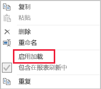

# 导入建模的数据缩减方法

本文面向开发导入模型的 Power BI Desktop 数据建模人员。 本文介绍的各种方法可用于缩减加载到导入模型中的数据。

导入模型所加载的数据经过压缩和优化，由 VertiPaq 存储引擎存储到磁盘。 源数据加载到内存中时，可能会被压缩数十倍，因此可以合理地预计 10 GB 的源数据可以压缩到大约 1 GB 的大小。 此外，保存到磁盘上时，还可以再缩减 20%。

尽管 VertiPaq 存储引擎效率高，但务必最大程度地压缩将要加载到模型中的数据。 对于大型模型（或预计会随时间而变大的模型）尤其如此。 以下是四个令人信服的原因：

- 容量可能不支持较大型的模型。 共享容量可以承载最多 1 GB 的模型，Premium 容量可以承载最多 13 GB 的模型。 有关详细信息，请参阅 [Power BI Premium 支持大型数据集](../service-premium-large-datasets.md)一文。
- 较小型的模型可以减少对容量资源（尤其是内存）的争用。 这使得可以在更长的时间内同时加载更多的模型，从而降低逐出率。 有关详细信息，请参阅 [Power BI Premium 部署](../whitepaper-powerbi-premium-deployment.md)白皮书中的[容量如何运作](../whitepaper-powerbi-premium-deployment.md#how-capacities-function)主题。
- 较小型的模型可以更快地刷新数据，从而降低延迟报告、获得更高的数据集刷新吞吐量以及减少源系统和容量资源的压力。
- 更小的表行数可以实现更快的计算评估，从而实现更优良的整体查询性能。

本文介绍了七种不同的数据缩减方法。 其中包括：

- [删除不必要的列](#remove-unnecessary-columns)
- [删除不必要的行](#remove-unnecessary-rows)
- [分组依据和汇总](#group-by-and-summarize)
- [优化列数据类型](#optimize-column-data-types)
- [自定义列的首选项](#preference-for-custom-columns)
- [禁用 Power Query 查询负载](#disable-power-query-query-load)
- [切换为混合模式](#switch-to-mixed-mode)

## 删除不必要的列

模型表列有以下两个主要用途：

- **报告**，用于实现报表设计，适当地筛选、分组和汇总模型数据
- 通过支持模型关系、模型计算、安全角色甚至数据颜色格式设置实现模型构造 

可能会删除不符合这些用途的列。 删除列称为垂直筛选  。

建议根据已知的报表设计需求设计具有适当列数的模型。 当然，这些需求可能会随时间而变化，但请牢记，之后添加列比之后删除列更为轻松。 删除列可能会破坏报表或模型结构。

## 删除不必要的行

模型表应尽可能少地加载行。 这一点可通过将筛选后的行集加载到模型表中来实现，原因有两个：按实体或时间进行筛选。 删除行称为水平筛选  。

按实体筛选需要将一部分源数据加载到模型中。  例如，不加载所有销售区域的销售情况，而只加载单个区域的销售情况。 这种设计方法将生成许多更小型的模型，还无需定义行级安全性（但需要在 Power BI 服务中授予特定的数据集权限，并创建连接到每个数据集的“副本”报表）。 可以使用 Power Query 参数和 Power BI 模板文件来简化管理和发布。 有关详细信息，请参阅[深入了解查询参数和 Power BI 模板](https://powerbi.microsoft.com/blog/deep-dive-into-query-parameters-and-power-bi-templates/)博客条目。

按时间筛选需要限制加载到事实型表中的数据历史记录的数量（以及限制加载到模型日期表中的日期行）。   建议不要自动加载所有可用的历史记录，除非这是已知的报告需求。 了解基于时间的 Power Query 筛选器可以参数化，甚至可以设置为使用相对时间周期（例如相对于刷新日期过去五年）会有所帮助。 此外请牢记，对时间筛选器进行回溯性更改不会破坏报表；只会导致报表中的可用数据历史记录减少（或增加）。

## 分组依据和汇总

缩减模型大小的最有效方法可能是加载预汇总数据。 此方法可用于提高事实型表的粒度。 但它有明显的取舍，即细节丢失。

例如，源销售事实数据表针对每个订单行存储一行。 通过汇总所有销售指标，以及按日期、客户和产品进行分组，可以显著减少数据。 那么请思考一下，按月份进行分组是否可以更为显著地减少数据  。 这可以将模型大小缩减 99%，但显然，不再可能设计日级别或单个订单级别的报表。 决定汇总事实型数据总是需要有所取舍。 混合模型设计可以减轻这种取舍，稍后将在[切换为混合模式](#switch-to-mixed-mode)主题中对此进行讨论。

## 优化列数据类型

VertiPaq 存储引擎为每个列使用单独的数据结构。 根据设计，这些数据结构会最大程度地优化使用值编码的数字列数据。 但文本和其他非数字数据使用的是哈希编码。 这要求存储引擎为列中包含的每个唯一文本值分配数字标识符。 而数字标识符之后存储在数据结构中，在存储和查询期间需要进行哈希查询。

在某些特定实例中，可以将源文本数据转换为数值。 例如，销售订单号可以始终以文本值为前缀（例如“SO123456”）。 前缀可以删除，订单数值可以转换为整数。 对于大型表，这可以显著减少数据，特别是当列包含唯一或高基数值时。

在本例中，建议将列“默认汇总”属性设置为“不汇总”。 这将有助于最大程度地减少不必要的订单数值的汇总。

## 自定义列的首选项

VertiPaq 存储引擎存储模型计算列（在 DAX 中定义），就像存储以 Power Query 为源的常规列一样。 但数据结构的存储方式略有不同，且通常压缩效率更低。 此外，它们是在加载所有 Power Query 表之后生成的，这可能会增加数据刷新时间。 因此，相较于以 Power Query computed 列（在 M 中定义）形式添加表列，以 calculated 列形式添加效率更低   。

首选项应为在 Power Query 中创建自定义列。 如果源是数据库，可通过以下两种方式实现更高的加载效率。 计算可在 SQL 语句中定义（使用提供程序的本机查询语言），也可具体化为数据源中的列。

但在某些实例中，模型计算列可能是更好的选择。 公式需要评估度量值，或需要 DAX 函数中才支持的特定建模功能时，就是这样。 有关此类示例的信息，请参阅[理解 DAX 中父-子级层次结构的函数](/dax/understanding-functions-for-parent-child-hierarchies-in-dax)一文。

## 禁用 Power Query 查询负载

拟支持与其他查询进行数据集成的 Power Query 查询不应加载到模型中。 要避免将查询加载到模型，请确保在这些实例中禁用查询加载。

## 切换为混合模式

在 Power BI Desktop 中，混合模式设计生成复合模型。 它基本上可以确定每个表的存储模式  。 因此，每个表均可将其“存储模式”属性设置为 Import 或 DirectQuery（Dual 是另一个选项）。

减小模型大小的有效方法是将较大的事实型表的“存储模式”属性设置为 DirectQuery。 注意，此设计方法可以与前文所述的[分组依据和汇总](#group-by-and-summarize)主题很好地结合使用。 例如，汇总的销售数据可用于设计高性能的“汇总”报表。 钻取页面可以显示特定（和有限）筛选器上下文的粒度销售，显示上下文中的所有销售订单。 在本例中，钻取页面将包含 DirectQuery 表中的视觉对象，以便检索销售订单数据。

但会导致许多与复合模型相关的安全性和性能影响。 有关详细信息，请参阅[在 Power BI Desktop 中使用复合模型](../desktop-composite-models.md)一文。

## 后续步骤

查看以下文章，了解有关 Power BI 导入模型设计的详细信息：

- [在 Power BI Desktop 中使用复合模型](../desktop-composite-models.md)
- [Power BI Desktop 中的存储模式](../desktop-storage-mode.md)
