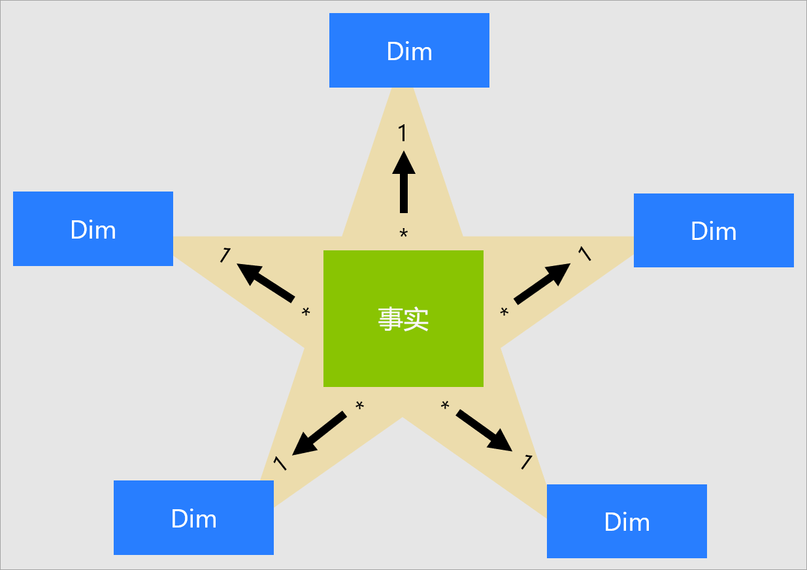
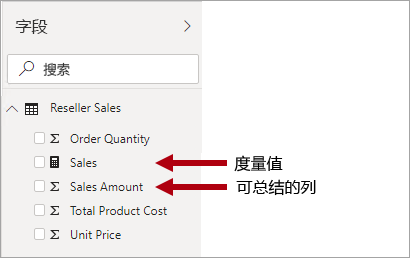
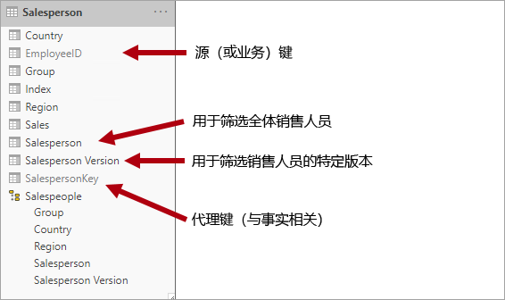
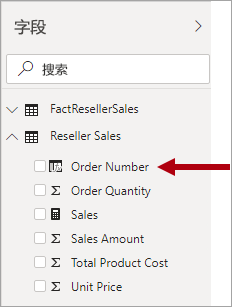

# 了解星型架构及其对 Power BI 的重要性

本文面向 Power BI Desktop 数据建模者。 本文介绍星型架构的设计及其与开发 Power BI 数据模型的关系，这些数据模型已针对性能和可用性进行优化。

本文不会完整地讨论星型架构的设计。 若要了解详细信息，请直接参阅已发布的内容，例如 Ralph Kimball 等人所作的“数据仓库工具包：  维度建模的完整指南（2002 年第 2 版）。

## 星型架构概述

星型架构是由关系数据仓库广泛采用的成熟建模方法  。 它要求建模者将其模型表分类为“维度”或“事实”   。

“维度表”描述了业务实体，即建模所需的“事物”  。 实体可以包含产品、人员、地点和概念，包括时间本身。 在星型架构中，最一致的表是日期维度表。 维度表包含用作唯一标识符的键列（一列或多列）以及描述性的列。

“事实数据表”存储观察信息或事件  。 这些可以是销售订单、股票结余、汇率、温度等。事实数据表包含与维度表和数值度量值列相关的维度键列。 维度键列确定事实数据表的维度，而维度键值确定事实数据表的粒度   。 例如，一个用于存储销售目标的事实数据表有两个维度键列：“Date”和“ProductKey”   。 很容易理解该表有两个维度。 但若不考虑维度键值，就无法确定粒度。 在本例中，假设“Date”列中存储的值是每月的第一天  。 在这种情况下产生的是月份-产品级别的粒度。

通常情况下，维度表包含的行数相对较少。 另一方面，事实数据表可能包含非常多的行，并行数会随着时间的推移不断增长。

## 与 Power BI 模型相关的星型架构

本文中引入的星型架构设计和许多相关概念与开发针对性能和可用性优化的 Power BI 模型紧密相关。

每个 Power BI 报表视觉对象都会生成发送到 Power BI 模型（Power BI 服务中称为数据集）的查询。 这些查询用于筛选、分组和汇总模型数据。 设计良好的模型则提供用于筛选、分组和汇总的表。 这很符合星型架构的设计原则：

- 维度表支持筛选和分组  
- 事实数据表支持汇总 

表类型（维度表或事实数据表）不是建模者通过设置某个表属性确认的，而是由模型关系确定。 模型关系在两个表之间建立筛选器传播路径，并且它是确定表类型的关系基数属性  。 常见的关系基数为“一对多”或反过来的“多对一”。 该关系中的“一”这一方始终是维度类型表，而“多”始终是事实类型的表。

结构良好的模型设计应包括维度类型的表或事实类型的表。 应避免在单个表中混用这两种类型。 此外，还建议尽可能地交付适当数量且具备适当关系的表。 还有一点也很重要，事实类型的表应始终以一致的粒度加载数据。

最后，请务必了解，优化模型设计是一门科学，也是一门艺术。 有时可以在得到良好指导的情况进行有意义的突破。

下面是很多与适用于 Power BI 模型的星系架构有关的其他概念。 其中包括：

- [度量值](#measures)
- [代理键](#surrogate-keys)
- [雪花维度](#snowflake-dimensions)
- [角色扮演维度](#role-playing-dimensions)
- [渐变维度](#slowly-changing-dimensions)
- [杂项维度](#junk-dimensions)
- [退化维度](#degenerate-dimensions)
- [无事实事实数据表](#factless-fact-tables)

## 度量值

在星型架构设计中，度量值是存储要汇总的值的事实数据表列  。

在 Power BI 模型中，度量值具有不同但类似的定义  。 它是一个采用[数据分析表达式 (DAX)](https://docs.microsoft.com/dax/data-analysis-expressions-dax-reference) 编写的公式，用于实现汇总。 度量值表达式通常利用 DAX 聚合函数（如 SUM、MIN、MAX、AVERAGE 等）在查询时生成标量值结果（值永远不会存储在模型中）。 度量值表达式涵盖广泛，从简单的列聚合到更复杂的公式（覆盖筛选器上下文和/或关系传播的公式）应有尽有。 有关详细信息，请阅读 [Power BI Desktop 中的 DAX 基本概念](https://docs.microsoft.com/power-bi/desktop-quickstart-learn-dax-basics)一文。

请务必了解 Power BI 支持实现汇总的第二种方法。 任何列（通常为数字列）都可以通过报表视觉对象或问答进行汇总。 这是为模型开发者提供的便利，因为在很多情况下都无需创建度量值。 例如，Adventure Works 经销商销售的“销售额”列可以通过多种方式进行汇总（包括 SUM、COUNT、AVERAGE、MEDIAN、MIN、MAX 等），无需为每种可能存在的聚合类型创建度量值  。

不过，即使对于简单的列级汇总，也需要创建度量值，在这一点上有两个具有说服力的原因：

- 如果知道报作者将使用[多维表达式 (MDX)](https://docs.microsoft.com/sql/analysis-services/multidimensional-models/mdx/mdx-query-the-basic-query?view=sql-server-2017) 查询模型，则该模型必须包含度量值。 MDX 无法实现列值的汇总。 这与使用 MDX 查询 Power BI 数据集的情况高度相关，也适用于使用[在 Excel 中分析](https://docs.microsoft.com/power-bi/service-analyze-in-excel)的情况（数据透视表发起 MDX 查询）。
- 接下来我们讨论需要确保报表作者只能以特定方式对列进行汇总的情况。 例如经销商销售的“单位价格”列（表示每个单位的费率）可以汇总，但只能使用特定的聚合函数进行汇总  。 在汇总时，绝不采用求和的方式，但可以使用其他聚合函数（MIN、MAX、AVERAGE 等）。 在本例中，建模者可以隐藏“单位价格”列，并为所有适用的聚合函数创建度量值  。

请注意，此设计方法非常适用于在 Power BI 服务中创作的报表和问答。 但是，Power BI Desktop 实时连接允许报表作者在“字段”窗格中显示隐藏的字段，这可能会绕过此设计方法  。

## 代理键

代理键是添加到表中以支持星型架构建模的一种唯一标识符  。 根据定义，它不会在源数据中进行定义或存储。 一般而言，代理键将添加到关系数据仓库维度表中，以便为每个维度表行提供唯一标识符。

Power BI 模型关系基于一个表中的单个唯一列，这会将筛选器传播到不同表中的单个列。 如果模型中的维度类型表不包含单个唯一列，则必须添加一个唯一标识符，使其成为关系中“一”的一方。 在 Power BI Desktop 中，可以通过创建 [Power Query 索引列](https://docs.microsoft.com/powerquery-m/table-addindexcolumn)轻松地实现此目的。

必须将此查询与“多”那一方的查询合并，以便还能向其中添加索引列。 在将这些查询加载到模型时，可以在模型表之间创建“一对多”关系。

## 雪花维度

雪花维度是单个业务实体的一组规范化表  。 例如，Adventure Works 按类别和子类别将产品分类。 类别分配给子类别，而产品又相应地分配给子类别。 在 Adventure Works 关系数据仓库中，“产品”维度经过了规范化并存储在三个相关表中：DimProductCategory、DimProductSubcategory 和 DimProduct    。

请想象这些规范化表位于事实数据表之外，形成雪花形状的设计。

在 Power BI Desktop 中，可以选择模仿雪花维度设计（可能是因为源数据如此），也可以将源表集成（非规范化）到单个模型表中。 一般而言，单个模型表的优点比多个模型表的优点更多。 最理想的决策取决于数据量和模型的可用性要求。

在选择模拟雪花维度设计时：

- Power BI 加载更多的表，从存储和性能角度而言，这样效率较低。 这些表必须包括支持模型关系的列，因此可能会导致模型较大。
- 需要遍历较长的关系筛选器传播链，与应用于单个表的筛选器相比，这可能效率更低。
- “字段”窗格向报表作者显示更多的模型表，这可能在体验上不太直观，特别是当雪花维度表只包含一列或两列时  。
- 不能创建跨越表的层次结构。

在选择集成到一个模型表中时，还可以定义一个层次结构，其中包含维度的最高和最低粒度。 冗余非规范化数据的存储可能会增加模型存储大小，尤其是在维度表很大的情况下。

## 渐变维度

渐变维度 (SCD) 是适当地管理维度成员随时间的变化的方法  。 它适用于随时间推移而变化的业务实体值，并且以即席方式进行。 渐变维度的一个很好的示例是客户维度，具体而言是其“联系人详细信息”列，如电子邮件地址和电话号码  。 与此相反，当维度属性经常发生变化时，会视为快速变化的维度，如股票的市场价格  。 这些实例中的常见设计方法是在事实数据表度量值中存储快速变化的属性值。

星型架构设计理论指两种常见的 SCD 类型：类型 1 和类型 2。 维度类型表可以是类型 1 或类型 2，或同时支持两种类型的不同列。

### 类型 1 SCD

类型 1 SCD 始终反映最新值，并在检测到源数据中的更改时简单地覆盖维度表数据   。 这种设计方法常用于存储附属值的列（例如客户的电子邮件地址或电话号码）。 当客户电子邮件地址或电话号码更改时，维度表会使用新值更新客户行。 就好像客户的联系信息一直是最新值一样。

Power BI 模型维度类型表的非增量刷新实现了类型 1 SCD 的结果。 它刷新表数据以确保加载最新值。

### 类型 2 SCD

类型 2 SCD支持维度成员的版本控制   。 如果源系统未存储版本，则通常是检测更改的数据仓库加载过程，并适当地管理维度表中的更改。 在这种情况下，维度表必须使用代理键来提供对维度成员的某个版本的唯一引用  。 它还包括定义版本的日期范围有效期的列（例如“开始日期”和“结束日期”），并可能包含标记列（例如“IsCurrent”），以便轻松地按当前维度成员进行筛选    。

例如，Adventure Works 将销售人员分配给销售区域。 当销售人员重定位区域时，必须创建新的销售人员版本，以确保历史记录事实与前一个区域保持关联。 为了能按销售人员准确地进行销售历史分析，维度表必须存储销售人员及其关联区域的各个版本。 该表还应包含开始和结束日期值，以定义有效期。 当前版本可以定义一个空的结束日期（或 12/31/9999），这指示该行是当前版本。 该表还必须定义代理键，因为业务键（此实例中的雇员 ID）不是唯一的。

请务必了解，当源数据不存储版本时，必须使用中间系统（如数据仓库）来检测和存储更改。 表加载过程必须保留现有数据并检测更改。 当检测到更改时，表加载过程必须让当前版本变为过期版本。 要做到这一点，它会更新结束日期值并插入新版本，并将上一版本的结束日期值用作新版本的开始日期值    。 此外，相关事实必须使用基于时间的查找来检索与事实日期相关的维度键值。 使用 Power Query 的 Power BI 模型无法实现此目的。 不过它可以从预加载的 SCD 类型 2 维度表加载数据。

Power BI 模型应支持查询成员的历史数据（不受更改影响），并支持对成员的某个版本进行查询，此版本表示成员某段时间内的特定状态。 在 Adventure Works 的示例中，可以查询销售人员，而无需考虑分配的销售区域，或查询销售人员的特定版本。

为实现此目的，Power BI 模型维度类型表必须包含用于筛选销售人员的列和用于筛选销售人员的特定版本的另一列。 版本列必须提供无歧义的说明，如“Michael Blythe (2008/12/15-2019/06/26)”或“Michael Blythe (最新版)”。 还必须让报表作者和使用者了解 SCD 类型 2 的基础知识，以及如何通过应用正确的筛选器来实现适当的报表设计。

在设计中，还有一个不错的做法是包括允许视觉对象向下钻取到版本级别的层次结构。

## 角色扮演维度

角色扮演维度是能以不同方式筛选相关事实的维度  。 例如，在 Adventure Works，日期维度表与经销商销售事实之间有三种关系。 可以使用同一维度表按订单日期、发货日期或交货日期筛选事实。

数据仓库中接受的设计方法是定义单个日期维度表。 在查询时，日期维度的“角色”是通过用于联接表的事实列建立的。 例如，在按订单日期分析销售情况时，表联接与经销商销售订单日期列相关。

在 Power BI 模型中，可以通过在两个表之间创建多个关系来模仿此设计。 在 Adventure Works 的示例中，数据和经销商销售表具有三种关系。 虽然这是可行的，但请务必了解两个 Power BI 模型表之间只能存在一个处于活动状态的关系。 所有其他关系都必须设置为非活动状态。 具有单个活动的关系意味着从日期到经销商销售有默认筛选器传播。 在此实例中，活动的关系设置为报表最常使用的筛选器，即 Adventure Works 的订单日期关系。

使用非活动关系的唯一方法是定义使用 [USERELATIONSHIP 函数](https://docs.microsoft.com/dax/userelationship-function-dax)的 DAX 表达式。 在我们的示例中，模型开发者必须创建度量值以按发货日期和交货日期分析经销商销售情况。 这可能比较繁琐，尤其是在经销商表定义了许多度量值的情况。 因为度量值过多，还会导致“字段”窗格混乱  。 还有其他一些限制：

- 当报表作者依赖于汇总列而不是定义度量值时，他们若不编写报表级别的度量值，就无法为非活动关系实现汇总。 在 Power BI Desktop 中创作报表时，只能定义报表级别的度量值。
- 如果在日期与经销商销售之间只有一个活动的关系路径，则无法同时按不同类型的日期对经销商销售数据进行筛选。 例如，不能生成按已发货销售额绘制订单日期销售额的视觉对象。

为克服这些限制，有一种常见的 Power BI 建模方法，就是为每个角色扮演实例创建维度类型表。 通常使用 DAX 将其他纬度表创建为[计算表](https://docs.microsoft.com/dax/calculatetable-function-dax)。 使用计算表时，该模型可以包含日期表、发货日期表和交货日期表，每个表与其对应的经销商销售表列之间都存在单一且活动的关系    。

此设计方法不要求为不同的日期角色定义多个度量值，并允许使用不同的日期角色同时进行筛选。 不过，使用这种设计方法有一个小小的代价，就是会有重复的日期维度表，从而导致增加模型的存储大小。 与事实类型表相比，维度类型表存储的行数会较少，所以这个问题并不是很重要。

为每个角色创建模型维度类型表时，请采用以下良好的设计做法：

- 确保使用自述性列名。 虽然所有日期表中都有一个“年份”列（列名在其表中是唯一的），但是默认视觉对象标题并不对其具备自述性  。 请考虑重命名每个维度角色表中的列，以便“发货日期”表中的列名为“发货年份”等   。
- 在适当的时候，请确保表说明可以向报表作者提供关于筛选器传播配置情况的反馈（通过“字段”窗格工具提示）  。 当模型包含用于筛选许多事实类型表的一般命名表（如日期）时，这种清晰度非常重要  。 例如，此表中有一个与经销商销售订单日期列之间的活动关系，请考虑提供类似于“按订单日期筛选经销商销售数据”的表描述。

## 杂项维度

如果有多个维度，特别是包含几个属性（可能只有一种）并且这些属性的值很少时，则杂项维度非常有用  。 合适的候选项包括订单状态列或客户人口统计列（性别、年龄分组等）。

杂项维度的设计目标是将多个“小”维度合并为一个维度，以减少模型的存储大小，还可以通过呈现更少的模型表来缓解“字段”窗格的混乱情况  。

杂项维度表通常是所有维度属性成员的笛卡尔积，具有代理键列。 代理键提供对表中每一行的唯一引用。 可以在数据仓库中构建维度，也可以通过使用 Power Query 创建执行[完整外部查询联接](https://docs.microsoft.com/powerquery-m/table-join)的查询，然后添加代理键（索引列）。

将此查询作为维度类型表加载到模型中。 还需要将此查询与事实查询合并，因此，索引列将加载到模型中，以支持创建“一对多”模型关系。

## 退化维度

退化维度指的是筛选所需的事实数据表的属性  。 Adventure Works 中有一个很好的例子，就是经销商销售订单号。 在这种情况下，创建仅包含这一列的独立表对模型设计并没有什么积极作用，因为这会增加模型的存储大小，并导致“字段”窗格混乱  。

在 Power BI 模型中，可以将销售订单号列添加到事实类型表，以允许按销售订单号进行筛选或分组。 对于之前介绍的“不应混用表格类型”规则（即模型表应是维度类型或者事实类型），这是一个例外情况。

## 无事实事实数据表

无事实事实数据表不包含任何度量值列  。 它仅包含维度键。

无事实事实数据表可以存储由维度键定义的观察值。 例如，在特定日期和时间，特定客户登录到你的网站。 你可以定义一个度量值以对无事实事实数据表中的行进行计数，从而对客户的登录时间和数量进行分析。

无事实事实数据表的更有力的用途是存储维度之间的关系，并且我们建议使用此 Power BI 模型设计方法定义“多对多”维度关系。 在“多对多”维度关系设计中，无事实事实数据表称为桥接表  。

例如，假设销售人员可以分配到一个或多个销售区域  。 桥接表将被设计为包含两列的无事实事实数据表：销售人员键和区域键。 这两列中可以存储重复的值。

这种“多对多”设计方法可以实现良好的文档记录，并且无需使用桥接表。 不过，当关联两个维度时，最佳做法还是使用桥接表方法。 若要了解详细信息，请参阅 [Power BI Desktop 中具有多对多基数的关系](https://docs.microsoft.com/power-bi/desktop-many-to-many-relationships)。

## 后续步骤

查看以下文章，详细了解星型架构设计或 Power BI 模型设计：

- [维度建模维基百科文章](https://go.microsoft.com/fwlink/p/?linkid=246459)
- [在 Power BI Desktop 中创建和管理关系](../desktop-create-and-manage-relationships.md)
- [Power BI Desktop 中具有多对多基数的关系](../desktop-many-to-many-relationships.md)
- [引导式建模学习体验](/learn/modules/model-data-power-bi/)