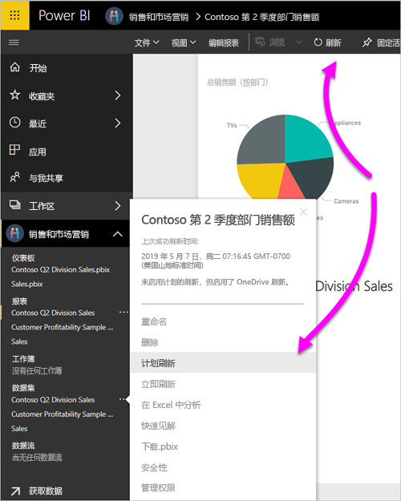

# 刷新 OneDrive 或 SharePoint Online 上存储的数据集
将 OneDrive 或 SharePoint Online 中的文件导入 Power BI 服务，可以有效确保在 Power BI Desktop 中所执行的操作与 Power BI 服务保持同步。

## 在 OneDrive 或 SharePoint Online 上存储 Power BI Desktop 文件的好处
如果你在 OneDrive 或 SharePoint Online 上存储 Power BI Desktop 文件，已加载到文件模型的任何数据都会被导入数据集。 在此文件中创建的任何报表都会被加载到 Power BI 服务中的“报表”  内。 假设你更改了 OneDrive 或 SharePoint Online 上的文件。 这些更改可以包括添加新度量值、更改列名或编辑可视化效果。 在你保存此文件后，Power BI 服务也会与这些更改同步，通常在大约一小时内完成。

可以直接在 Power BI Desktop 中手动执行一次性刷新操作，具体方法是选择“开始”  功能区上的“刷新”  。 选择“刷新”  后，就会使用原始数据源中更新后的数据来刷新文件模型。 这种刷新完全是在 Power BI Desktop 应用程序本身内发生。 它不同于 Power BI 中的手动刷新或计划刷新，请务必了解两者之间的区别。

如果导入 OneDrive 或 SharePoint Online 中的 Power BI Desktop 文件，就会将数据和模型信息加载到 Power BI 中的数据集。 建议刷新 Power BI 服务中的数据集，因为这是报表的基础。 因为数据源是外部数据源，所以可以使用“立即刷新”  来手动刷新数据集，也可以使用“计划刷新”  来创建刷新计划。 

在你刷新数据集时，Power BI 不会连接到 OneDrive 或 SharePoint Online 上的文件来查询更新后的数据。 而是使用数据集中的信息来直接连接到数据源，并查询更新后的数据。 然后，它再将相应数据加载到数据集中。 数据集中此类刷新后的数据不会同步回 OneDrive 或 SharePoint Online 上的文件。

## 支持的功能有哪些？
对于通过从本地驱动器导入的 Power BI Desktop 文件创建的数据集，Power BI 支持“立即刷新”  和“计划刷新”  功能。在本地驱动器中，可使用“获取数据”  或“查询编辑器”  连接到以下数据源，并从以下数据源加载数据。

### Power BI Gateway - Personal
* Power BI Desktop 的“获取数据”  和“查询编辑器”  中显示的所有联机数据源。
* Power BI Desktop 的“获取数据”  和“查询编辑器”  中显示的所有本地数据源，Hadoop 文件 (HDFS) 和 Microsoft Exchange 除外。

<!-- Refresh Data sources-->
[!INCLUDE [refresh-datasources](./includes/refresh-datasources.md)]

> [!NOTE]
> 必须安装一个网关并运行该网关，才能使 Power BI 连接到本地数据源并刷新数据集。
> 
> 

## OneDrive 或 OneDrive for Business。 有什么区别？
如果同时拥有个人版 OneDrive 和 OneDrive for Business，应在 OneDrive for Business 中保留要导入 Power BI 的所有文件。 原因如下：你有可能使用两个不同的帐户登录到它们。

可以在 Power BI 中轻松连接到 OneDrive for Business，因为 Power BI 帐户通常与 OneDrive for Business 帐户相同。 对于个人版 OneDrive，通常使用其他 [Microsoft 帐户](https://account.microsoft.com)登录。

如果使用 Microsoft 帐户登录，请务必选中“保持登录状态”  。 随后，Power BI 可以将你在 Power BI Desktop 中对文件执行的所有更新都与 Power BI 中的数据集同步。

如果已更改 Microsoft 凭据，便无法在 OneDrive 上的文件与 Power BI 中的数据集之间同步更改。 必须连接到 OneDrive，并重新从中导入文件。

## 如何设置计划刷新？
如果你创建刷新计划，Power BI 会直接连接到数据源。 Power BI 使用数据集中的连接信息和凭据来查询更新后的数据。 然后，Power BI 将更新后的数据加载到数据集中。 随后，它根据 Power BI 服务中的相应数据集，更新任何报表可视化效果和仪表板。

若要详细了解如何创建计划刷新，请参阅[配置计划刷新](refresh-scheduled-refresh.md)。

## 出现问题时
出现问题通常是因为 Power BI 无法登录数据源。 如果数据集尝试连接到本地数据源，但网关处于脱机状态，也可能会出现问题。 为了避免这些问题，请确保 Power BI 可以登录数据源。 请尝试在“数据源凭据”  中登录数据源。 有时，用于登录数据源的密码会更改；有时，Power BI 会从数据源注销。

如果已保存对 OneDrive 上 Power BI Desktop 文件的更改，但在大约 1 小时内未在 Power BI 上看到这些更改，可能是因为 Power BI 无法连接到 OneDrive。 再次尝试连接到 OneDrive 上的文件。 如果看到登录提示，请务必选中“保持登录状态”  。 由于 Power BI 无法连接到 OneDrive 以与文件同步，因此你需要重新导入文件。

请确保选中**刷新失败时发送电子邮件通知**。 你会想立即了解计划刷新是否失败。

## 故障排除
有时可能不会按预期方式刷新数据。 与网关连接时，通常会遇到数据刷新问题。 请查看网关故障排除文章，了解相关工具和已知问题。

[本地数据网关故障排除](service-gateway-onprem-tshoot.md)

[Power BI Gateway - Personal 故障排除](service-admin-troubleshooting-power-bi-personal-gateway.md)

更多问题？ 请尝试在 [Power BI 社区](https://community.powerbi.com/)中提问

