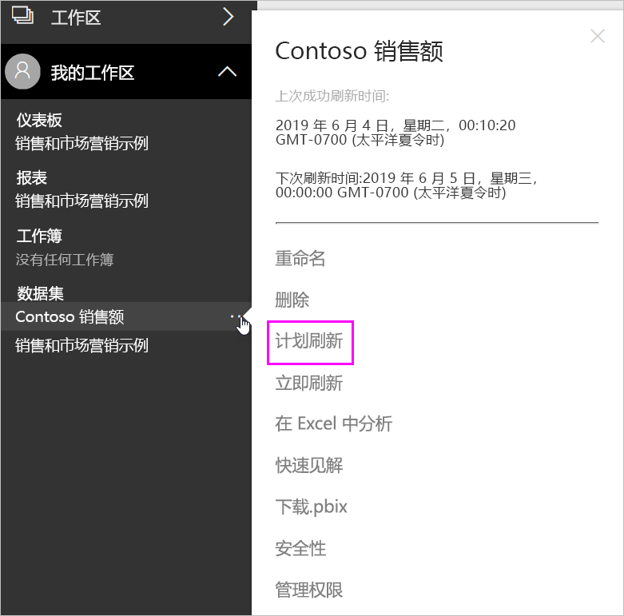
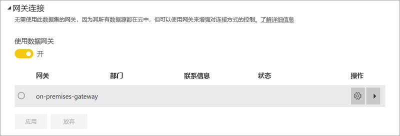
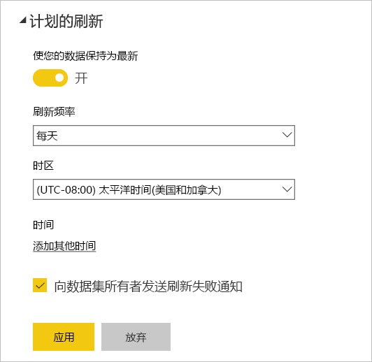

# 配置计划刷新

>[!NOTE]
>非活动状态持续两个月后，你的数据集上的计划刷新会暂停。 有关详细信息，请参阅本文后面的[*计划刷新*](#scheduled-refresh)。

本文将介绍可用于[本地数据网关（个人模式）](service-gateway-personal-mode.md)和[本地数据网关](service-gateway-onprem.md)计划刷新的选项。 在 Power BI 服务的以下领域中指定刷新选项：“网关连接”、“数据源凭据”和“计划刷新”    。 我们将依次介绍每个选项。 有关数据刷新的详细信息（包括刷新计划的限制），请参阅[数据刷新](refresh-data.md#data-refresh)。

若要访问“计划刷新”屏幕，请执行以下操作  ：

1. 在导航窗格中，选择“数据集”下所列的某个数据集旁边的“更多选项”(…)   。
2. 选择“计划刷新”  。

    

## 网关连接

根据你拥有联机可用的个人网关还是企业网关，将会看到不同的选项。

如果没有网关可用，将看到“网关连接”处于禁用状态  。 你还将看到一条消息，指出如何安装个人网关。

如果已配置个人网关且其处于联机状态，则该网关可供选择。 如果不可用，它将显示脱机。

你还可以选择企业网关（如果有）。 如果你的帐户在针对给定网关配置的数据源的“用户”选项卡中列出，则你只会看到企业网关可用  。

## 数据源凭据

### Power BI Gateway - Personal

如果使用个人网关来刷新数据，则必须提供用于连接到后端数据源的凭据。 如果已从一项联机服务连接到内容包，则会为计划刷新保留输入用于连接的凭据。

仅当首次在数据集上使用刷新时，才会要求登录数据源。 输入后，这些凭据将随数据集一起保留。

> [!NOTE]
> 对于部分身份验证方法，如果用于登录数据源的密码过期或发生更改，则还需要更改“数据源凭据”中的数据源密码  。

出现故障时，问题通常与网关处于脱机状态（因为其无法登录 Windows 并启动服务）有关，或与 Power BI 无法登录数据源以便查询更新数据有关。 如果刷新失败，请检查数据集的设置。 如果网关服务处于脱机状态，则将在“状态”中看到错误  。 如果 Power BI 无法登录数据源，你将收到数据源凭据错误。

### 本地数据网关

如果使用本地数据网关来刷新数据，则不需要提供凭据，因为凭据由网关管理员为数据源定义。

> [!NOTE]
> 连接到本地 SharePoint 进行数据刷新时，Power BI 仅支持匿名  、基本  和 Windows (NTLM/Kerberos)  身份验证机制。 对于本地 SharePoint 数据源的数据刷新，Power BI 不支持 *ADFS* 或任何基于表单的身份验证机制。 

## 计划的刷新

可在“计划刷新”部分定义刷新数据集的频率和时间段  。 部分数据源不需要使用网关即可进行刷新配置；其他数据源则需要使用网关。

将“使你的数据保持为最新”滑块设为“开”来配置设置   。

> [!NOTE]
> 目标是在计划时间段的 15 分钟内启动刷新，但如果服务无法更快地分配所需资源，则可能会延迟最多一小时。

> [!NOTE]
> 非活动状态持续两个月后，你的数据集上的计划刷新会暂停。 在没有用户访问基于数据集构建的任何仪表板或报表时，将数据集视为不活动。 此时，系统将向数据集所有者发送一封电子邮件，指示已暂停计划的刷新。 然后，数据集的刷新计划将显示为“禁用”  。 要恢复计划刷新，只需重新访问基于数据集构建的任何仪表板或报表。

## 支持的功能有哪些？

对于计划刷新的不同网关，支持某些特定数据集。 下面是用来了解可用内容的参考。

### Power BI Gateway - Personal

**Power BI Desktop**

* Power BI Desktop 的“获取数据”和“查询编辑器”中显示的所有联机数据源  。
* Power BI Desktop 的“获取数据”和“查询编辑器”中显示的所有本地数据源，Hadoop 文件 (HDFS) 和 Microsoft Exchange 除外  。

**Excel**

* Power Query 中显示的所有联机数据源。
* Power Query 中显示的所有本地数据源，Hadoop 文件 (HDFS) 和 Microsoft Exchange 除外。
* Power Pivot 中显示的所有联机数据源。
* Power Pivot 中显示的所有本地数据源，Hadoop 文件 (HDFS) 和 Microsoft Exchange 除外。

> [!NOTE]
> 在 Excel 2016 及更高版本中，Power Query 在功能区“数据”部分的“获取和转换数据”下列出   。

### Power BI Gateway

有关支持的数据源的信息，请参阅 [Power BI 数据源](power-bi-data-sources.md)。

## 故障排除
有时可能不会按预期方式刷新数据。 通常，这会是与网关连接出现的问题。 请查看网关故障排除文章，了解相关工具和已知问题。

- [本地数据网关故障排除](service-gateway-onprem-tshoot.md)
- [Power BI Gateway - Personal 故障排除](service-admin-troubleshooting-power-bi-personal-gateway.md)

## 后续步骤

- [Power BI 中的数据刷新](refresh-data.md)  
- [Power BI Gateway - Personal](service-gateway-personal-mode.md)  
- [本地数据网关（个人模式）](service-gateway-onprem.md)  
- [本地数据网关故障排除](service-gateway-onprem-tshoot.md)  
- [Power BI Gateway - Personal 故障排除](service-admin-troubleshooting-power-bi-personal-gateway.md)  

更多问题？ [尝试咨询 Power BI 社区](https://community.powerbi.com/)