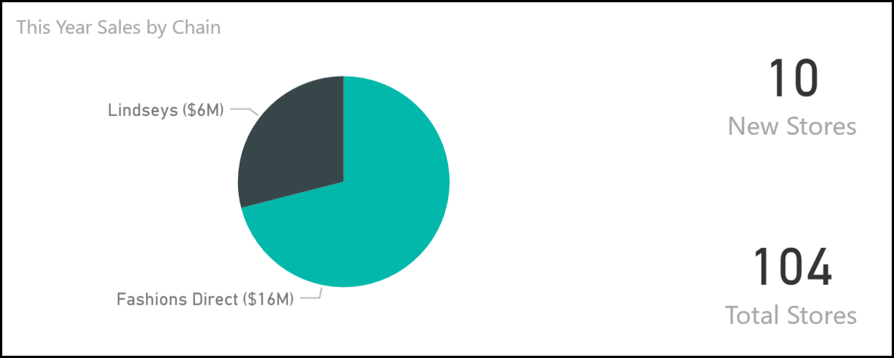
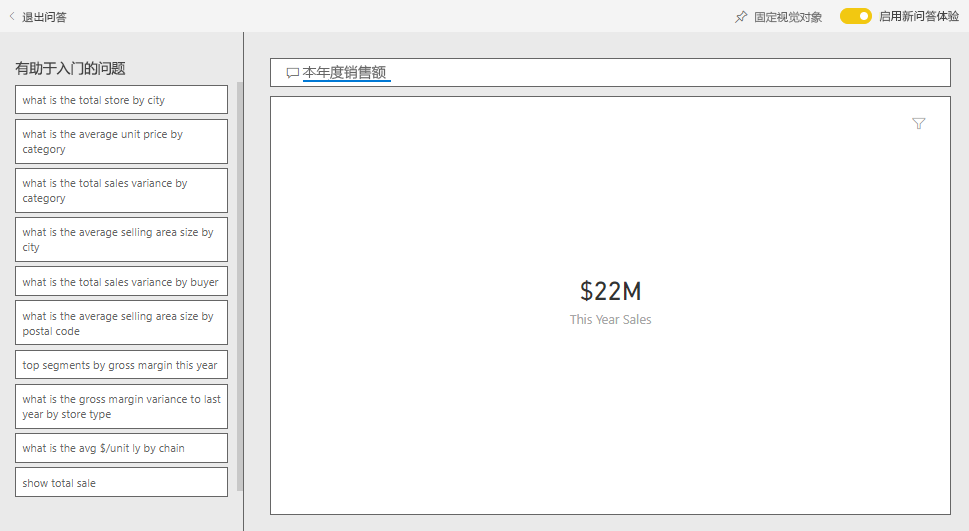
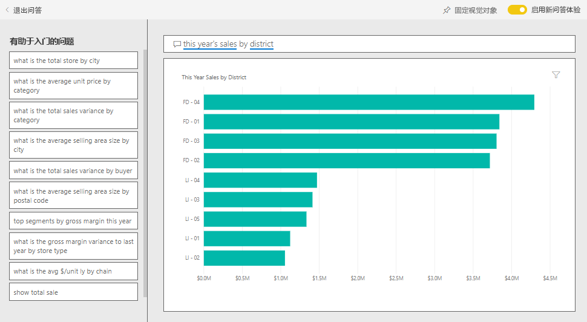
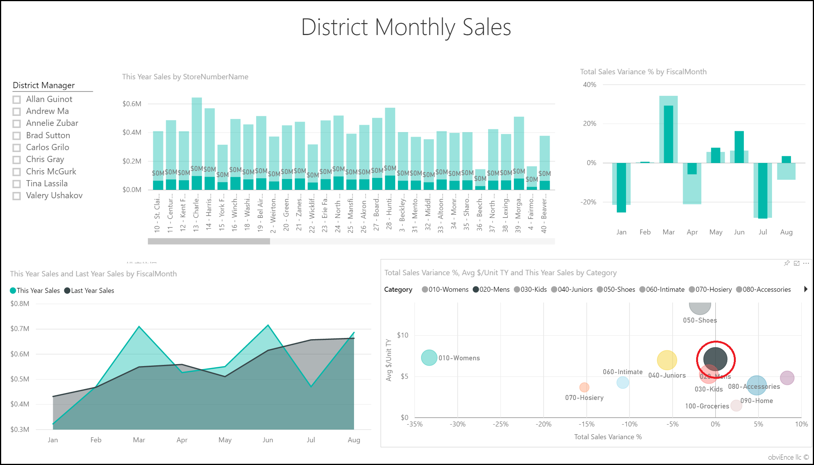
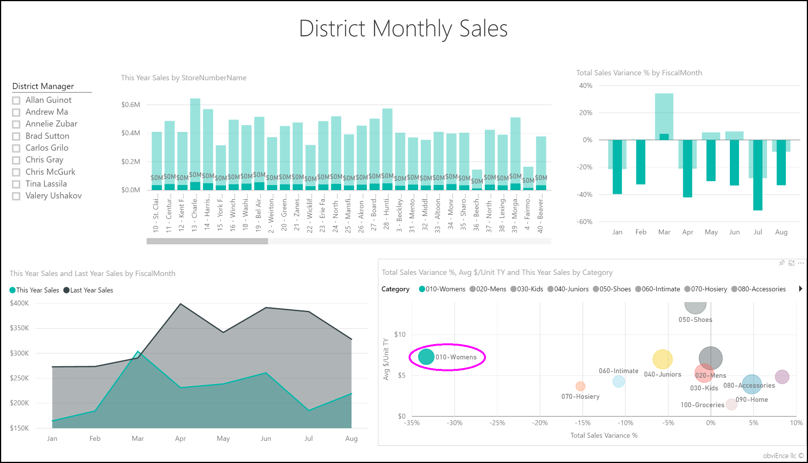
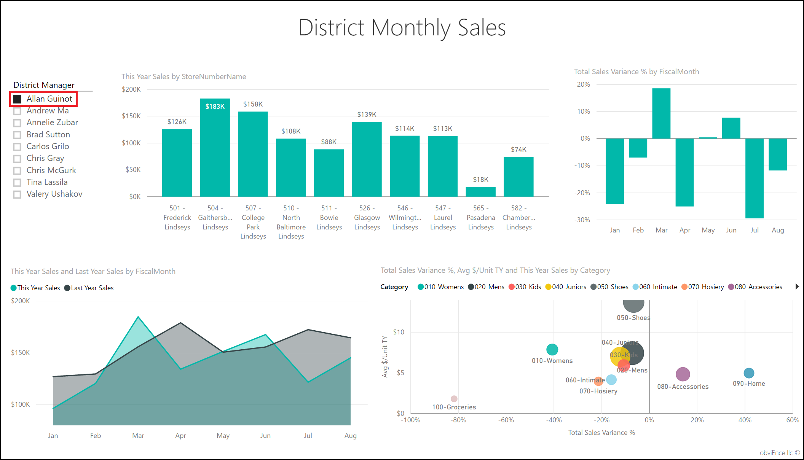
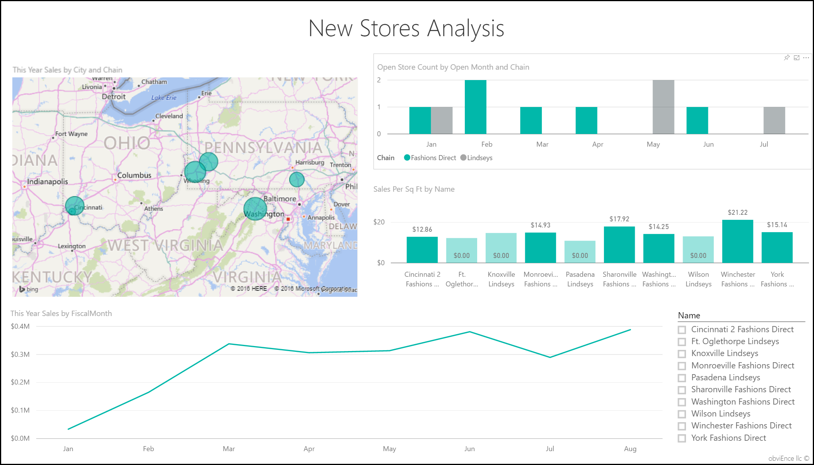

# Power BI 的零售分析示例：参观

“零售分析示例”内容包包含仪表板、报告和数据集，用于分析跨多个商店和地区销售的商品的零售数据。 此指标将今年与去年的销售额、单位数、毛利、差额，以及新店铺分析进行比较。 

此示例是一系列示例的一部分，展示了如何将 Power BI 与面向业务的数据、报表和仪表板结合使用。 它是使用 [obviEnce](http://www.obvience.com/) 提供的真实数据（已经过匿名处理）进行创建。 数据可采用以下几种格式：内容包、.pbix Power BI Desktop 文件或 Excel 工作簿。 请参阅[用于 Power BI 的示例](sample-datasets.md)。 

本教程探讨了 Power BI 服务中的零售分析示例内容包。 由于报表体验在 Power BI Desktop 和服务中非常相似，因此也可以使用 Power BI Desktop 中的示例 .pbix 文件跟着本教程一起操作。 

不需要 Power BI 许可证即可在 Power BI Desktop 中查看示例。 如果没有 Power BI Pro 许可证，可以将该示例保存到 Power BI 服务中的“我的工作区”。 

## 获取示例

 必须先将示例下载为[内容包](#get-the-content-pack-for-this-sample)、[.pbix 文件](#get-the-pbix-file-for-this-sample)或 [Excel 工作簿](#get-the-excel-workbook-for-this-sample)，然后才能使用它。

### 获取内容包形式的此示例

1. 打开并登录 Power BI 服务 (app.powerbi.com)，然后打开要在其中保存此示例的工作区。 

    如果没有 Power BI Pro 许可证，可以将该示例保存到“我的工作区”。

2. 选择左下角的“获取数据”  。

    
3. 在随即显示的“获取数据”  页上，选择“示例”  。
   
4. 依次选择“零售分析示例”  和“连接”  。  
  
   
   
5. 此时，Power BI 导入内容包，然后向当前工作区添加新的仪表板、报表和数据集。
   
   
  
### 获取 .pbix 文件形式的此示例

也可以将此零售分析示例下载为 [.pbix 文件](http://download.microsoft.com/download/9/6/D/96DDC2FF-2568-491D-AAFA-AFDD6F763AE3/Retail%20Analysis%20Sample%20PBIX.pbix)，这是专用于 Power BI Desktop 的文件格式。 

### 获取 Excel 工作簿形式的此示例

若要查看此示例的数据源，还可以将它下载为 [Excel 工作簿](http://go.microsoft.com/fwlink/?LinkId=529778)。 该工作簿包含你可以查看和修改的 Power View 工作表。 若要查看原始数据，请启用“数据分析”加载项，再依次选择“Power Pivot”>“管理”  。 若要启用 Power View 和 Power Pivot 加载项，请参阅[从 Excel 本身内查看 Excel 示例](sample-datasets.md#optional-take-a-look-at-the-excel-samples-from-inside-excel-itself)，以了解详细信息。

## 启动仪表板并打开报表

1. 在保存示例的工作区中，打开“仪表板”  选项卡，然后找到“零售分析示例”  仪表板，并选择它。 
2. 在仪表板中，选择“总商店新增及现有商店”  磁贴，以打开“零售分析示例”报表中的“商店销售额概述”  页面。 

     

   在此报表页上，会看到我们总共有 104 家商店，其中 10 家是新商店。 我们有两个供应链，Fashions Direct 和 Lindseys。 Fashions Direct 商店平均面积要大一些。
3. 在“按供应链划分的本年度销售额”  饼图中，选择“Fashions Direct”  。

     

   请注意“总销售差额百分比”  气泡图中的结果：

     

   FD-01  地区平均“每平方英尺的销售额”  最高，FD-02 与去年相比“总销售额方差”  最低。 FD-03 和 FD-04 总体绩效最差。
4. 选择单个气泡或其他图表以查看交叉突出显示，从而透露你选择的影响。
5. 要返回到仪表板，选择顶部导航栏中的“零售分析示例”  。

   
6. 在仪表板中，选择“本年度销售额新增及现有商店”  磁贴，这等同于在问答框中键入“本年度销售额”  。

   

   将显示问答结果：

   

## 查看使用 Power BI 问答创建的磁贴
我们将更具体地进行说明。

1. 将问题更改为*按**地区**划分本年度销售额*。 观察结果：问答会自动将答案放在条形图中，并建议其他短语：

   
2. 现在，将问题更改为***按邮编和供应链**划分的本年度销售额*。

   请注意 Power BI 在你键入并显示适当相应时是如何回答此问题的。
3. 尝试更多问题并查看所获得的结果类别。
4. 准备好后，返回到仪表板。

## 深入了解数据
现在，让我们更详细地浏览下结果，了解下各地区的绩效。

1. 在仪表板中，选择“本年度销售额，上年度销售额”  磁贴，这将打开报表的“地区每月销售额”  页。

   

   在“按会计月划分的总销售差额百分比”  图表中，注意方差百分比与去年相比的大型方差变化，其中 1 月、4 月和 7 月特别糟糕。

   

   我们来看看是否可以缩小问题范围。
2. 在气泡图中，选择“020-男性”  气泡。

     

   观察到虽然男性类别在 4 月的影响不如整体业务严重，但是 1 月和 7 月仍是问题月。
1. 选择“010-女性”  气泡。

   

   注意，女性类别在所有月份的表现都比整体业务糟糕许多，并且与去年相比，几乎每个月都更糟。
1. 再次选择气泡以清除筛选器。

## 尝试切片器
让我们来看看具体地区的情况。

1. 在左上角的“地区经理”  切片器中选择“Allan Guinot”  。

   

   注意，Allan 地区在 3 月和 6 月的表现都超过去年。
2. 在“Allan Guinot”  仍处于选中状态情况下，选择气泡图中的”女性-10”  气泡。

   

   请注意，对于“女性-10”类别，Allan 地区的销量没有达到去年水平。
3. 探索其他地区经理及类别；你还能发现什么其他见解？
4. 准备就绪后，返回到仪表板。

## 数据显示有关本年度的销售额增长情况
最后要探讨的领域是通过考察今年新开的商店来实现增长。

1. 选择“今年开业的按开放月和供应链划分的商店”  磁贴，这将打开报表的“新商店分析”  页。

   

   显而易见，今年开业的 Fashions Direct 商店比 Lindseys 商店多。
2. 观察“按名称划分的每平方英尺的销售额”  图表：

   

    注意新店每平方英尺平均销售额的差异。
3. 选择右上方“按开放月和供应链划分的开店数”  图表中的“Fashions Direct”  图例项。 注意，即使针对同一个供应链，最好的商店 (Winchester Fashions Direct) 表现明显比最差的商店 (Cincinnati 2 Fashions Direct) 要好，分别是 21.22 美元与 12.86 美元。

   
4. 在“名称”  切片器中选择“Winchester Fashions Direct”  ，并观察折线图。 2 月份报告的第一批销售数字。
5. 在切片器中选择“Cincinnati 2 Fashions Direct”  ，你将会在折线图中看到它于 6 月开业，似乎是表现最不好的店。
6. 通过选择图表中的其他条形图、折线图和气泡图来了解情况，看看你能发现什么见解。

## 后续步骤：连接到你的数据
可以在此环境中安全操作，因为能够选择不保存更改。 不过，如果确实保存了更改，可随时选择“获取数据”  来获取此示例的新副本。

我们希望本教程已经演示 Power BI 仪表板、问答和报表如何能够帮助深入了解示例数据。 现在轮到你了；立即连接到你自己的数据。 借助 Power BI，可以连接到各种数据源。 若要了解详细信息，请参阅 [Power BI 服务入门](service-get-started.md)。
