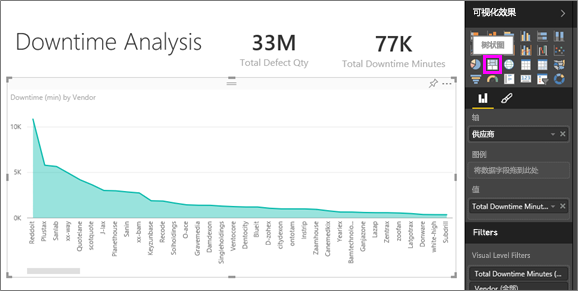
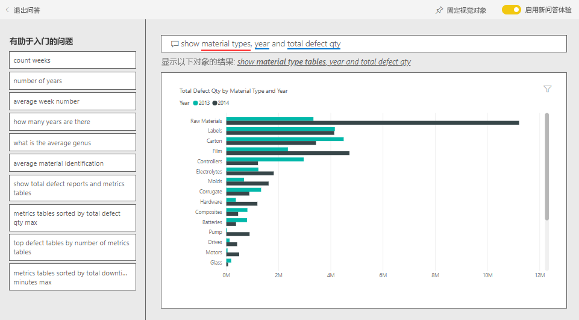
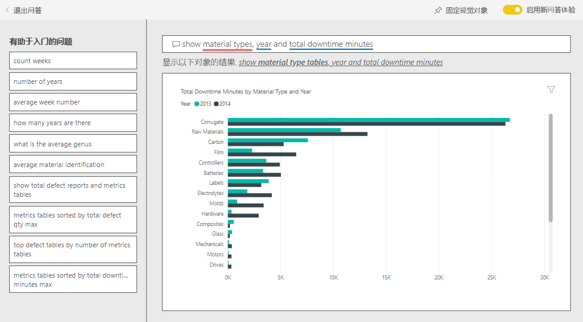
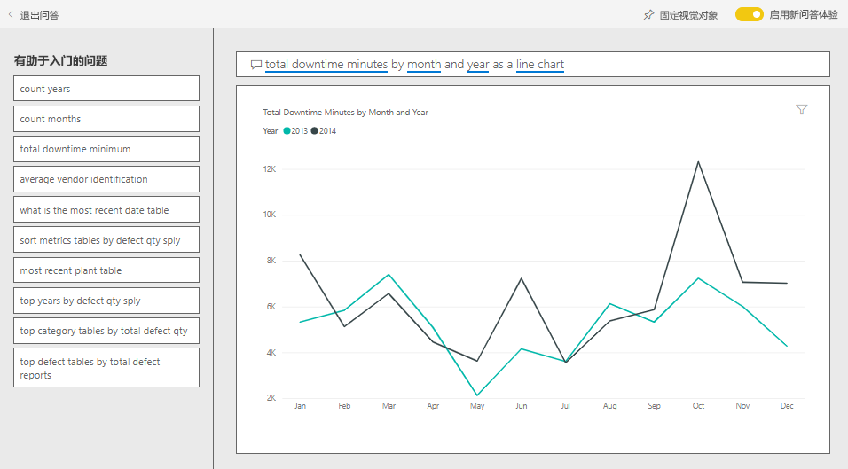

# Power BI 的供应商质量分析示例：参观

此行业示例仪表板与基础报表着重于传统供应链的其中一项挑战 - 供应商质量分析。 有两个主要度量值在此分析中发挥作用：瑕疵品总数和瑕疵品所造成的停工时间总计。 

此示例有两个主要目标：

* 了解就质量而言，哪家供应商最好，哪家供应商最差。
* 指出哪些工厂在找出及淘汰瑕疵品方面表现较佳，从而最大限度地缩短了停工时间。

此示例是一系列示例的一部分，展示了如何将 Power BI 与面向业务的数据、报表和仪表板结合使用。 它是使用 [obviEnce](http://www.obvience.com/) 依据真实数据（已经过匿名处理）进行创建的。 数据可采用以下几种格式：内容包、.pbix Power BI Desktop 文件或 Excel 工作簿。 请参阅[用于 Power BI 的示例](sample-datasets.md)。 

本教程介绍 Power BI 服务中的供应商质量分析示例内容包。 由于报表体验在 Power BI Desktop 和服务中非常相似，因此也可以使用 Power BI Desktop 中的示例 .pbix 文件跟着本教程一起操作。 

不需要 Power BI 许可证即可在 Power BI Desktop 中查看示例。 如果没有 Power BI Pro 许可证，可以将该示例保存到 Power BI 服务中的“我的工作区”。 

## 获取示例

必须先将示例下载为[内容包](#get-the-content-pack-for-this-sample)、[.pbix 文件](#get-the-pbix-file-for-this-sample)或 [Excel 工作簿](#get-the-excel-workbook-for-this-sample)，然后才能使用它。

### 获取内容包形式的此示例

1. 打开并登录 Power BI 服务 (app.powerbi.com)，然后打开要在其中保存此示例的工作区。

   如果没有 Power BI Pro 许可证，可以将该示例保存到“我的工作区”。

2. 选择左下角的“获取数据”  。
   
   
3. 在随即显示的“获取数据”  页上，选择“示例”  。
   
4. 依次选择“供应商质量分析示例”  和“连接”  。  
   
   

5. 此时，Power BI 导入内容包，然后向当前工作区添加新的仪表板、报表和数据集。
   
   
  
### 获取 .pbix 文件形式的此示例

也可以将此供应商质量分析示例下载为 [.pbix 文件](http://download.microsoft.com/download/8/C/6/8C661638-C102-4C04-992E-9EA56A5D319B/Supplier-Quality-Analysis-Sample-PBIX.pbix)，这是专用于 Power BI Desktop 的文件格式。

### 获取 Excel 工作簿形式的此示例

若要查看此示例的数据源，还可以将它下载为 [Excel 工作簿](http://go.microsoft.com/fwlink/?LinkId=529779)。 该工作簿包含你可以查看和修改的 Power View 工作表。 若要查看原始数据，请启用“数据分析”加载项，再依次选择“Power Pivot”>“管理”  。 若要启用 Power View 和 Power Pivot 加载项，请参阅[从 Excel 本身内查看 Excel 示例](sample-datasets.md#optional-take-a-look-at-the-excel-samples-from-inside-excel-itself)，以了解详细信息。

## 用料瑕疵所造成的停工时间
让我们来分析用料瑕疵所造成的停工时间，并查看应由哪些供应商负责。  

1. 在仪表板中，选择“瑕疵品总数”或“停工时间总分钟数”图块   。

     

   “供应商质量分析示例”报表会打开“停工时间分析”页面  。

   可以看到瑕疵品总数为 3,300 万，导致总停工时间达 77,000 分钟。 尽管部分用料的瑕疵品相对较少，但它们会导致延误，从而导致更长的停工时间。 让我们在报表页面上浏览这些项目。  
2. 查看“按用料类型划分的瑕疵品和停工时间(分钟)”组合图中的“停工时间总分钟数”一行，我们发现起皱的用料导致的停工时间最长   。  
3. 选择“起皱”列可以查看受此瑕疵影响最大的工厂以及负责的供应商  。  

     
4. 在“各工厂停工时间(分钟)”地图中，依次选择地图中的各个工厂，查看哪家供应商或哪种用料该为各工厂的停工时间负责  。

### 哪些供应商最差？
 我们想要找出最差的八家供应商，并决定他们的停工时间百分比责任归属。 为此，我们可以将“按供应商划分的停工时间(分钟)”分区图更改为树状图  。  

1. 在报表的“停工时间分析”页面中，选择左上角方的“编辑报表”   。  
2. 选择“按供应商划分的停工时间(分钟)”分区图，并在“可视化效果”窗格中选择“树状图”图标    。  

     

    树状图会自动将“供应商”字段作为“组”   。  

      

   从此树状图中，我们可以看到前八个供应商是树状图左侧的八个区块。 我们也可以看到它们应为约 50% 的停工时间总分钟数承担责任。  
3. 在顶部导航栏中选择“供应商质量分析示例”，返回到仪表板  。

### 工厂比较
现在让我们来探索哪些工厂在管理瑕疵用料方面表现较佳，从而缩短了停工时间。  

1. 在仪表板中，选择“按工厂和瑕疵类型划分的总瑕疵报表”地图图块  。      

     

   报表会打开“供应商质量分析”页面  。  

2. 在“按工厂和瑕疵类型划分的总瑕疵报表”图例中，选择“有影响”圆圈   。  

      

    可以看到，在气泡图中，“物流”是问题最多的类别  。 该类别中的总瑕疵量、瑕疵报告次数和停工分钟数最多。 让我们进一步研究此类别。  
3. 在气泡图中选择“物流”气泡，并观察伊利诺斯州斯普林菲尔德市和伊利诺伊州内伯威尔市的工厂  。 内伯威尔市似乎在管理瑕疵供货方面做得更好，因为它的退货量较高，影响量也较小，而斯普林菲尔德市的影响量就较大。  

     
4. 在顶部导航栏中选择“供应商质量分析示例”，返回到仪表板  。

## 哪种类型的用料管理最佳？
管理最佳的用料类型是指无论瑕疵品数量如何，都具有最低的停工时间或不造成任何影响的类型。

1. 在仪表板中，查看**按用料类型和瑕疵类型划分的瑕疵品总数**磁贴。

   

   可以看到，尽管“原料”用料类型的总瑕疵品数较大，但大部分瑕疵品会被退货或不会造成影响  。

   由此确认，尽管瑕疵品数量高，该用料类型不会造成大量的停工时间。

2. 在仪表板中，查看**按用料类型划分的瑕疵品总数和停工时间总分钟数**磁贴。

   

   原料受到妥善管理，尽管瑕疵品数量较高，但停工时间总分钟数较低。

### 按年份比较瑕疵品与停工时间的关系
1. 选择“按工厂和瑕疵类型划分的总瑕疵报表”地图图块，将报表打开至“供应商质量分析”页面   。
2. 在“瑕疵品总数(按月份和年份)”图表中，可以看到 2014 年的瑕疵品总数高于 2013 年  。  

      
3. 瑕疵品多代表停工时间一定也更多吗？ 在问答框中提问可以找出答案。  
4. 在顶部导航栏中选择“供应商质量分析示例”，返回到仪表板  。  
5. 既然我们知道“原料”具有最高数量的瑕疵品，可在问题框中键入“显示用料类型、年份和瑕疵品总数”  。  

    2014 年的原料瑕疵品数量比 2013 年高很多。  

      
6. 现在，将问题改为“显示用料类型、年份和停工时间总分钟数” __ 。  

   

   可以看到，虽然 2014 年的原料瑕疵品更多，但 2013 年和 2014 年的原料停工时间差不多。 2014 年原料瑕疵品更多并未导致 2014 年原料停工时间长太多。

### 按月份比较瑕疵品与停工时间的关系
让我们看看另一个与瑕疵品总数相关的仪表板磁贴。  

1. 选择左上角的“编辑问答”，返回到仪表板  。  

    进一步查看“瑕疵品总数(按月份和年份)”图块  。 可发现 2014 年上半年的瑕疵品数与 2013 年非常接近，但 2014 年下半年的瑕疵品数大幅增加。  

      

    我们来看看瑕疵品数的增加是否会导致停工时间分钟数也跟着增加。  
2. 在问题框中键入“按月份和年份划分的停工时间总分钟数折线图”  。  

   

   除了六月和十月停工时间分钟数激增外，瑕疵品数量并未导致停工时间显著增加。 这意味着我们很好地完成了瑕疵品管理工作。  
3. 要将此图表固定到仪表板，请选择问题框上方的  固定图标。  
4. 若要浏览离群值月份，可提出问题（例如“工厂 10 月份的停工时间总分钟数”），按用料类型、工厂位置、类别等查看 10 月的停工时间分钟数  。 
5. 选择左上角的“编辑问答”，返回到仪表板  。

## 后续步骤：连接到数据
可以在此环境中安全操作，因为能够选择不保存更改。 不过，如果确实保存了更改，可随时选择“获取数据”  来获取此示例的新副本。

我们希望本教程已经演示 Power BI 仪表板、问答和报表如何能够帮助深入了解示例数据。 现在轮到你了；立即连接到你自己的数据。 借助 Power BI，可以连接到各种数据源。 若要了解详细信息，请参阅 [Power BI 服务入门](service-get-started.md)。
