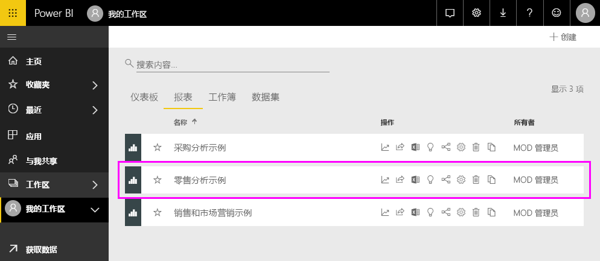

#  连接到 Power BI 服务中的示例

本教程介绍如何： 
- 导入示例内容包、将其添加到 Power BI 服务以及打开内容。 内容包  是一种示例类型，其中，数据集与仪表板和报表捆绑在一起。 
- 在 Power BI Desktop 中打开示例 .pbix 文件。

如需更多背景信息，请参阅 [Power BI 的示例数据集](sample-datasets.md)。 在本文章中，你将了解这些示例的全部信息：如何获取，在何处保存，如何使用这些示例，以及每个示例所表示的一些应用场景。 

## 先决条件
Power BI 服务和 Power BI Desktop 均支持该示例。 要继续学习，我们将使用零售分析示例。

本教程使用的零售分析  示例内容包包含仪表板、报表和数据集。
为了熟悉此特定内容包及其应用场景，请在开始之前查看 [Power BI 的零售分析示例：体验教程](sample-retail-analysis.md)。

## Power BI 服务中的示例

1. 打开并登录 Power BI 服务 (app.powerbi.com)，然后打开要在其中保存此示例的工作区。 

    如果没有 Power BI Pro 许可证，可以将该示例保存到“我的工作区”。

2. 选择左侧导航窗格底部的**获取数据**。 

   

   如果看不到“获取数据”，请选择窗格顶部的以下图标来展开导航窗格：  。

5. 在随即显示的“获取数据”  页上，选择“示例”  。
   
6. 依次选择“零售分析示例”  和“连接”  。   
   
   

## 导入的内容是什么？
在选择“连接”时，借助示例内容包，Power BI 会获取该内容包的副本并将其存储在云中  。 创建内容包的人员还会在其中包含数据集、报表和仪表板，而这些正是当你选择“连接”时所获取的内容  。 

1. 选择“连接”后，Power BI 会创建新的仪表板并将其列在“仪表板”选项卡上   。 
   
   
2. 打开“报表”  选项卡。你将在此处看到名为零售分析示例的新报表  。
   
   
   
   查看“数据集”选项卡；这里还有一个新数据集  。
   
   

## 浏览新内容
现在可以自行浏览仪表板、数据集和报表。 有多种不同方法可以导航到仪表板、报表和数据集。 下面的过程介绍了其中一种方法。  

1. 导航返回到“仪表板”选项卡，然后选择“零售分析示例”仪表板以将其打开   。       

   打开仪表板，其中包含各种可视化磁贴。   
 
1. 选择仪表板中的一个磁贴以打开基础报表。 在此示例中，我们将选择“按会计月划分的本年度销售额和去年销售额”分区图  。  

   

   报表将打开包含所选分区图的页面；在此示例中，是报表的“地区每月销售额”页  。
   
   
   
   > [!NOTE]
   > 如果磁贴是使用 [Power BI 问答](power-bi-tutorial-q-and-a.md)创建的，则会改为打开问答页。 如果磁贴是[从 Excel 固定](service-dashboard-pin-tile-from-excel.md)的，则 Excel Online 将在 Power BI 内打开。
   > 
   > 
1. 如果有人与同事共享内容包，他们通常只想共享见解，而不是提供对数据的直接访问权限。 在“数据集”选项卡上，你有多种选项可用于浏览数据集  。 但是，无法像在 Power BI Desktop 或 Excel 中一样查看数据的行和列。 
   
   
   
1. 浏览数据集的一种方法是从头开始创建你自己的可视化效果和报表。 选择图表图标  打开处于报表编辑模式的数据集。
     
   

1. 浏览数据集的另一种方法是运行[快速见解](consumer/end-user-insights.md)。 选择“更多选项”(…)，然后选择“获取快速见解”   。 见解就绪后，选择“查看见解”  。
     
    

## Power BI Desktop 中的示例 
首次在 Power BI Desktop 中打开示例 .pbix 文件时，它将在报表视图中显示，可在其中浏览、创建和修改可视化效果中的任何报表页数。 报表视图所提供的设计体验与 Power BI 服务中报表的编辑视图所提供的几乎相同。 可四处移动可视化内容，进行复制粘贴、合并等。 

与在 Power BI 服务中编辑报表不同，在 Power BI Desktop 中，还可运用查询并对数据建模以确保数据支持报表中的最佳见解。 无论在本地驱动器还是云中，都可在任何位置保存 Power BI Desktop 文件。

1. 下载[零售分析示例 .pbix 文件](http://download.microsoft.com/download/9/6/D/96DDC2FF-2568-491D-AAFA-AFDD6F763AE3/Retail%20Analysis%20Sample%20PBIX.pbix)并在 Power BI Desktop 中将其打开。 

    

1. 将在报表视图中打开该文件。 请注意报表编辑器底部的四个选项卡；这些选项卡代表此报表中的四页。 在此示例中，当前选择了“新商店”页  。 

    。

1. 若要深入了解报表编辑器，请参阅[报表编辑器教程](service-the-report-editor-take-a-tour.md)。

## 报表中有哪些内容？
下载示例 .pbix 文件时，不仅下载了报表，还下载了基础数据集  。 打开该文件时，Power BI Desktop 会加载数据与其关联的查询和关系。 可以查看基础数据和关系，但无法在查询编辑器中查看基础查询。

1. 选择表图标  切换到[数据视图](desktop-data-view.md)。
 
    

    在数据视图中，可以检查、浏览和了解 Power BI Desktop 模型中的数据。 它与你在查询编辑器中查看表、列和数据的方式不同。 数据视图中的数据已加载到模型中。

    进行数据建模时，有时想要查看表的行和列中的实际内容而不想在报表画布上创建视觉对象。 特别是当你要创建度量值和计算列时，或者需要识别数据类型或数据类别时。

1. 通过选择以下图标切换到[关系视图](desktop-relationship-view.md)：。
 
    

    关系视图显示模型中的所有表、列和关系。 从此处，可以查看、更改和创建关系。

## 后续步骤
可以在此环境中安全操作，因为能够选择不保存更改。 不过，如果确实保存了更改，可随时选择“获取数据”  来获取此示例的新副本。

我们希望本教程已经演示 Power BI 仪表板、数据集、关系和报表如何能够帮助深入了解示例数据。 现在轮到你了；立即连接到你自己的数据。 借助 Power BI，可以连接到各种数据源。 若要了解详细信息，请参阅 [Power BI 服务入门](service-get-started.md)和 [Power BI Desktop 入门](desktop-getting-started.md)。  

有关详细信息，请参阅：  
- [Power BI 服务中设计器的基本概念](service-basic-concepts.md)
- [Power BI 服务示例](sample-datasets.md)
- [Power BI 数据源](service-get-data.md)

更多问题？ [尝试参与 Power BI 社区](http://community.powerbi.com/)
