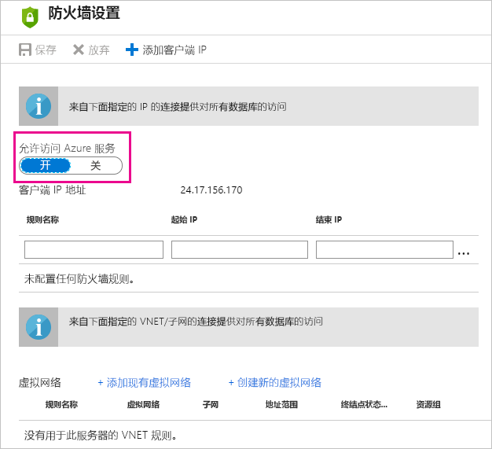

# Power BI 的 Azure SQL 数据库计划刷新中的故障排除

有关刷新的详细信息，请参阅[刷新 Power BI 中的数据](refresh-data.md)和[配置计划刷新](refresh-scheduled-refresh.md)。

设置 Azure SQL 数据库的计划刷新时，若在编辑凭据时收到含错误代码 400 的错误消息，尝试按照以下步骤设置正确的防火墙规则：

1. 登录 [Azure 门户](https://portal.azure.com)。

1. 请参阅要为其配置刷新的 Azure SQL 数据库。

1. 在“概述”边栏选项卡的顶部，选择“设置服务器防火墙”   。

1. 在“防火墙设置”边栏选项卡上，请确保“允许访问 Azure 服务”设置为“开启”    。

      

更多问题？ [尝试参与 Power BI 社区](http://community.powerbi.com/)
