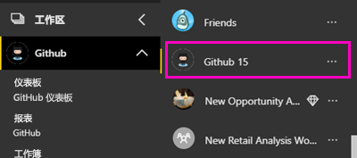
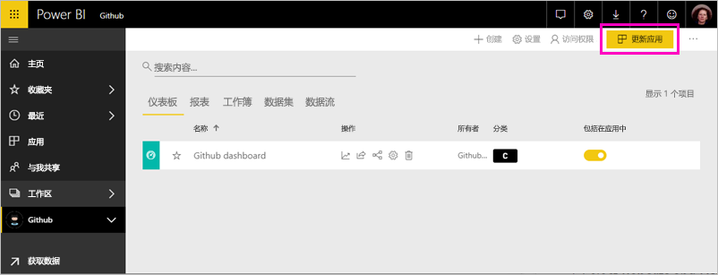

# 使用 Power BI 连接到 GitHub
本文介绍如何使用 Power BI 模板应用从 GitHub 帐户拉取数据。 模板应用生成一个带有仪表板、一组报表和数据集的工作区，以便你可以浏览 GitHub 数据。 适用于 Power BI 的 GitHub 应用使你通过参与、问题、拉取请求和活动用户的相关数据，深入了解 GitHub 存储机制（也称为存储库）。

安装模板应用后，可以更改仪表板和报表。 然后可以将其作为应用分发给组织中的同事。

连接到 [GitHub 模板应用](https://app.powerbi.com/groups/me/getapps/services/pbi-contentpacks.pbiapps-github)或进一步了解 Power BI 与 [GitHub 集成](https://powerbi.microsoft.com/integrations/github)。

还可以尝试 [GitHub 教程](service-tutorial-connect-to-github.md)。 它为 Power BI 文档安装有关公共存储库的实际 GitHub 数据。

>[!NOTE]
>模板应用要求 GitHub 帐户具有存储库的访问权限。 以下是有关要求的详细信息。

## 如何连接
[!INCLUDE [powerbi-service-apps-get-more-apps](./includes/powerbi-service-apps-get-more-apps.md)]
   
3. 选择“GitHub”\>“立即获取”   。
4. 在“安装此 Power BI 应用?”中，选择“安装”   。
4. 在“应用”窗格中，选择“GitHub”磁贴   。

    

6. 在“开始使用新应用”中，选择“连接数据”   。

    

5. 输入该存储库的存储库名称和存储库所有者。 请参阅下面有关[查找这些参数](#FindingParams)的详细信息。
   
    

5. 输入 GitHub 凭据（如果你已经登录浏览器，可跳过此步骤）。 
6. 对于**身份验证方法**，选择**oAuth2**\>**登录**。 
7. 按照 GitHub 验证界面执行操作。 向适用于 Power BI 的 GitHub 模板应用授予对 GitHub 数据的权限。
   
   
   
    Power BI 连接 GitHub 和你的数据。  数据会每天刷新一次。 Power BI 导入数据之后，将显示新 GitHub 工作区的内容。

## 修改和分发应用

现已安装 GitHub 模板应用。 这意味着同时创建了 GitHub 应用工作区。 在工作区中，可以更改报表和仪表板，然后将其作为应用分发给组织中的同事  。 

1. 选择左侧导航栏中工作区名称旁边的箭头。 将看到工作区包含仪表板和报表。

    

8. 选择新的 [GitHub 仪表板](https://powerbi.microsoft.com/integrations/github)。    
    

3. 若要查看新 GitHub 工作区的所有内容，请在左侧导航栏中选择“工作区” > “GitHub”   。
 
   

    此视图是工作区的内容列表。 在右上角，可以看到“更新应用”  。 准备好将应用分发给同事后，就可以开始了。 

    

2. 选择“报表”和“数据集”可查看工作区中的其他元素   。

    阅读并了解如何向同事[分发应用](service-create-distribute-apps.md)。

## 应用中包含的内容
在 Power BI 中 GitHub 提供以下数据：     

| 表名 | 说明 |
| --- | --- |
| 参与 |参与者表提供每周汇总的参与者所执行的总新增、删除和提交操作。 包括前 100 个参与者。 |
| 问题 |列出所选存储库的所有问题，其中包含计算，如：解决问题的总时间和平均时间、未解决问题总数和已解决问题总数。 存储库中没有任何问题时，此表为空。 |
| 拉取请求 |此表包含此存储库和拉取请求者的所有拉取请求。 它也包含相关计算，如：有多少未解决、已解决和总的拉取请求、拉取这些请求花了多少时间，以及拉取请求所耗用的平均时间。 存储库中没有任何问题时，此表为空。 |
| 用户数 |下表提供了 GitHub 使用者或参与者的列表，他们针对所选的存储库进行参与、提出问题或解决拉取请求。 |
| 里程碑 |它具有所选存储库的所有里程碑。 |
| DateTable |此表包含从今天开始推算的和过去多年的日期，可让你按日期分析 GitHub 数据。 |
| ContributionPunchCard |此表可用作所选存储库的参与穿孔卡。 它会按一周中各天和一天中各小时来显示提交。 此表未连接到模型中的其他表。 |
| RepoDetails |此表提供所选存储库的详细信息。 |

## 系统要求
* 具有存储库访问权限的 GitHub。  
* 第一次登录期间授予给适用于 GitHub 的 Power BI 应用的权限。 有关撤消访问权限的详细信息，请参阅下文。  
* 具有足够可用的 API 调用以拉取和刷新数据。  

### 取消授权 Power BI
若要取消将 Power BI 连接到 GitHub 存储库的授权，可以撤销 GitHub 中的访问权限。 有关详细信息，请参阅 [GitHub 帮助](https://help.github.com/articles/keeping-your-ssh-keys-and-application-access-tokens-safe/#reviewing-your-authorized-applications-oauth)主题。

## 查找参数
你可以通过查看 GuiHub 本身的存储库来确定所有者和存储库：

第一部分“Azure”是所有者，第二部分“azure-sdk-for-pho”是存储库本身。  将在存储库的 URL 中看到这两个相同的项目：

    <https://github.com/Azure/azure-sdk-for-php> .

## 故障排除
如有必要，可以验证你的 GitHub 凭据。  

1. 在另一个浏览器窗口中，转到 GitHub 网站并登录到 GitHub。 将在 GitHub 网站的右上角看到你已登录。    
2. 在 GitHub 中，导航到你计划要在 Power BI 中访问的存储库的 URL。 例如： https://github.com/dotnet/corefx 。  
3. 返回到 Power BI，尝试连接到 GitHub。 在“配置 GitHub”对话框中，使用相同存储库的存储库名称和存储库所有者。  

## 后续步骤

* [教程：使用 Power BI 连接到 GitHub 存储库](service-tutorial-connect-to-github.md)
* [在 Power BI 中创建新工作区](service-create-the-new-workspaces.md)
* [在 Power BI 中安装并使用应用](consumer/end-user-apps.md)
* [连接到适用于外部服务的 Power BI 应用](service-connect-to-services.md)
* 是否有任何问题? [尝试咨询 Power BI 社区](http://community.powerbi.com/)

