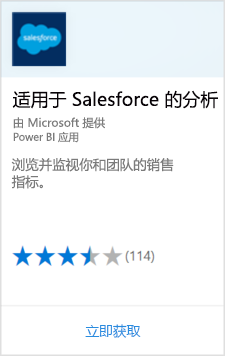

# 使用 Power BI 连接到 Salesforce
你可以使用 Power BI 轻松连接到你的 Salesforce.com 帐户。 借助此连接，可检索 Salesforce 数据以及让系统自动提供仪表板和报表。

详细了解 [Salesforce 与 Power BI 的集成](https://powerbi.microsoft.com/integrations/salesforce)。

## 如何连接
1. 在 Power BI 中，选择左侧导航窗格底部的“获取数据”  。
   
    
2. 在**服务**框中，选择**获取**。
   
    
3. 依次选择“Analytics for Salesforce”和“获取”   。  
   
   
4. 选择“登录”以启动登录流程  。
   
    
5. 出现提示时，输入你的 Salesforce 凭据。 单击“允许”，让 Power BI 能够访问 Salesforce 基本信息和数据  。
   
   
6. 使用下拉选项，配置想要导入 Power BI 的内容：
   
   * **仪表板**
     
     选择基于某一角色的预定义仪表板（例如**销售经理**）。 这些仪表板检索一组特定的 Salesforce 标准数据，其中不包含自定义字段。
     
     
   * **报表**
     
     从你的 Salesforce 帐户中选择一个或多个自定义报表。 这些报表与 Salesforce 中的视图匹配，并且可以包含来自自定义字段或对象的数据。
     
     
     
     如果看不到任何报表，请在你的 Salesforce 帐户中添加或创建它们，然后再次尝试连接。

7. 单击“连接”以开始导入过程  。 导入期间，你会看到显示导入正在进行的通知。 导入完成时，你会看到包含 Salesforce 数据的仪表板、报表和数据集在左侧导航窗格中列出。
   
   

可以更改仪表板，以自己喜欢的方式显示数据。 可以通过问答提问，或[选择磁贴](consumer/end-user-tiles.md)以打开基础报表并[编辑或删除仪表板磁贴](service-dashboard-edit-tile.md)。

**下一步？**

* 尝试在仪表板顶部的[在“问答”框中提问](consumer/end-user-q-and-a.md)
* 在仪表板中[编辑或删除磁贴](service-dashboard-edit-tile.md)
* [选择磁贴](service-dashboard-tiles.md)以打开基础报表。
* 虽然数据集按计划每日刷新，但可更改刷新计划或根据需要使用“立即刷新”来尝试刷新 

## 系统要求和注意事项

- 与已启用 API 访问的 Salesforce 生产帐户连接

- 登录期间授予 Power BI 应用权限

- 帐户具有足够可用的 API 调用，以拉取和刷新数据

- 刷新操作需要有效的身份验证令牌。 Salesforce 限制每个应用程序最多使用五个身份验证令牌，因此，请确保导入的 Salesforce 数据集在五个以下。

- Salesforce 报表 API 具有限制，最多支持 2,000 行数据。

## 故障排除

如果遇到任何错误，请查看上述要求。 

目前不支持登录自定义或沙盒域。

### “无法连接到远程服务器”消息

如果在尝试连接到 Salesforce 帐户时收到“无法连接到远程服务器”消息，请参阅以下论坛中的这一解决方案：[Salesforce 连接器登录错误消息：无法连接到远程服务器](https://www.outsystems.com/forums/Forum_TopicView.aspx?TopicId=17674&TopicName=log-in-error-message-unable-to-connect-to-the-remote-server&)

## 后续步骤
[什么是 Power BI？](fundamentals/power-bi-overview.md)

[Power BI 服务数据源](service-get-data.md)

