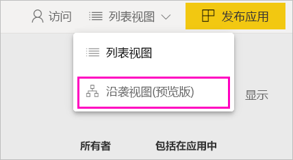
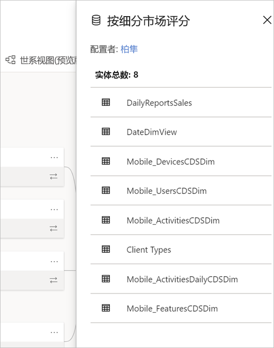
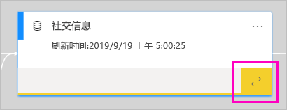
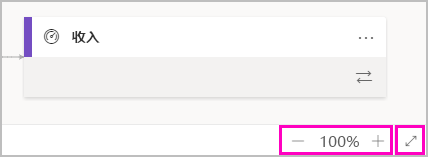

# 数据世系（预览版）
在现代商业智能 (BI) 项目中，了解数据从数据源到其目标的流可能是一项挑战。 如果已生成跨多个数据源、项目和依赖项的高级分析项目，则该挑战甚至更艰巨。  “如果更改此数据会发生什么情况？” 或“为什么此报表不是最新的？”之类的问题 可能很难回答。 他们可能需要专家团队或进行深入调查才能找到答案。 我们设计了数据世系视图来帮助你回答这些问题。

 
Power BI 具有多种项目类型，如仪表板、报表、数据集和数据流。 许多数据集和数据流连接到外部数据源（如 SQL Server）和其他工作区中的外部数据集。 如果数据集位于你的工作区外部，则它可能位于 IT 中的某人或其他分析师所拥有的工作区中。 最终，外部数据源和数据集导致更加难以知道数据的来源。 我们针对复杂和较简单的项目引入了世系视图。 

在世系视图中，可以看到工作区中所有项目与其所有外部依赖项之间的世系关系。 数据流已有关系图视图，世系视图可展开该视图。 它显示所有工作区项目之间的连接，包括与数据流（上游和下游）的连接。 从 11 月开始，单独的数据流关系图视图即将消失。

## 浏览世系视图

除了“我的工作区”以外，每个工作区（无论是新的还是经典的）都自动具有世系视图。 需要在工作区中至少具有参与者角色才能查看。 有关详细信息，请参阅本文中的[权限](#permissions)。 

- 若要访问世系视图，请转到工作区列表视图。 点击“列表视图”旁边的箭头，然后选择“世系视图”   。

    

    在此视图中，可以看到所有工作区项目以及数据如何从一个项目流向另一个项目。

**数据源**

可以看到数据集和数据流从中获取其数据的数据源。 在数据源卡上，可以看到有助于识别源的详细信息。 例如，对于 Azure SQL Server，还会看到数据库名称。

 
**网关**

如果数据源通过本地网关进行连接，则会将网关信息添加到数据源卡。 如果具有网关管理员或数据源用户的权限，将看到详细信息，如网关名称。

**数据集和数据流**
 
在数据集上，可以看到上次刷新时间，以及数据集是否经过认证或升级。

 
如果工作区中的报表基于另一个工作区中的数据集生成，则会在数据集卡上看到源工作区名称。 选择源工作区名称以转到该工作区。
 
- 对于任何项目，选择省略号 (...) 可查看选项菜单。 它具有列表视图中可用的所有相同操作。
  
若要查看数据集上的更多元数据，请选择数据集卡本身。 有关数据集的其他信息显示在侧窗格中。

 
## 显示任何项目的世系视图 

假设要查看特定项目的世系视图。

- 选择项目下的双箭头。

    

    Power BI 突出显示与该项目相关的所有项目，并使其他项目变暗。 

## 导航和全屏 

世系视图为交互式画布。 可以使用鼠标和触摸板在画布中导航以及放大或缩小。  

- 若要放大和缩小，请使用右下角的菜单，或使用鼠标或触摸板。 

- 若要为图形本身腾出更多空间，请使用右下角的全屏选项。 

    

## 权限

- 需要 Power BI Pro 许可证才能查看世系视图。
- 世系视图仅适用于具有工作区访问权限的用户。
- 用户必须在工作区中具有管理员、成员或参与者角色。 具有查看者角色的用户无法切换到世系视图。

## 注意事项和限制

世系视图在 Internet Explorer 中不可用。 有关详细信息，请参阅 [Power BI 支持的浏览器](power-bi-browsers.md)。

## 后续步骤

- [跨工作区使用数据集简介（预览）](service-datasets-across-workspaces.md)
