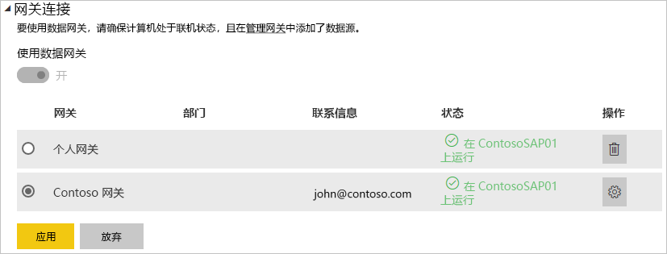

# 管理数据源 - SAP HANA

[!INCLUDE [gateway-rewrite](includes/gateway-rewrite.md)]

[安装本地数据网关](/data-integration/gateway/service-gateway-install)之后，需要[添加可与该网关结合使用的数据源](service-gateway-data-sources.md#add-a-data-source)。 本文介绍如何使用用于计划刷新或 DirectQuery 的网关和 SAP HANA 数据源。

## 添加数据源

有关如何添加数据源的信息，请参阅[添加数据源](service-gateway-data-sources.md#add-a-data-source)。 “数据源类型”选择 SAP HANA  。

选择 SAP HANA 数据源类型之后，填写数据源的服务器、用户名和密码信息    。

> [!NOTE]
> 将使用这些凭据运行对数据源的所有查询。 若要详细了解如何存储凭据，请参阅[在云中存储加密凭据](service-gateway-data-sources.md#store-encrypted-credentials-in-the-cloud)。

所有内容填写完毕之后，请选择“添加”  。 现在你可以使用此数据源对本地 SAP HANA 服务器进行计划刷新或 DirectQuery。 如果成功，则会看到*连接成功*。

### 高级设置

为数据源配置隐私级别（可选）。 这样可以控制数据的组合方式。 这仅适用于计划刷新。 它不适用于 DirectQuery。 若要详细了解数据源的隐私级别，请参阅[隐私级别 (Power Query)](https://support.office.com/article/Privacy-levels-Power-Query-CC3EDE4D-359E-4B28-BC72-9BEE7900B540)。

## 使用数据源

创建数据源后，可借助 DirectQuery 连接或通过计划刷新使用该数据源。

> [!NOTE]
> 在 Power BI Desktop 和本地数据网关内的数据源之间，服务器名称和数据库名称必须匹配。

数据集和网关内的数据源之间的链接取决于服务器名称和数据库名称。 这些名称必须匹配。 例如，如果在 Power BI Desktop 内为服务器名称提供了某 IP 地址，则网关配置中的数据源也需使用该 IP 地址。 如果在 Power BI Desktop 中使用了 SERVER\INSTANCE，则为网关配置的数据源中也需使用它  。

此示例适用于 DirectQuery 和计划刷新这两种情况。

### 通过 DirectQuery 连接使用数据源

需确保 Power BI Desktop 和为网关配置的数据源之间的服务器名称和数据库名称相互匹配。 还需要确保你的用户列在数据源的“用户”选项卡中，以便发布 DirectQuery 数据集  。 首次导入数据时，需要在 Power BI Desktop 中选择 DirectQuery。 有关使用 DirectQuery 的详细信息，请参阅[在 Power BI Desktop 中使用 DirectQuery](desktop-use-directquery.md)。

发布之后，应从 Power BI Desktop 或**获取数据**启动报表。 在网关中创建数据源之后，可能会花费几分钟时间连接才可用。

### 通过计划刷新使用数据源

如果你被列于网关内配置的数据源的“用户”选项卡中，并且服务器和数据库名称匹配，则你可以看到网关显示为计划刷新的一个选项  。

## 后续步骤

* [本地数据网关疑难解答](/data-integration/gateway/service-gateway-tshoot)
* [对网关进行排除故障 - Power BI](service-gateway-onprem-tshoot.md)  

更多问题？ [尝试参与 Power BI 社区](http://community.powerbi.com/)

