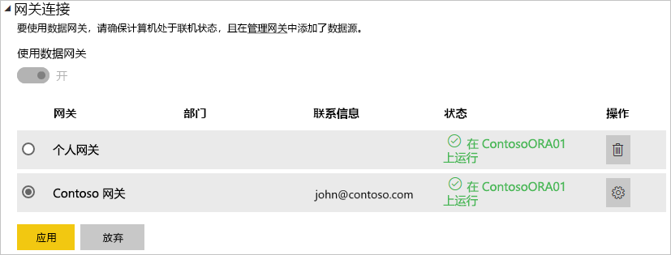

# 管理数据源 - 导入/计划刷新

[!INCLUDE [gateway-rewrite](includes/gateway-rewrite.md)]

[安装本地数据网关](/data-integration/gateway/service-gateway-install)后，需要[添加可与该网关结合使用的数据源](service-gateway-data-sources.md#add-a-data-source)。 本文介绍如何结合使用网关和用于计划刷新的数据源，而不是使用 DirectQuery 或实时连接。

## 添加数据源

有关如何添加数据源的信息，请参阅[添加数据源](service-gateway-data-sources.md#add-a-data-source)。

列出的所有数据源类型均可用于通过本地数据网关进行的计划刷新。 Analysis Services、SQL Server 和 SAP HANA 可用于计划刷新或 DirectQuery/实时连接。

然后需要填充数据源信息，其中包括用于访问数据源的源信息和凭据。

> [!NOTE]
> 将使用这些凭据运行对数据源的所有查询。 若要详细了解如何存储凭据，请参阅[在云中存储加密凭据](service-gateway-data-sources.md#storing-encrypted-credentials-in-the-cloud)。

有关可与计划刷新一起使用的数据源类型的列表，请参阅[可用数据源类型列表](service-gateway-data-sources.md#list-of-available-data-source-types)。

所有内容填充完毕之后，请选择“添加”  。 借助你的本地数据，现在你可以对计划刷新使用此数据源。 如果成功，则会看到“连接成功”  。

### 高级设置

为数据源配置隐私级别（可选）。 这会控制数据的合并方式。 这仅适用于计划刷新。 若要详细了解数据源的隐私级别，请参阅[隐私级别 (Power Query)](https://support.office.com/article/Privacy-levels-Power-Query-CC3EDE4D-359E-4B28-BC72-9BEE7900B540)。

## 对计划刷新使用数据源

创建数据源后，可通过 DirectQuery 连接或计划刷新使用该数据源。

> [!NOTE]
> 在 Power BI Desktop 和本地数据网关内的数据源之间，服务器名称和数据库名称必须匹配。

数据集和网关内的数据源之间的链接取决于服务器名称和数据库名称。 这些名称必须匹配。 例如，如果在 Power BI Desktop 内为服务器名称提供了某 IP 地址，则网关配置中的数据源也需使用该 IP 地址。 如果在 Power BI Desktop 中使用了“SERVER\INSTANCE”，则在为网关配置的数据源中也需要使用它  。

如果你被列于网关内配置的数据源的“用户”选项卡中，并且服务器和数据库名称匹配，则你可以看到网关显示为计划刷新的一个选项  。

> [!WARNING]
> 如果数据集包含多个数据源，则必须在网关内添加每个数据源。 如果未将一个或多个数据源添加到网关，则不会看到可用于计划刷新的网关。

## 限制

OAuth 在本地数据网关是不受支持的身份验证方案。 不能添加需要 OAuth 的数据源。 如果数据集具有需要 OAuth 的数据源，则不能将网关用于计划刷新。

## 后续步骤

* [本地数据网关疑难解答](/data-integration/gateway/service-gateway-tshoot)
* [对网关进行排除故障 - Power BI](service-gateway-onprem-tshoot.md)

更多问题？ [尝试参与 Power BI 社区](http://community.powerbi.com/)
