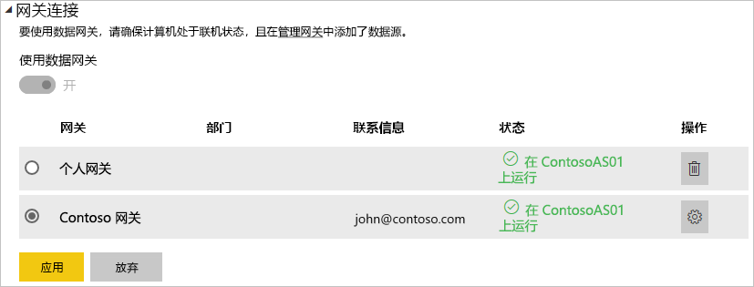

# <a name="manage-your-data-source---analysis-services"></a>管理数据源 - Analysis Services

[!INCLUDE [gateway-rewrite](includes/gateway-rewrite.md)]

[安装本地数据网关](/data-integration/gateway/service-gateway-install)之后，需要[添加可与该网关结合使用的数据源](service-gateway-data-sources.md#add-a-data-source)。 本文介绍如何使用用于计划刷新或实时连接的网关和 SQL Server Analysis Services (SSAS) 数据源。

若要详细了解如何设置与 Analysis Services 的实时连接，请[观看此视频](https://www.youtube.com/watch?v=GPf0YS-Xbyo&feature=youtu.be)。

> [!NOTE]
> 如果有 Analysis Services 数据源，你需要在加入到与 Analysis Services 服务器位于同一个林/域的计算机上安装网关。

## <a name="add-a-data-source"></a>添加数据源

有关如何添加数据源的信息，请参阅[添加数据源](service-gateway-data-sources.md#add-a-data-source)。 如果要连接到多维或表格服务器，请选择 Analysis Services 作为“数据源类型”   。


填写数据源的信息（包括服务器和数据库）   。 网关会使用为“用户名”  和“密码”  输入的信息连接到 Analysis Services 实例。

> [!NOTE]
> 输入的 Windows 帐户必须具有连接到该实例的服务器管理员权限。 如果此帐户的密码设置为过期，且数据源未更新此密码，则用户将遇到连接错误。 若要详细了解如何存储凭据，请参阅[在云中存储加密凭据](service-gateway-data-sources.md#store-encrypted-credentials-in-the-cloud)。


填写所有内容之后，选择“添加”  。 现在可以使用此数据源对本地的 Analysis Services 实例进行计划刷新或实时连接。 如果成功，则会看到“连接成功”  。


### <a name="advanced-settings"></a>高级设置

为数据源配置隐私级别（可选）。 此设置可控制数据的组合方式。 它仅适用于计划刷新。 隐私级别设置不适用于实时连接。 若要详细了解数据源的隐私级别，请参阅[隐私级别 (Power Query)](https://support.office.com/article/Privacy-levels-Power-Query-CC3EDE4D-359E-4B28-BC72-9BEE7900B540)。


## <a name="user-names-with-analysis-services"></a>Analysis Services 的用户名

<iframe width="560" height="315" src="https://www.youtube.com/embed/Qb5EEjkHoLg" frameborder="0" allowfullscreen></iframe>

每次用户与连接到 Analysis Services 的报表交互时，有效用户名将传递到网关，然后传递到你的本地 Analysis Services 服务器。 你用于登录 Power BI 的电子邮件地址会作为有效用户传递到 Analysis Services。 在连接属性 [EffectiveUserName](https://msdn.microsoft.com/library/dn140245.aspx#bkmk_auth) 中传递它。 

电子邮件地址必须与本地 Active Directory 域内定义的用户主体名称 (UPN) 匹配。 UPN 是 Active Directory 帐户的属性。 Windows 帐户必须存在于 Analysis Services 角色中。 如果在 Active Directory 中找不到匹配项，则登录不会成功。 若要详细了解 Active Directory 和用户命名，请参阅 [User Naming Attributes](https://msdn.microsoft.com/library/ms677605.aspx)（用户命名特性）。

你还可以[将 Power BI 登录名与本地目录 UPN 映射](service-gateway-enterprise-manage-ssas.md#map-user-names-for-analysis-services-data-sources)。

## <a name="map-user-names-for-analysis-services-data-sources"></a>映射 Analysis Services 数据源的用户名

<iframe width="560" height="315" src="https://www.youtube.com/embed/eATPS-c7YRU" frameborder="0" allowfullscreen></iframe>

Power BI 允许映射 Analysis Services 数据源的用户名。 你可以配置规则，以便将登录 Power BI 时使用的用户名映射到为 Analysis Services 连接上的 EffectiveUserName 传递的名称。 当 Azure Active Directory (Azure AD) 中的用户名与本地 Active Directory 实例中的 UPN 不匹配时，映射用户名功能是解决此问题的一种好方法。 例如，如果你的电子邮件地址是 nancy@contoso.onmicrsoft.com，你可以将其映射到 nancy@contoso.com，并且该值将被传递到网关。

可以通过两种不同的方式映射用于 Analysis Services 的用户名：

* 手动重映射用户
* 执行本地 Active Directory 属性查找，将 Azure AD UPN 重映射到 Active Directory 用户（Active Directory 查找映射）

可以使用第二种方法来执行手动映射，但这样做耗时且很难维护。 这在模式匹配不够用时尤其困难。 例如，当域名在 Azure AD 与本地 Active Directory 之间有所不同时，或者当用户帐户名称在 Azure AD 与 Active Directory 之间有所不同时。 这便是为何不建议使用第二种方法进行手动映射。

我们将在接下来的两个部分中按顺序介绍这两种方法。

### <a name="manual-user-name-remapping"></a>手动重映射用户名

对于 Analysis Services 数据源，可以配置自定义 UPN 规则。 当你的 Power BI 服务登录名与本地目录 UPN 不匹配时，自定义规则会十分有帮助。 例如，如果使用 john@contoso.com 登录 Power BI，但本地目录 UPN 是 john@contoso.local，可以配置映射规则，将 john@contoso.local 传递到 Analysis Services。

若要访问 UPN 映射屏幕，请执行以下步骤。

1. 转到齿轮图标，然后选择“管理网关”  。
2. 展开包含 Analysis Services 数据源的网关。 或者，如果尚未创建 Analysis Services 数据源，可以在此时创建。
3. 选择数据源，然后选择“用户”  选项卡。
4. 选择**映射用户名**。

    

你会看到添加规则和对给定用户进行测试的选项。

> [!NOTE]
> 可能会更改不想更改的用户。 例如，如果 Replace（原始值）  是 contoso.com 且 With（新名称）  是 @contoso.local，则登录名包含 @contoso.com 的所有用户随后都将被替换为 @contoso.local。 此外，如果 Replace（原始名称）  是 dave@contoso.com 且 With（新名称）  是 dave@contoso.local，则登录名为 v-dave@contoso.com 的用户将作为 v-dave@contoso.local 发送。

### <a name="active-directory-lookup-mapping"></a>Active Directory 查找映射

若要通过执行本地 Active Directory 属性查找来将 Azure AD UPN 重映射到 Active Directory 用户，请按照此部分中的步骤操作。 首先，我们将介绍这种方法的工作原理。

在 Power BI 服务中，将发生以下事件：

* 对于 Power BI Azure AD 用户对本地 SSAS 服务器执行的每个查询，都会同时传递 UPN 字符串（如 firstName.lastName@contoso.com）。

> [!NOTE]
> 仍会在将用户名字符串发送到本地数据网关之前  ，应用 Power BI 数据源配置中定义的任何手动 UPN 用户映射。

在具有可配置自定义用户映射的本地数据网关上，按照以下步骤操作。

1. 查找要搜索的 Active Directory。 可以使用自动或可配置。
2. 从 Power BI 服务查找 Active Directory 人员的属性（如电子邮件地址）。 属性基于传入的 UPN 字符串，如 firstName.lastName@contoso.com。
3. 如果 Active Directory 查找失败，尝试将同时传递的 UPN 用作传递给 SSAS 的 EffectiveUser。
4. 如果 Active Directory 查找成功，检索该 Active Directory 人员的 UserPrincipalName。
5. 它将 UserPrincipalName 电子邮件地址作为 EffectiveUser 传递给 SSAS（如 Alias@corp.on-prem.contoso）。

若要将网关配置为执行 Active Directory 查找，请执行以下操作：

1. [下载和安装最新网关](/data-integration/gateway/service-gateway-install)。

2. 在网关中，将本地数据网关服务更改为使用域帐户（而不是本地服务帐户）运行。 否则 Active Directory 查找将无法在运行时正常工作。 在计算机上转到[本地数据网关应用](/data-integration/gateway/service-gateway-app)，然后转到“服务设置” > “更改服务帐户”   。 请确保自己拥有此网关的恢复密钥，因为需要在同一台计算机上还原它，除非要改为新建网关。 重启网关服务以便使更改生效。

3. 以管理员身份转到网关的安装文件夹 C:\Program Files\On-premises data gateway  ，以确保自己拥有写入权限。 打开 Microsoft.PowerBI.DataMovement.Pipeline.GatewayCore.dll.config  文件。

4. 根据你  Active Directory 用户的 Active Directory 属性配置，编辑以下两个配置值。 以下配置值是示例。 基于 Active Directory 配置指定值。 这些配置区分大小写，因此请确保它们与 Active Directory 中的值匹配。

    

    如果没有为 ADServerPath 配置提供任何值，则网关使用默认的全局目录。 你还可以为 ADServerPath 指定多个值。 每个值必须用分号分隔，如以下示例所示：

    ```xml
    <setting name="ADServerPath" serializeAs="String">
        <value> >GC://serverpath1; GC://serverpath2;GC://serverpath3</value>
    </setting>
    ```

    网关从左到右解析 ADServerPath 的值，直到找到匹配项。 如果未找到匹配项，则使用原始 UPN。 确保运行网关服务 (PBIEgwService) 的帐户对你在 ADServerPath 中指定的所有 Active Directory 服务器具有查询权限。

    网关支持两种类型的 ADServerPath，如以下示例所示：

    **WinNT**

    ```xml
    <value="WinNT://usa.domain.corp.contoso.com,computer"/>
    ```

    **GC**

    ```xml
    <value> GC://USA.domain.com </value>
    ```

5. 重启本地数据网关服务以便使配置更改生效。

### <a name="work-with-mapping-rules"></a>使用映射规则

若要创建映射规则，请输入“原始名称”  和“新名称”  的值，然后选择“添加”  。

| 字段 | 说明 |
| --- | --- |
| Replace（原始名称） |用于登录 Power BI 的电子邮件地址。 |
| With（新名称） |用其替换的值。 替换的结果会传递到 Analysis Services 连接的 EffectiveUserName 属性。 |


当在列表中选择某个项时，可以使用 v 形图标选择对其重新排序。 也可以删除该条目。


### <a name="use-a-wildcard"></a>使用通配符

可以将通配符 (*) 用于“Replace（原始名称）”  字符串。 它只能用于自身而不能与任何其他字符串部分一起使用。 如果要获取所有用户，并将单个值传递到数据源，请使用通配符。 当你希望组织中的所有用户都在本地环境中使用相同的用户时，此方法非常有用。

### <a name="test-a-mapping-rule"></a>测试映射规则

若要验证原始名称替换为的内容，请输入“原始名称”  的值。 选择“测试规则”  。


> [!NOTE]
> 保存规则后，服务在几分钟后才会开始使用它们。 规则会立即在浏览器中生效。

### <a name="limitations-for-mapping-rules"></a>映射规则限制

映射只适用于正在配置的特定数据源。 它不是全局设置。 如果具有多个 Analysis Services 数据源，必须对每个数据源的用户进行映射。

## <a name="authentication-to-a-live-analysis-services-data-source"></a>向实时 Analysis Services 数据源进行身份验证

每次用户与 Analysis Services 交互时，有效用户名将传递到网关，然后传递到你的本地 Analysis Services 服务器。 UPN（通常是用于登录云的电子邮件地址）会作为有效用户传递到 Analysis Services。 UPN 将在连接属性 EffectiveUserName 中传递。 

此电子邮件地址应与本地 Active Directory 域内定义的 UPN 匹配。 UPN 是 Active Directory 帐户的属性。 该 Windows 帐户必须存在于 Analysis Services 角色中，才能访问服务器。 如果在 Active Directory 中找不到匹配项，则登录不会成功。

Analysis Services 还可以基于此帐户提供筛选。 筛选可能伴随基于角色的安全性或行级别安全性出现。

## <a name="role-based-security"></a>基于角色的安全性

模型提供了基于用户角色的安全性。 在 SQL Server Data Tools – Business Intelligence 中创作期间，或在部署模型之后，通过使用 SQL Server Management Studio 为特定模型项目定义角色。 角色按 Windows 用户名或按 Windows 组包含成员。 角色定义了用户进行查询或对模型执行操作所具有的权限。 大多数用户属于具有读取权限的角色。 其他角色用于具有处理项目、管理数据库功能和管理其他角色的权限的管理员。

## <a name="row-level-security"></a>行级别安全性

行级别安全性特指 Analysis Services 行级别安全性。 模型可以提供动态的行级别安全性。 与至少具有一个用户所属的角色不同，任何表格模型都不需要动态安全性。 在较高级别，动态安全定义了用户对数据以至特定表中的特定行的读取访问权限。 类似于角色，动态行级别安全性依赖于用户的 Windows 用户名。

用户查询和查看模型数据的能力取决于：

- 其 Windows 用户帐户作为成员所属的角色。
- 动态行级别安全性（如果已配置）。

在模型中实现角色和动态行级别安全性已超出本文的讨论范围。 若要了解详细信息，请参阅 MSDN 上的[角色（SSAS 表格）](https://msdn.microsoft.com/library/hh213165.aspx)和[安全角色（Analysis Services - 多维数据）](https://msdn.microsoft.com/library/ms174840.aspx)。 若要特别深入地了解表格模型的安全性，请下载并阅读[保护表格 BI 语义模型白皮书](https://msdn.microsoft.com/library/jj127437.aspx)。

## <a name="what-about-azure-ad"></a>那么 Azure AD 呢？

Microsoft 云服务使用 [Azure AD](/azure/active-directory/fundamentals/active-directory-whatis) 来处理对用户的身份验证。 Azure AD 是包含用户名和安全组的租户。 通常情况下，用户登录时使用的电子邮件地址与帐户的 UPN 相同。

## <a name="what-is-the-role-of-my-local-active-directory-instance"></a>本地 Active Directory 实例的角色是什么？

为了使 Analysis Services 能够确定连接到它的用户是否属于具有数据读取权限的角色，服务器需要转换从 Azure AD 传递到网关，然后传递到 Analysis Services 服务器的有效用户名。 Analysis Services 服务器向 Windows Active Directory 域控制器 (DC) 传递有效用户名。 Active Directory DC 随后会验证有效用户名是否为本地帐户上的有效 UPN。 它会将用户的 Windows 用户名返回到 Analysis Services 服务器。

不能在未加入域的 Analysis Services 服务器上使用 EffectiveUserName。 为避免发生登录错误，Analysis Services 服务器必须加入域。

## <a name="how-do-i-tell-what-my-upn-is"></a>如何辨别我的 UPN？

你可能不知道你的 UPN 是什么，而且你有可能不是域管理员。 你可以从工作站使用以下命令找出你的帐户的 UPN。

    whoami /upn

结果类似于电子邮件地址，但是它是位于域帐户上的 UPN。 如果使用 Analysis Services 数据源进行实时连接，并且此 UPN 与你用于登录 Power BI 的电子邮件地址不匹配，则可能要了解一下如何[映射用户名](#map-user-names-for-analysis-services-data-sources)。

## <a name="synchronize-an-on-premises-active-directory-with-azure-ad"></a>将本地 Active Directory 与 Azure AD 同步

如果计划使用 Analysis Services 实时连接，则本地 Active Directory 帐户必须与 Azure AD 匹配。 UPN 必须在帐户之间匹配。

云服务只知道 Azure AD 中的帐户。 如果在本地 Active Directory 实例中添加了帐户，则这并不重要。 如果帐户在 Azure AD 中不存在，则无法使用。 你可以通过多种不同的方式将本地 Active Directory 帐户与 Azure AD 匹配：

- 可以将帐户手动添加到 Azure AD 中。

   可以在 Azure 门户或 Microsoft 365 管理中心中创建一个帐户，帐户名称与本地 Active Directory 帐户的 UPN 匹配。

- 你可以使用 [Azure AD Connect](/azure/active-directory/hybrid/how-to-connect-sync-whatis) 工具将本地帐户同步到 Azure AD 租户。

   Azure AD Connect 工具提供了选项以用于目录同步和设置身份验证。 这些选项包括密码哈希同步、传递身份验证和联合身份验证。 如果你不是租户管理员或本地域管理员，请联系 IT 管理员以帮助进行配置。

   使用 Azure AD Connect 可确保 UPN 在 Azure AD 与本地 Active Directory 实例之间匹配。

> [!NOTE]
> 使用 Azure AD Connect 工具同步帐户会在 Azure AD 租户内创建新帐户。

## <a name="use-the-data-source"></a>使用数据源

创建数据源后，可通过实时连接或通过计划刷新使用该数据源。

> [!NOTE]
> 在 Power BI Desktop 和本地数据网关内的数据源之间，服务器名称和数据库名称必须匹配。

数据集和网关内的数据源之间的链接取决于服务器名称和数据库名称。 这些名称必须匹配。 例如，如果在 Power BI Desktop 内为服务器名称提供了某 IP 地址，则网关配置中的数据源也必须使用该 IP 地址。 如果在 Power BI Desktop 中使用了 SERVER\INSTANCE，则为网关配置的数据源中也必须使用它  。

此要求适用于实时连接和计划刷新这两种情况。

### <a name="use-the-data-source-with-live-connections"></a>通过实时连接使用数据源

确保 Power BI Desktop 和为网关配置的数据源之间的服务器名称和数据库名称相互匹配。 还需要确保你的用户列在数据源的“用户”选项卡中，以便发布实时连接数据集  。 首次导入数据时，需要在 Power BI Desktop 中选择实时连接。

发布之后，应从 Power BI Desktop 或“获取数据”  启动报表。 在网关中创建数据源之后，可能会花费几分钟时间连接才可用。

### <a name="use-the-data-source-with-scheduled-refresh"></a>通过计划刷新使用数据源

如果你被列于网关内配置的数据源的“用户”选项卡中，并且服务器和数据库名称匹配，则你可以看到网关显示为计划刷新的一个选项  。



### <a name="limitations-of-analysis-services-live-connections"></a>Analysis Services 实时连接限制

你可以使用针对表格或多维实例的实时连接。

| **服务器版本** | **所需的 SKU** |
| --- | --- |
| 2012 SP1 CU4 或更高版本 |商业智能和企业版 SKU |
| 2014 |商业智能和企业版 SKU |
| 2016 |标准 SKU 或更高版本 |

* 不支持单元格级别格式和转译功能。
* 操作和命名集不会向 Power BI 公开。 仍然可以连接到包含操作或命名集的多维数据集，并创建视觉对象和报表。

## <a name="next-steps"></a>后续步骤

* [本地数据网关疑难解答](/data-integration/gateway/service-gateway-tshoot)
* [对网关进行排除故障 - Power BI](service-gateway-onprem-tshoot.md)

更多问题？ 尝试参与 [Power BI 社区](https://community.powerbi.com/)。

