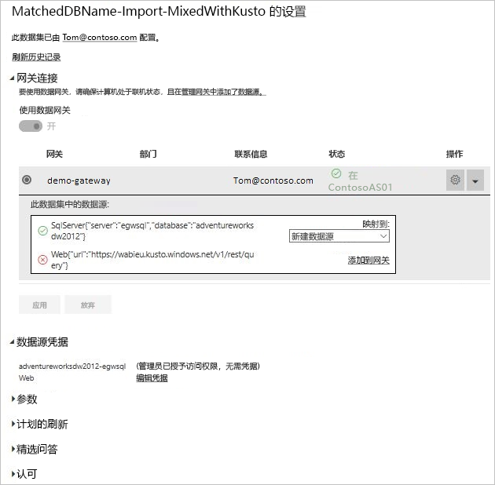

# 合并或追加本地和云数据源

[!INCLUDE [gateway-rewrite](includes/gateway-rewrite.md)]

可以使用本地数据网关合并或追加同一查询中的本地和云数据源。 此解决方案非常有用，因为无需使用单独的查询即可合并来自多个源的数据。

>[!NOTE]
>本文仅适用于在单个查询中合并或追加了云和本地数据源的数据集。 对于包含单独查询的数据集（一个连接到本地数据源，另一个连接到云数据源），网关不会执行云数据源的查询。

## 先决条件

- 安装在本地计算机上的[网关](/data-integration/gateway/service-gateway-install)。
- 包含合并了本地和云数据源的查询的 Power BI Desktop 文件。

>[!NOTE]
>若要访问任何云数据源，必须确保网关有权访问那些数据源。

1. 在 Power BI 服务的右上角，选择齿轮图标 > “管理网关”  。

    

2. 选择要配置的网关。

3. 在“网关群集设置  ”下，选择“允许用户的云数据源通过此网关群集刷新  ” > “应用”  。

    

4. 在此网关群集下，添加查询中使用的任何[本地数据源](service-gateway-enterprise-manage-scheduled-refresh.md#add-a-data-source)。 无需在此处添加云数据源。

5. 将包含合并了本地和云数据源的查询的 Power BI Desktop 文件上传到 Power BI 服务。

6. 在新数据集的“数据集设置”页上  ：

   - 对于本地源，选择与此数据源关联的网关。
   - 在“数据源凭据”下，根据需要编辑云数据源凭据  。

    请确保正确设置云和本地数据源的隐私级别，以确保安全地处理联接。

     

7. 设置云凭据后，可使用“立即刷新”选项刷新数据集  。 或者可以安排定期刷新。

## 后续步骤

若要详细了解网关的数据刷新，请参阅[将数据源用于定期刷新](service-gateway-enterprise-manage-scheduled-refresh.md#using-the-data-source-for-scheduled-refresh)。
