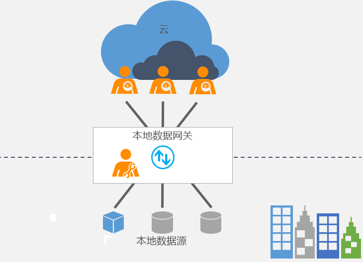

# 本地数据网关是什么？

[!INCLUDE [gateway-rewrite](includes/gateway-rewrite.md)]

本地数据网关充当网桥，提供本地数据（不位于云中的数据）与几种 Microsoft 云服务之间快速安全的数据传输。 这些云服务包括 Power BI、PowerApps、Power Automate、Azure Analysis Services 和 Azure 逻辑应用。 通过使用网关，组织可以将数据库和其他数据源保留在其本地网络上，还可以在云服务中安全地使用该本地数据。

## 网关的工作原理

有关网关工作原理的详细信息，请参阅[本地数据网关体系结构](/data-integration/gateway/service-gateway-onprem-indepth)。

## 网关类型

有两种不同类型的网关，各适用于不同的方案：

* 本地数据网关  允许多个用户连接到多个本地数据源。 可以将本地数据网关与所有支持的服务结合使用，只需要安装单个网关即可。 此网关非常适用于多个用户访问多个数据源的复杂场景。

*  本地数据网关（个人模式）允许一个用户连接到源，且无法与其他人共享。 本地数据网关（个人模式）只能与 Power BI 一起使用。 此网关非常适用于你是创建报表的唯一人员且不需要与其他人共享数据源的场景。

## 使用网关

使用网关有以下四个主要步骤。

1. 在本地计算机上[下载并安装网关](/data-integration/gateway/service-gateway-install)。
1. 根据防火墙和其他网络要求[配置](/data-integration/gateway/service-gateway-app)网关。
1. [添加网关管理员](/data-integration/gateway/service-gateway-manage)，以便管理网关和管理其他网络要求。
1. [使用网关](service-gateway-sql-tutorial.md)刷新本地数据源。
1. 出现错误时，对网关进行[故障排除](service-gateway-onprem-tshoot.md)。

## 后续步骤

* [安装本地数据网关](/data-integration/gateway/service-gateway-install)

更多问题？ [尝试参与 Power BI 社区](https://community.powerbi.com/)
