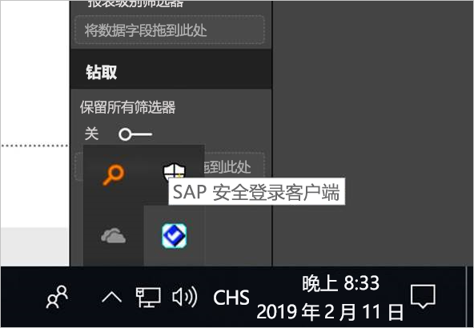
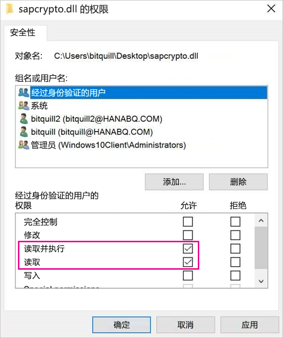
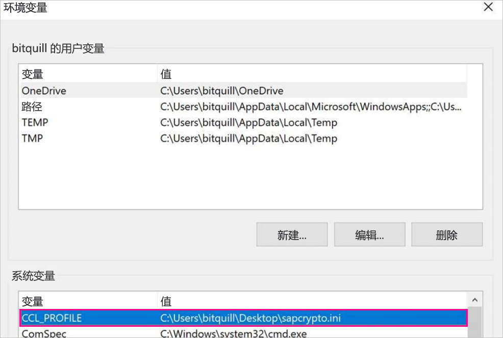
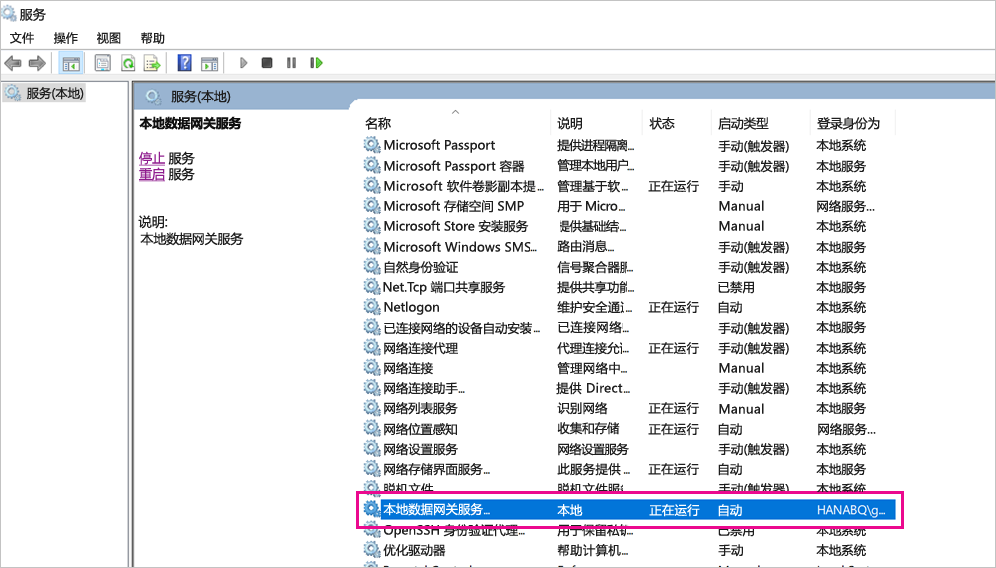
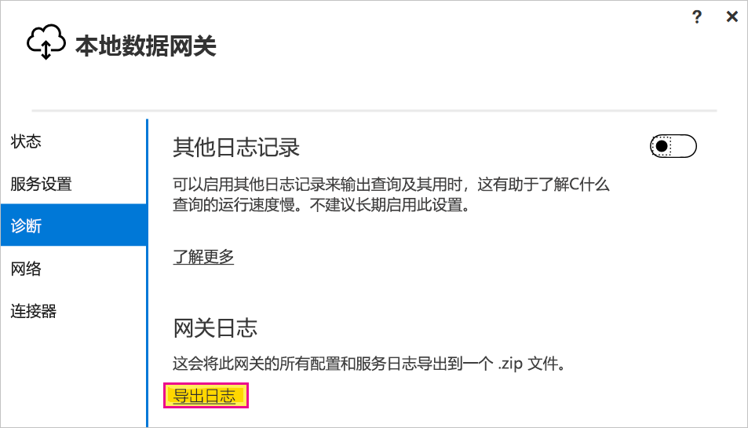

# <a name="use-kerberos-single-sign-on-for-sso-to-sap-bw-using-commoncryptolib-sapcryptodll"></a>使用 CommonCryptoLib (sapcrypto.dll) 将适用于 SSO 的 Kerberos 单一登录用于 SAP BW

本文介绍如何将 SAP BW 服务器配置为使用 CommonCryptoLib (sapcrypto.dll) 从 Power BI 服务启用 SSO。

> [!NOTE]
> 在尝试刷新使用 Kerberos SSO 的基于 SAP BW 的报表之前，除了完成[配置 Kerberos SSO](service-gateway-sso-kerberos.md) 中的步骤之外，还请完成本文中的步骤。 将 CommonCryptoLib 用作 SNC 库可启用到 SAP BW 应用程序服务器和 SAP BW 消息服务器的 SSO 连接。

## <a name="configure-sap-bw-server-to-enable-sso-using-commoncryptolib"></a>使用 CommonCryptoLib 配置 SAP BW 以启用 SSO

> [!NOTE]
> 本地数据网关是 64 位软件，因此需要 64 位版本的 CommonCryptoLib (sapcrypto.dll)。 如果计划在尝试通过网关（推荐）进行 SSO 连接之前，先在 SAP GUI 中测试到 SAP BW 服务器的 SSO 连接，那么还将需要 32 位版本的 CommonCryptoLib，因为 SAP GUI 是 32 位软件。

1. 确保已使用 CommonCryptoLib 为 BW 服务器正确配置 Kerberos SSO。 如果是，则应该能够使用 SSO 通过已配置为使用 CommonCryptoLib 的 SAP GUI 之类的 SAP 工具访问 BW 服务器（直接访问或通过 SAP BW 消息服务器访问）。 有关设置步骤的详细信息，请参阅 [SAP Single Sign-On:Authenticate with Kerberos/SPNEGO](https://blogs.sap.com/2017/07/27/sap-single-sign-on-authenticate-with-kerberosspnego/)（SAP 单一登录：使用 Kerberos/SPNEGO 进行身份验证）。 BW 服务器应使用 CommonCryptoLib 作为其 SNC 库，并具有开头是“CN=”的 SNC 名称，例如“CN=BW1”。 有关 SNC 名称要求的详细信息，请参阅[适用于 Kerberos 配置的 SNC 参数](https://help.sap.com/viewer/df185fd53bb645b1bd99284ee4e4a750/3.0/en-US/360534094511490d91b9589d20abb49a.html)（具体而言，snc/identity/as 参数）。

1. 如果未配置，请在安装了网关的计算机上安装 x64 版本的 [SAP .NET 连接器](https://support.sap.com/en/product/connectors/msnet.html)。 可以通过在 Power BI Desktop 中尝试连接到 BW 服务器来检查组件是否已安装。 如果无法使用 2.0 实现进行连接，则说明未安装 .NET 连接器。

1. 确保 SAP 安全登录客户端 (SLC) 未在安装了网关的计算机上运行。 SLC 缓存 Kerberos 票证的方式可能会影响网关使用 Kerberos 进行 SSO 的能力。 如果已安装 SLC，请将其卸载或确保退出 SAP 安全登录客户端：右键单击系统托盘中的图标，选择“注销”和“退出”，然后再使用网关尝试进行 SSO 连接。 不支持在 Windows Server 计算机上使用 SLC。 有关详细信息，请参阅 [SAP 备注 2780475](https://launchpad.support.sap.com/#/notes/2780475)（需要 s 用户）。

    

    如果卸载 SLC 或选择“注销”和“退出”，请打开 cmd 窗口，输入 `klist purge` 以清除任何缓存的 Kerberos 票证，然后再尝试通过网关进行 SSO 连接   。

1. 从 SAP 快速启动板上下载 64 位 CommonCryptoLib (sapcrypto.dll) 版本 8.5.25 或更高版本，并将其复制到网关计算机上的文件夹中  。 在用于复制 sapcrypto.dll 的同一目录中，创建一个名为 sapcrypto.ini 的文件，该文件包含以下内容：

    ```
    ccl/snc/enable_kerberos_in_client_role = 1
    ```

    .ini 文件包含 CommonCryptoLib 在网关方案中启用 SSO 所需的配置信息。

    > [!NOTE]
    > 这些文件必须存储在同一位置；换句话说，/path/to/sapcrypto/ 应同时包含 sapcrypto.ini 和 sapcrypto.dll  。

    网关服务用户和服务用户将模拟的 Active Directory (AD) 用户均需要这两个文件的读取和执行权限。 建议向经过身份验证的用户组同时授予对 .ini 和 .dll 文件的权限。 出于测试目的，还可以将这些权限显式授予网关服务用户和将要用于测试的 Active Directory 用户。 在以下屏幕截图中，我们已向经过身份验证的用户组授予对 sapcrypto.dll 的“读取 &amp; 执行”权限  ：

    

1. 如果没有 SAP BW 数据源，请在 Power BI 服务中的“管理网关”页上添加一个数据源  。 如果已有与需要 SSO 连接流过的网关相关联的 BW 数据源，请准备对其进行编辑。 如果要创建到 BW 应用程序服务器的 SSO 连接，请选择“SAP Business Warehouse”  作为“数据源类型”  。 如果要创建到 BW 消息服务器的 SSO 连接，请选择“SAP Business Warehouse 消息服务器”  。

    对于“SNC 库”，选择“SNC\_LIB 或 SNC\_LIB\_64 环境变量”或“自定义”    。 如果选择“SNC\_LIB”选项，则必须将网关计算机上的 SNC\_LIB\_64 环境变量的值设置为网关计算机上 sapcrypto.dll 64 位副本的绝对路径，例如 C:\Users\Test\Desktop\sapcrypto.dll   。 如果选择“自定义”，请将 sapcrypto .dll 的绝对路径粘贴到“管理网关”页上显示的“自定义 SNC 库路径”字段中   。 对于“SNC 合作伙伴名称”  键入 BW 服务器的 SNC 名称。 在“高级设置”下，确保已选中“通过 Kerberos 对 DirectQuery 查询使用 SSO”   。 如果要从 PBI Desktop 建立 Windows 身份验证连接，则应填写其他字段。

1. 创建一个 CCL\_PROFILE 系统环境变量，并将其指向 sapcrypto.ini：

    

    请记住，sapcrypto .dll 和 .ini 文件必须位于同一位置。 在上面所示的示例中，sapcrypto.ini 位于桌面上，sapcrypto.dll 也应位于桌面上。

1. 重新启动网关服务：

    

1. [运行 Power BI 报表](service-gateway-sso-kerberos.md#run-a-power-bi-report)

## <a name="troubleshooting"></a>故障排除

如果无法在 Power BI 服务中刷新报表，可以使用网关跟踪、CPIC 跟踪和 CommonCryptoLib 跟踪来帮助诊断问题。 CPIC 跟踪和 CommonCryptoLib 是 SAP 产品，因此 Microsoft 无法为其提供任何直接支持。 对于将被授予对 BW 的 SSO 访问权限的 Active Directory 用户，某些 Active Directory 配置可能要求这些用户是安装了网关的计算机上的管理员组的成员。

1. 网关日志  ：只需重现问题，打开[网关应用](https://docs.microsoft.com/data-integration/gateway/service-gateway-app)，转到“诊断”选项卡，然后选择“导出日志”   ：

    

1. CPIC 跟踪  ：若要启用 CPIC 跟踪，请设置两个环境变量：CPIC\_TRACE 和 CPIC\_TRACE\_DIR。 第一个变量设置跟踪级别，第二个变量设置跟踪文件目录。 该目录必须是经过身份验证的用户组的成员可以写入的位置。 将 CPIC\_TRACE 设置为 3，将 CPIC\_TRACE\_DIR 设置为要跟踪写入其中的文件的任何目录。

    

    重现问题，检查 CPIC\_TRACE\_DIR 是否包含跟踪文件。

1. CommonCryptoLib 跟踪  ：通过向之前创建的 sapcrypto.ini 文件添加两行，启用 CommonCryptoLib 跟踪：

    ```
    ccl/trace/level=5
    ccl/trace/directory=<drive>:\logs\sectrace
    ```

    确保将 ccl/trace/directory 选项更改为经过身份验证的用户组的成员可以写入的位置  。 或者，创建一个新的 .ini 文件来更改此行为。 在与 sapcrypto.ini 和 sapcrypto.dll 相同的目录中，创建一个包含以下内容且名为 sectrace.ini 的文件。 将“目录”选项替换为计算机上经过身份验证的用户可以写入的位置：

    ```
    LEVEL = 5

    DIRECTORY = <drive>:\logs\sectrace
    ```

    现在，重现问题，并检查目录指向的位置是否包含跟踪文件。 完成后，请确保关闭 CPIC 和 CCL 跟踪。

    有关 CommonCryptoLib 跟踪的详细信息，请参阅 [SAP 备注 2491573](https://launchpad.support.sap.com/#/notes/2491573)（需要 s 用户）。

## <a name="next-steps"></a>后续步骤

有关“本地数据网关”  和 DirectQuery  的详细信息，请查看以下资源：

* [本地数据网关是什么？](/data-integration/gateway/service-gateway-getting-started)
* [Power BI 中的 DirectQuery](desktop-directquery-about.md)
* [DirectQuery 支持的数据源](desktop-directquery-data-sources.md)
* [DirectQuery 和 SAP BW](desktop-directquery-sap-bw.md)
* [DirectQuery 和 SAP HANA](desktop-directquery-sap-hana.md)
