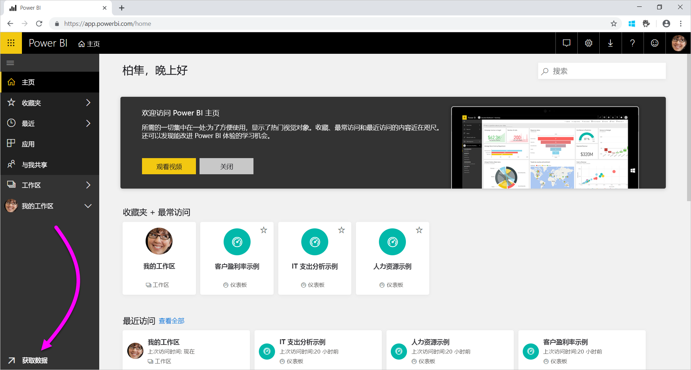
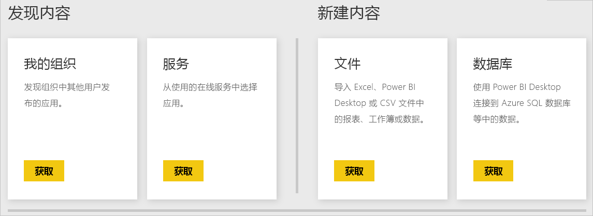

# Power BI 服务数据源
数据是 Power BI 的核心。 假设你正在浏览数据。 可通过创建图表和仪表板，或使用**问答**提问来执行此任务。 你看到的可视化效果和答案从数据集中获取其基础数据。 但是，数据集来自何处呢？ 它来自数据源。

在本文中，我们将介绍可以从 Power BI 服务连接到的数据源类型。 请记住，你还可以从很多其他类型的数据源获取数据。 如果选择这些数据源，则可能需要首先使用 Power BI Desktop 或 Excel 的高级数据查询和建模功能。 我们稍后会详细介绍这些选项。 现在，让我们看看可直接从 Power BI 服务站点获取的不同类型的数据源。

可通过选择页面左下角的“获取数据”，从 Power BI 中的任何数据源获取数据  。

 

选择“获取数据”后，可选择想要访问的数据 

## 发现内容

**发现内容**部分包含已为你准备好的全部所需数据和报表。 在 Power BI 中，有两种类型的内容包：组织和服务。 

**组织**：如果你和你组织中的其他用户拥有 Power BI Pro 帐户，则你可以创建、共享和使用内容包。 若要了解详细信息，请参阅[组织内容包简介](service-organizational-content-pack-introduction.md)。

**服务**：差不多有数十个具有适用于 Power BI 的内容包的服务，而且无时无刻都有更多服务添加进来。 大多数服务要求你拥有一个帐户。 若要了解详细信息，请参阅[使用 Power BI 连接到要使用的服务](service-connect-to-services.md)。

## 新建内容

**新建内容**部分包含用于自行创建和导入内容的选项。 在 Power BI 中，有两种方法可以创建或导入自己的内容：文件和数据库。 

### 文件

Excel（.xlsx 和 .xlsm）- 在 Excel 中，一个工作簿可能会包含不同的数据类型    。 例如，它可以包含已自行输入到工作表中的数据。 它还可以包含使用 Power Query 从外部数据源查询和加载的数据。 Power Query 可通过 Excel 2016 中的“获取和转换”或 Power Pivot 获取  。 可以从工作表中的表导入数据，也可以从数据模型中导入数据。 若要了解详细信息，请参阅[从 Power BI 文件获取数据](service-get-data-from-files.md)。

**Power BI Desktop** ( *.pbix*) - 可以使用 Power BI Desktop 查询和加载外部数据源中的数据，并创建报表。 还可以使用度量值和关系扩展数据模型，或将 Power BI Desktop 文件导入 Power BI 站点。 Power BI Desktop 最适合更高级的用户。 通常情况下，这些用户非常了解其数据源。 他们还了解数据查询和转换，以及数据建模概念。 若要了解详细信息，请参阅[连接到 Power BI Desktop 中的数据](desktop-connect-to-data.md)。

**逗号分隔值** ( *.csv*) - 文件为具有数据行的简单文本文件。 每行可能会包含一个或多个值，每个值被逗号分隔开。 例如，包含姓名和地址数据的 *.csv* 可能拥有许多行。 每行可能会包含名字、姓氏、街道地址、城市、州/省等的值。 不能将数据导入 *.csv* 文件，但许多应用程序（如 Excel）可将简单的表格数据另存为 *.csv* 文件。

对于其他文件类型（如 XML 表 [ *.xml*] 或文本 [ *.txt*] 文件），可以首先使用“获取和转换”来查询、转换数据并将该数据加载到 Excel 或 Power BI Desktop 文件  。 然后，你可以将 Excel 或 Power BI Desktop 文件导入 Power BI。

存储文件的位置也会产生重大影响。 OneDrive for Business 提供了最大程度的灵活性以及与 Power BI 的集成。 可以在本地驱动器上保存文件。 但在需要刷新数据时会有一些额外的步骤。 有关详细信息，请参阅以下文章链接。

### 数据库

**云中的数据库** - 通过 Power BI 服务，可以实时连接到：

* Azure SQL 数据库
* Azure SQL 数据仓库
* Azure HDInsight 上的 Spark

从 Power BI 到这些数据库的连接为实时连接。 假设连接到 Azure SQL 数据库。 随后可通过在 Power BI 中创建报表来开始浏览其数据。 无论何时切分数据或将其他字段添加到可视化效果，Power BI 都会直接对数据库进行查询。 若要了解详细信息，请参阅 [Azure 和 Power BI](service-azure-and-power-bi.md)。

**本地数据库** - 可从 Power BI 服务直接连接到 SQL Server Analysis Services 表格模型数据库。 为此，需要 Power BI Enterprise 网关。 如果不确定如何连接到组织的表格模型数据库，请联系管理员或 IT 部门。 若要了解详细信息，请参阅 [Power BI 中的 SQL Server Analysis Services 实时数据](sql-server-analysis-services-tabular-data.md)。

对于组织中的其他数据库类型，需要使用 Power BI Desktop 或 Excel 连接到数据模型，并在数据模型中查询和加载数据。 然后，可以将文件导入其中存在数据集的 Power BI。 如果配置计划刷新，Power BI 将使用该配置以及来自文件的连接信息直接连接到数据源，并查询更新。 Power BI 随后将这些更新加载到数据集中。 若要了解详细信息，请参阅[连接到 Power BI Desktop 中的数据](desktop-connect-to-data.md)。

## 如果我的数据来自不同源怎么办？
有数百个可与 Power BI 配合使用的不同数据源。 无论从何处获取数据，数据都必须采用 Power BI 服务可以使用的格式。 借助可使用的数据，Power BI 服务可以创建报表和仪表板、使用**问答**回答问题，等等。

部分数据源已经针对 Power BI 服务设置数据格式。 这些数据源类似于 Google Analytics 和 Twilio 等服务提供商提供的内容包。 SQL Server Analysis Services 表格模型数据库也已可供使用。 你还可以实时连接到云中的数据库，如 Azure SQL 数据库和 HDInsight 上的 Spark。

在其他情况下，可能需要查询并加载你希望添加到某个文件中的数据。 例如，假设组织中有物流数据。 你将该数据存储在服务器上的数据仓库数据库中。 在 Power BI 服务中，除非数据库是表格模型数据库，否则不能连接到该数据库并开始浏览其数据。 但是，可以使用 Power BI Desktop 或 Excel 查询该物流数据，并将其加载到稍后要另存为文件的数据模型中。 然后，可以将该文件导入其中存在数据集的 Power BI。

你可能会想：“但是，数据库中的物流数据每天都在变化。 如何刷新 Power BI 数据集呢？” 将数据导入数据集时，还可以从 Power BI Desktop 或 Excel 文件导入连接信息。

假设配置计划刷新或对数据集执行手动刷新。 Power BI 使用来自数据集的连接信息以及其他几个设置来直接连接到数据库。 然后，它会查询更新并将这些更新加载到数据集中。 需要提醒的是，可能会需要 Power BI 网关来保护本地服务器和 Power BI 之间的任何数据传输。 传输完成后，报表和仪表板中的所有可视化效果都会自动刷新。

可以看出，即使无法直接从 Power BI 服务连接到数据源，仍然可以将这些数据导入 Power BI。 只是可能需要几个更多的步骤，以及来自 IT 部门的一些帮助。 若要了解详细信息，请参阅 [Power BI Desktop 中的数据源](desktop-data-sources.md)。

## 更多详细信息
你会发现术语数据集和数据源在 Power BI 中得到广泛使用。 它们经常用作同义词。 尽管它们是相互关联的，但实际上是两种不同的事物。

使用“获取数据”时，会在 Power BI 中自动创建**数据集**  。 借助“获取数据”，可以连接到内容包并从中导入数据，也可以连接到实时数据源  。 数据集包含有关数据源和数据源凭据的信息。 在许多情况下，它还包含从数据源复制的数据子集。 在报表和仪表板中创建可视化效果时，你看到的通常是数据集中的数据。

**数据源**指数据集中数据的来源。 例如，数据可能来自：

* Google Analytics 或 QuickBooks 等联机服务
* 云中的数据库，如 Azure SQL 数据库
* 自己组织中的本地计算机或服务器上的数据库或文件

## 数据刷新
你也许会将文件保存到本地驱动器或组织中某个位置的驱动器上。 你可能需要 Power BI 网关，以便可以在 Power BI 中刷新数据集。 发生刷新时，需要打开存储文件的计算机。 可以重新导入文件或使用 Excel 或 Power BI Desktop 中的“发布”，但这些选项均不是自动过程。

如果将文件保存到 OneDrive for Business 或 SharePoint - 团队网站，则随后可连接到 Power BI，或将文件导入 Power BI。 这样一来，数据集、报表和仪表板将始终保持最新。 因为 OneDrive 和 Power BI 均位于云中，所以 Power BI 可以直接连接到保存的文件。 它大约每小时连接一次并检查更新。 如果有任何更新，数据集和任何可视化效果都会自动刷新。

来自服务的内容包将自动更新。 在大多数情况下，它们每天更新一次。 可以手动刷新，但是否看到任何更新的数据将取决于服务提供商。 组织中的人员对内容包的更新将取决于所使用的数据源。 它们还取决于创建内容包的人员如何配置刷新。

Azure SQL 数据库、Azure SQL 数据仓库和 Azure HDInsight 上的 Spark 是云中的数据源。 Power BI 服务也位于云中，因此 Power BI 可以使用 **DirectQuery** 实时连接到这些数据源。 Power BI 中显示的内容始终为同步内容，无需设置计划刷新。

从 Power BI 连接到 SQL Server Analysis Services 时，它就像云中的 Azure 数据库一样，是一个实时连接。 不同之处在于数据库本身位于组织中的服务器上。 此类连接需要 IT 部门配置的 Power BI 网关。

数据刷新是 Power BI 中非常重要的一部分，十分深奥，因此在本文中无法一一介绍。 如果你想要全面地了解数据刷新，则请务必查看 [Power BI 中的数据刷新](refresh-data.md)。

## 注意事项和限制
对于 Power BI 服务中使用的所有数据源，请考虑以下限制。 还有适用于特定功能的其他限制，但下面的列表适用于整个 Power BI 服务：

* **数据集大小限制** - 存储在 Power BI 服务的共享容量中的数据集的大小限制为 1 GB。 如果需要更大的数据集，可以使用 [Power BI Premium ](service-premium-what-is.md)。

* **列中的非重复值** - 在 Power BI 数据集中缓存数据时（有时称为“导入”模式），可以在列中存储的非重复值的数量限制为 1,999,999,997。

* **行限制** - 使用  DirectQuery 时，Power BI 对发送到基础数据源的查询结果施加限制。 如果发送到数据源的查询返回超过一百万行，则会出现错误，查询将失败。 基础数据仍可包含超过一百万行。 由于大多数报表将数据聚合为较小的结果集，因此不太可能遇到此限制。

* **列限制** - 数据集中允许的最大列数为 16,000 列，这包括数据集中的所有表。 此限制适用于 Power BI 服务以及 Power BI Desktop 中使用的数据集。 Power BI 以此方式跟踪数据集中的列数和表数，这意味着数据集中每个表的最大列数为 16,000 减 1。

