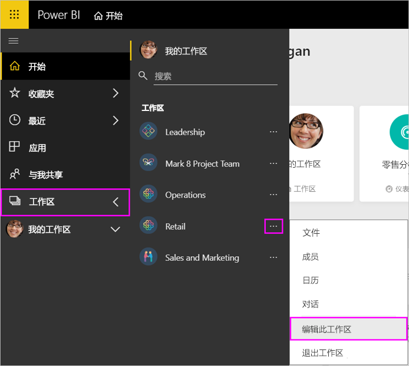
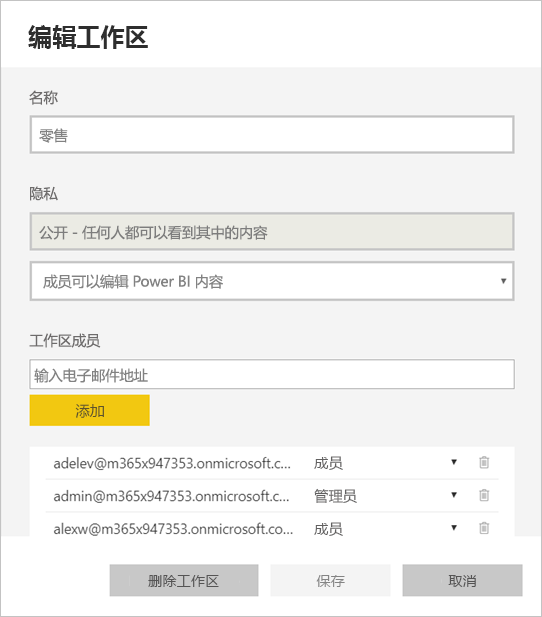
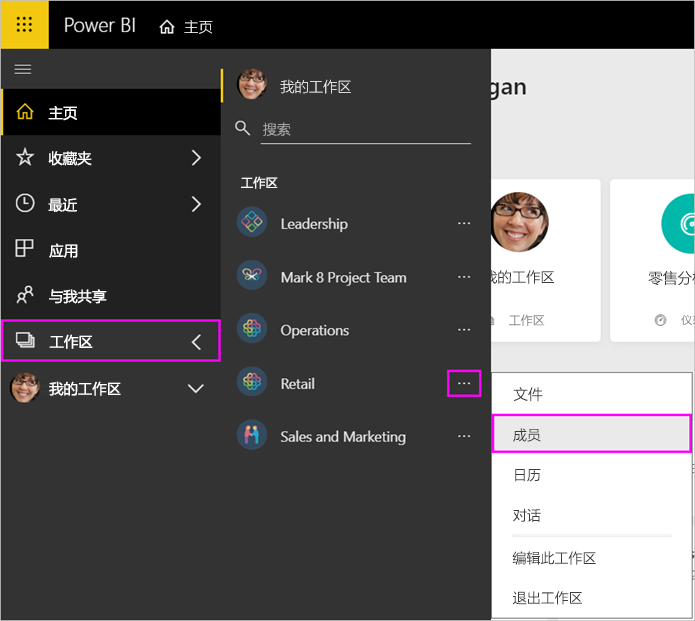
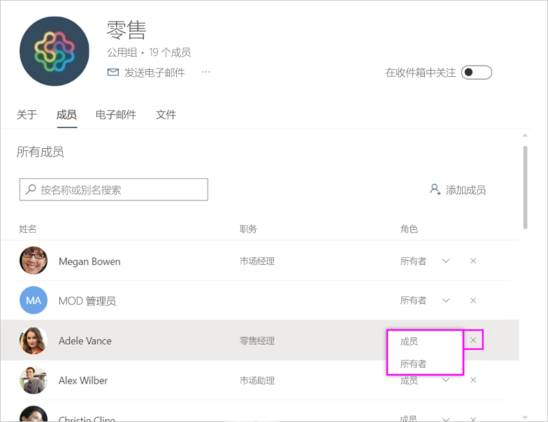
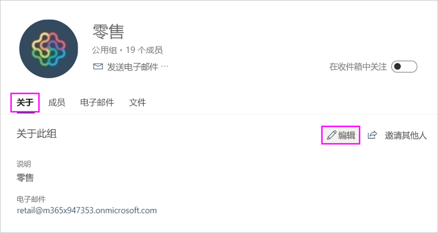
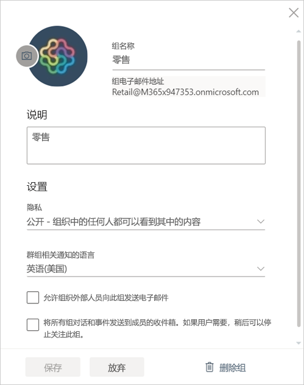

# 管理 Power BI 和 Office 365 中的工作区

作为 [Power BI 或 Office 365 中的工作区](service-create-distribute-apps.md)的创建者或管理员，可以在 Power BI 中管理工作区的某些方面。 你在 Office 365 中管理的其他方面。

> [!NOTE]
> 新工作区体验会更改 Power BI 工作区与 Office 365 组之间的关系。 每次创建新工作区时，不会自动创建 Office 365 组。 了解如何[创建新工作区](service-create-the-new-workspaces.md)。

在 Power BI 中，你可以  ：

* 添加或删除工作区成员，包括使某个工作区成员成为管理员。
* 编辑工作区名称。
* 删除工作区。

在 Office 365 中，你可以  ：

* 添加或删除工作区的组成员，包括将成员设为所有者。
* 编辑组名称、图像、说明和其他设置。
* 查看组电子邮件地址。
* 删除组。

要成为工作区的管理员或成员，需要具有 [Power BI Pro](service-features-license-type.md) 许可证。 除非工作区位于 Power BI Premium 容量中，否则应用用户也需要具有 Power BI Pro 许可证。 请阅读[什么是 Power BI Premium？](service-premium-what-is.md)了解详细信息。

## 编辑 Power BI 中的工作区

1. 在 Power BI 服务中，选择“工作区”旁边的箭头，然后选择工作区名称旁边的“更多选择”(…)，接下来选择“编辑此工作区”    。

   

   > [!NOTE]
   > 如果你是工作区管理员，则只能看到“编辑此工作区”  。

1. 可以在此处重命名工作区、添加或删除成员，也可以删除工作区。

   

1. 选择**保存**或**取消**。

## 在 Office 365 中编辑 Power BI 工作区属性

也可以直接在 Outlook for Office 365 中编辑工作区的各个方面。

### 编辑工作区组的成员

1. 在 Power BI 服务中，选择“工作区”旁边的箭头，然后选择工作区名称旁边的“更多选项”(…)，接下来选择“成员”    。

   

   这将打开工作区的 Outlook for Office 365 组视图。 可能需要登录到你的公司帐户。

1. 选择队友姓名旁边的角色，将此人设为“成员”或“所有者”   。 选择“X”以从组中删除此人  。

   

### 添加图像并设置其他工作区属性

从工作区分发应用时，在此处添加的图像即为应用的图像。 请参阅“创建新工作区”一文的[将图像添加到 Office 365 工作区](service-create-workspaces.md#add-an-image-to-your-office-365-workspace-optional)  。

1. 在工作区的 Outlook for Office 365 视图中，转到“关于”选项卡并选择“编辑”   。

    
1. 可以编辑与组相关的通知的名称、描述和语言。 也可在此处添加图像，以及设置其他属性。

   

1. 选择**保存**或**放弃**。

## 后续步骤

* [在 Power BI 中发布应用](service-create-distribute-apps.md)

* 更多问题？ [尝试参与 Power BI 社区](https://community.powerbi.com/)
