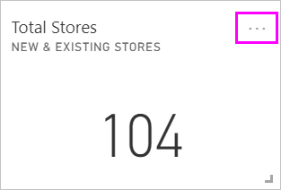
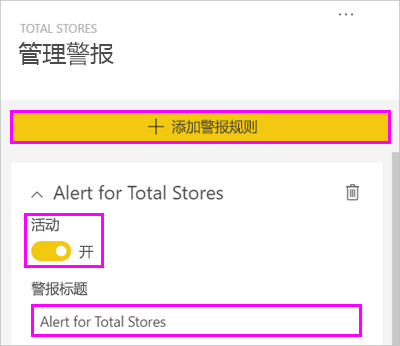
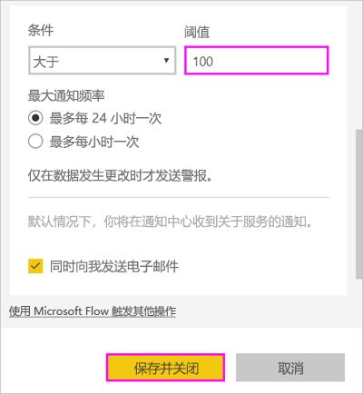
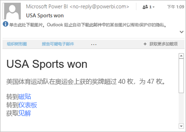
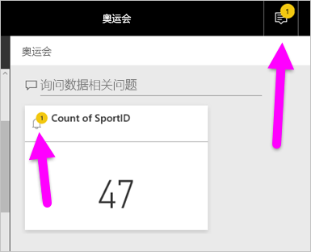
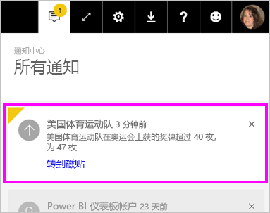
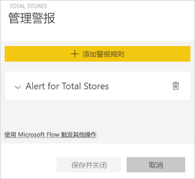
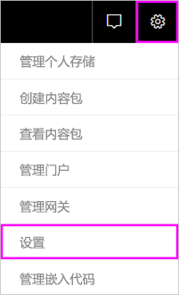

# Power BI 服务中的数据警报

设置警报，以便在仪表板中的数据更改超出你设置的限制时通知你。

如果你拥有 Power BI Pro 许可证，则可以在磁贴上设置警报。 如果有人共享具有 [Premium 容量](service-premium-what-is.md)的仪表板，你也可以设置警报。 只能为报表视觉对象固定到的磁贴设置警报，而且只能为仪表、KPI 和卡片设置警报。 可以在从报表固定到仪表板的流数据集创建的视觉对象上设置警报。 不能对使用“添加磁贴” > “自定义流式处理数据”在仪表板上直接创建的流式处理磁贴上设置警报   。

即使共享你的仪表板，也只有你可以看到自己设置的警报。 数据警报跨平台完全同步；可以在 [Power BI 移动应用](consumer/mobile/mobile-set-data-alerts-in-the-mobile-apps.md)和 Power BI 服务中设置和查看数据警报。 它们对 Power BI Desktop 不可用。 甚至可以通过 Microsoft Flow 自动化和集成警报。 可在此 [Microsoft Flow 和 Power BI](service-flow-integration.md) 文章中亲自尝试执行操作。

> [!WARNING]
> 数据驱动的警报通知提供有关数据的信息。 如果你在移动设备上查看 Power BI 数据，而该设备之后丢失或被盗，建议使用 Power BI 服务来关闭所有数据驱动的警报规则。

## 在 Power BI 服务中设置数据警报

观看视频，了解 Amanda 如何将一些警报添加到仪表板上的磁贴。 然后可以按照视频下面的分步说明来自己尝试。

<iframe width="560" height="315" src="https://www.youtube.com/embed/JbL2-HJ8clE" frameborder="0" allowfullscreen></iframe>

此示例使用零售分析示例仪表板中的卡片磁贴。 如果要跟着本教程一起操作，请[获取零售业分析示例](sample-retail-analysis.md#get-the-content-pack-for-this-sample)。

1. 启动仪表板。 从“总商店数”磁贴中，选择省略号  。

   

1. 选择钟形图标 ，为“总商店数”添加一个或多个警报  。

1. 若要开始，请选择“+ 添加警报规则”，确保“活动”滑块已设置为“开”，并为警报命名    。 标题有助于轻松识别警报。

   

1. 向下滚动，输入警报的详细信息。  在此示例中，你将创建一个在总商店数超过 100 时每天提醒一次的警报。

   

    警报会显示在通知中心  。 如果选中该复选框，Power BI 还会向你发送有关警报的电子邮件。

1. 选择“保存并关闭”  。

## 接收警报

跟踪的数据到达你设定的某个阈值时，将发生下列情况。 首先，Power BI 会检查自最后一个警报以来是否已超过 1 小时或 24 小时（具体取决于你选择的选项）。 如果数据超过阈值，你就会收到警报。

接下来，Power BI 将向通知中心发出警报（可选择以电子邮件形式发送）  。 每个警报都包含数据的直接链接。 选择链接以查看可在其中浏览、共享和了解详细信息的相关磁贴。  

* 如果你已设置警报向你发送电子邮件，则你将在收件箱中找到如下内容。

   

* Power BI 会将消息添加到你的“通知中心”，并会对相应磁贴添加新的警报图标。 

   

* 通知中心显示警报详细信息  。

    

   > [!NOTE]
   > 警报仅适用于刷新后的数据。 数据刷新时，Power BI 会查看是否为该数据设置了警报。 如果数据已达到了警报的阈值，Power BI 会触发警报。

## 管理警报

可通过多种方法管理警报：

* 从仪表板磁贴。

* 从“Power BI 设置”菜单。

* 在 [Power BI 移动应用](consumer/mobile/mobile-set-data-alerts-in-the-mobile-apps.md)中的磁贴上。

### 从仪表板磁贴

1. 如果需要更改或删除磁贴的警报，请通过选择钟形图标 ，重新打开“管理警报”窗口  。

    Power BI 显示为该磁贴设置的警报。

    

1. 若要修改警报，请选择警报名称左侧的箭头。

    

1. 若要删除警报，请选择警报名称右侧的垃圾桶。

      

### 从 Power BI 设置菜单

1. 从 Power BI 菜单栏选择齿轮图标并选择“设置”  。

    。

1. 在“设置”  下，选择“警报”  。

    

1. 你可以从此处打开和关闭警报，打开“管理警报”  窗口，以进行更改或删除警报。

## 提示和故障排除

* 带有日期/时间度量值的卡片磁贴不支持警报。

* 警报仅适用于数字数据类型。

* 警报仅适用于刷新后的数据。 它们不适用于静态数据。

* 如果生成 KPI、卡片或仪表报表视觉对象，然后将该视觉对象固定到仪表板，那么警报仅适用于流数据集。

## 后续步骤

* [创建涵盖数据警报的 Microsoft Flow](service-flow-integration.md)。

* [在移动设备上设置数据警报](consumer/mobile/mobile-set-data-alerts-in-the-mobile-apps.md)。

* [什么是 Power BI？](power-bi-overview.md)

更多问题？ [尝试咨询 Power BI 社区](http://community.powerbi.com/)
