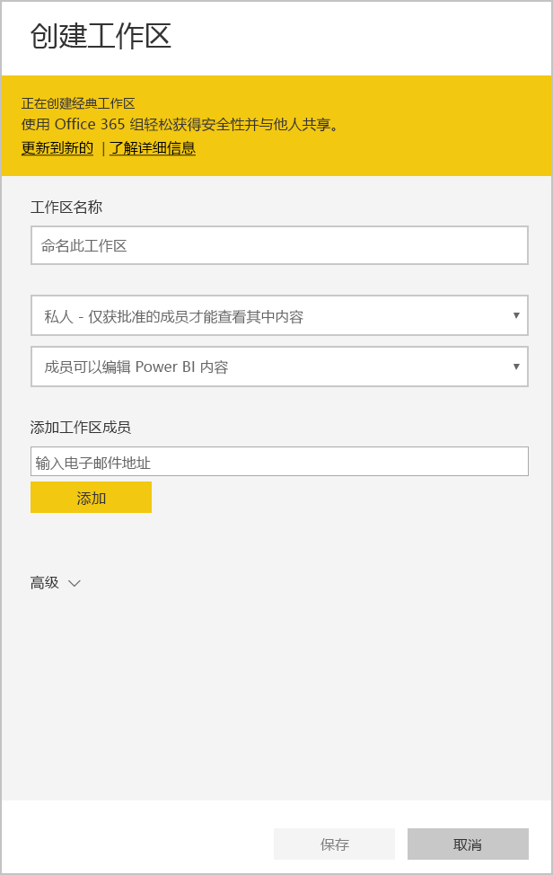
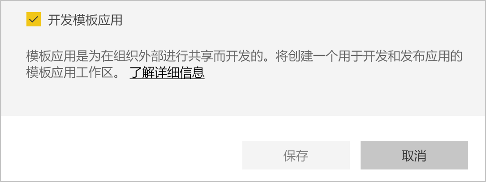
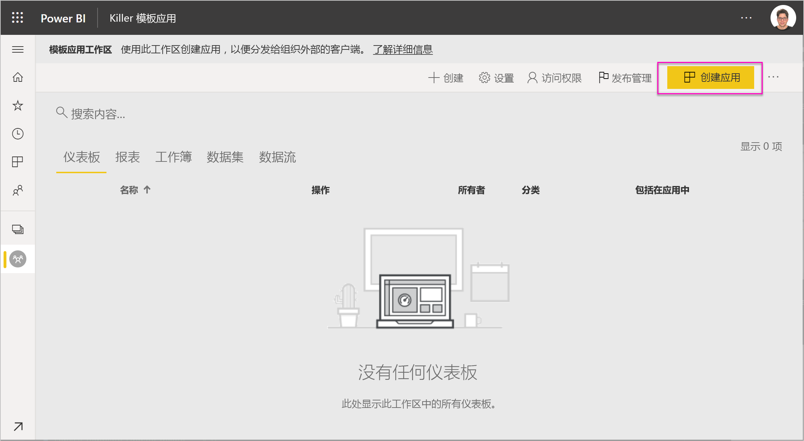
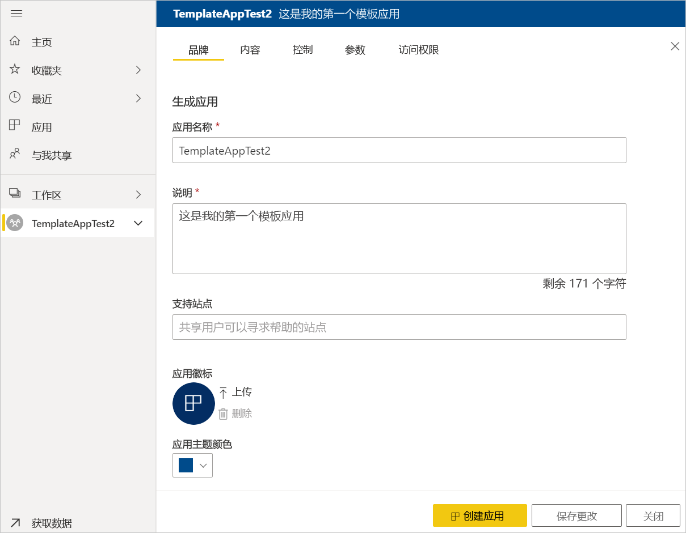
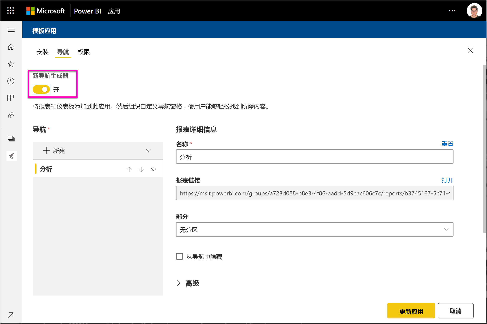
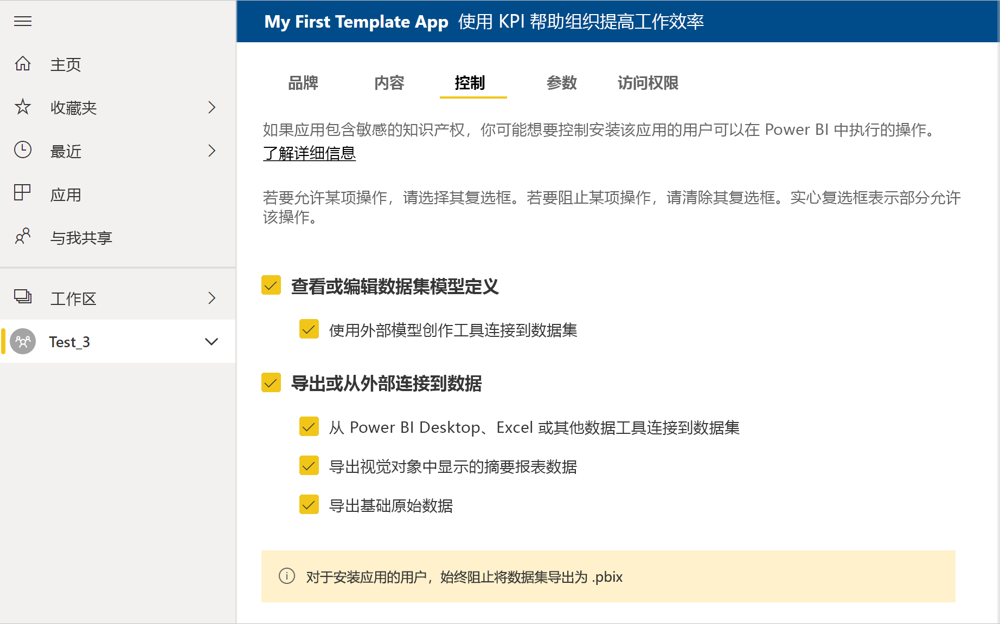
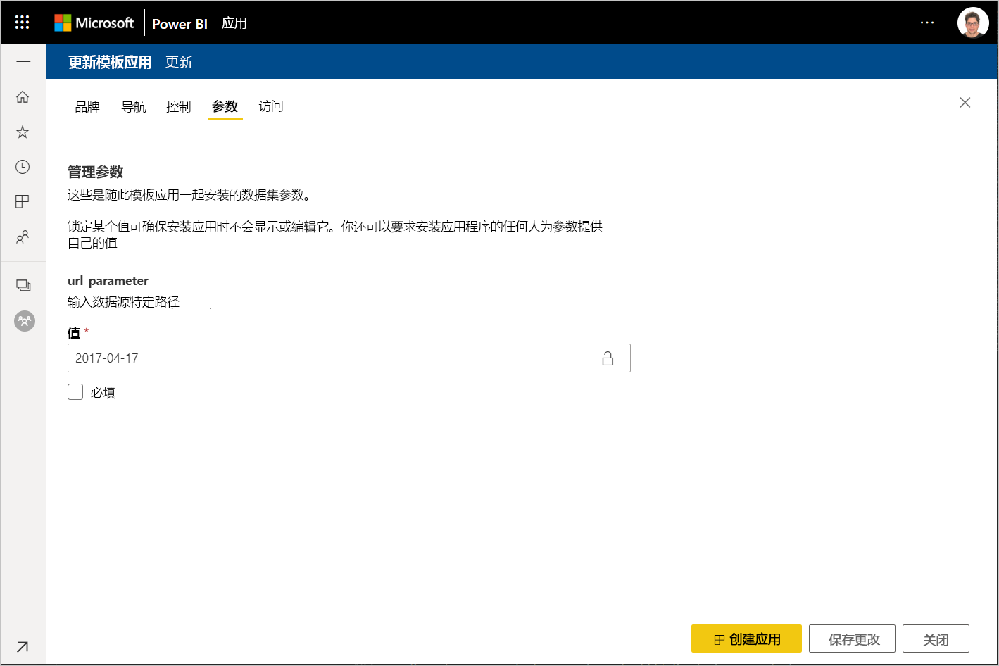
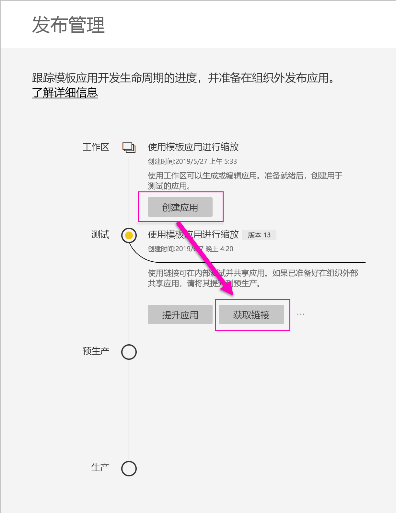

# 在 Power BI 中创建模板应用

新的 Power BI 模板应用使 Power BI 合作伙伴能够在极少编码或没有编码的情况下生成 Power BI 应用，并将它们部署到任何 Power BI 客户  。  本文包含创建 Power BI 模板应用的分步说明。

如果可以创建 Power BI 报表和仪表板，那么你可成为模板应用构建者，可以生成分析内容并将其打包到“应用”中   。 可以通过任何可用平台（例如 AppSource）或者通过在自己的 Web 服务中使用应用，将应用部署其他 Power BI 租户。 作为构建者，可以创建用于分发的受保护的分析包。

Power BI 租户管理员管理和控制组织中谁可以创建模板应用，以及谁可以安装它们。 获得授权的这些用户可以安装模板应用，然后对其进行修改并将其分发给组织中的 Power BI 使用者。

## 先决条件

下面是生成模板应用的要求：  

- 一个 [Power BI Pro 许可证](service-self-service-signup-for-power-bi.md)
- [安装 Power BI Desktop](desktop-get-the-desktop.md)（可选）
- 熟悉 [Power BI 的基本概念](service-basic-concepts.md)
- 用于公开共享模板应用的权限。 有关详细信息，请参阅 Power BI [管理门户的模板应用设置](service-admin-portal.md#template-apps-settings)。

## 创建模板应用工作区

若要创建可以分发给其他 Power BI 租户的模板应用，需要在一个新的应用工作区中创建它。

1. 在 Power BI 服务中，选择“工作区” > “创建应用工作区”   。

    

2. 在“创建应用工作区”中，选择“升级到新版”   。

    

3. 为应用工作区输入名称、说明（可选）和徽标图像（可选）。

4. 展开“高级”部分，然后选择“开发模板应用”   。

    

5. 选择**保存**。
>[!NOTE]
>需要 Power BI 管理员授权才能提升模板应用。

## 在模板应用中创建内容

与常规 Power BI 应用工作区一样，下一步是在工作区中创建内容。  

- 在应用工作区中[创建 Power BI 内容](power-bi-creator-landing.md)。

如果在 Power Query 中使用参数，请确保这些参数具有明确定义的类型（例如，Text）。 不支持 Any 和 Binary 类型。

在[有关在 Power BI 中创作模板应用的提示](service-template-apps-tips.md)中，可找到为模板应用创建报表和仪表板时要考虑的一些建议。

## 创建测试模板应用

现在工作区中已有内容，即可将其打包到模板应用中。 第一步是创建一个测试模板应用，只能从租户的组织内部访问。

1. 在模板应用工作区中，选择“创建应用”  。

    

    此处，可以在五个类别中为模板应用填写其他构建选项：

    **品牌**

    
    - 应用名称
    - 说明
    - 支持网站（将模板应用重新分发为组织应用后，应用信息下会显示链接）
    - 应用徽标（文件大小限不超过 45K，1:1 纵横比，.png、.jpg、.jpeg 格式）
    - 应用主题颜色

    **导航**

    激活“新导航生成器”，可在其中定义应用的左侧导航窗格（有关详细信息，请参阅本文中的[设计导航体验](service-create-distribute-apps.md#design-the-navigation-experience)）  。

   
    
    应用登陆页面：  如果决定退出导航生成器，则可以选择应用登陆页面。 将报表或仪表板定义为应用的登陆页面。 使用可以给人留下正确印象的登陆页面。

    **控件**

    对应用程序用户设置有关应用程序内容的限制。 可以使用此控件来保护应用中的知识产权。

    

    >[!NOTE]
    >安装应用的用户始终无法导出为 .pbix 格式。

    **参数**

    使用此类别在连接到数据源时管理参数行为。 详细了解如何[创建查询参数](https://powerbi.microsoft.com/blog/deep-dive-into-query-parameters-and-power-bi-templates/)。

    
    - **值**：默认参数值。
    - **必需**：可用于要求安装程序输入特定于用户的参数。
    - **锁定**：锁定阻止安装程序更新参数。

    **访问**在测试阶段，确定组织中的其他人可以安装和测试应用。 不用担心，可在以后随时返回和更改这些设置（设置不会影响对分布式模板应用的访问）。

2. 选择“创建应用”  。

    你会看到测试应用已就绪的消息，其中包含可复制并与应用测试人员共享的链接。

    

    你还完成了发布管理过程的第一步，这也是接下来要完成的步骤。

## 管理模板应用版本

在公开发布此模板应用之前，需要确保它已准备就绪。 Power BI 已创建发布管理窗格，可在其中关注并检查完整的应用发布路径。 还可以触发阶段间的转换。 常见的阶段包括：

- 生成测试应用：仅在组织中进行测试。
- 将测试包提升到预生产阶段：在组织外进行测试。
- 将预生产包提升到生产：生产版本。
- 删除任何包或从上一阶段重新开始。

在发布阶段之间转移时，URL 不会更改。 提升不影响 URL 本身。

让我们来了解各个阶段：

1. 在模板应用工作区中，选择“发布管理”  。

    

2. 选择“创建应用”  。

    如果在上面的“创建测试模板应用”中创建了测试应用，那么“测试”旁边的黄色圆点已经填充，无需在此处选择“创建应用”    。 如果选择它，则会返回到模板应用创建过程。

3. 选择“获取链接”  。

    

4. 若要测试应用安装体验，请复制通知窗口中的链接并将其粘贴到新的浏览器窗口中。

    从这里开始，需要按照客户所遵循的相同过程进行操作。 有关版本信息，请参阅[在组织中安装和分发模板应用](service-template-apps-install-distribute.md)。

5. 在对话框中，选择“安装”  。

    安装成功后，会看到新应用已就绪的通知。

6. 选择“转到应用”  。
7. 在“开始使用新应用”中，看到的应用与客户将看到的应用相同  。

    
8. 选择“浏览应用”以使用示例数据验证测试应用  。
9. 若要进行任何更改，请返回到原始工作区中的应用。 更新测试应用，直到满意为止。
10. 准备好将应用提升到预生产以在租户之外进行进一步测试时，请返回“发布管理”窗格，然后选择“提升应用”   。 

    
    >[!NOTE]
    > 应用提升后，将在组织外部变得公开可用。

    如果没有看到该选项，请与你的 Power BI 管理员联系，以向你授予管理门户中[模板应用开发权限](service-admin-portal.md#template-apps-settings)。
11. 选择“提升”以确认选择  。
12. 复制此新 URL 以在租户外共享以供测试。 此链接也是开始通过创建[新的云合作伙伴门户产品和服务](https://docs.microsoft.com/azure/marketplace/cloud-partner-portal/power-bi/cpp-publish-offer)在 AppSource 上分发应用时要提交的链接。 仅提交云合作伙伴门户的预生产链接。 只有在应用获得批准且你收到应用已在 AppSource 中发布的通知后，才能在 Power BI 中将此包提升到生产。
13. 当应用准备好通过 AppSource 进行生产或共享时，请返回“发布管理”窗格，然后选择“预生产”旁边的“提升应用”    。
14. 选择“提升”以确认选择  。

    现在应用已投入生产，并已准备好分发。

    

为了让应用广泛适用于全球数千名 Power BI 用户，我们建议将该应用提交到 AppSource。 有关详细信息，请参阅 [Power BI 应用程序产品/服务](https://docs.microsoft.com/azure/marketplace/cloud-partner-portal/power-bi/cpp-power-bi-offer)。

## 后续步骤

通过[在组织中安装、自定义和分发模板应用](service-template-apps-install-distribute.md)，了解客户与模板应用的互动方式。

有关分发应用的详细信息，请参阅 [Power BI 应用程序产品/服务](https://docs.microsoft.com/azure/marketplace/cloud-partner-portal/power-bi/cpp-power-bi-offer)。
