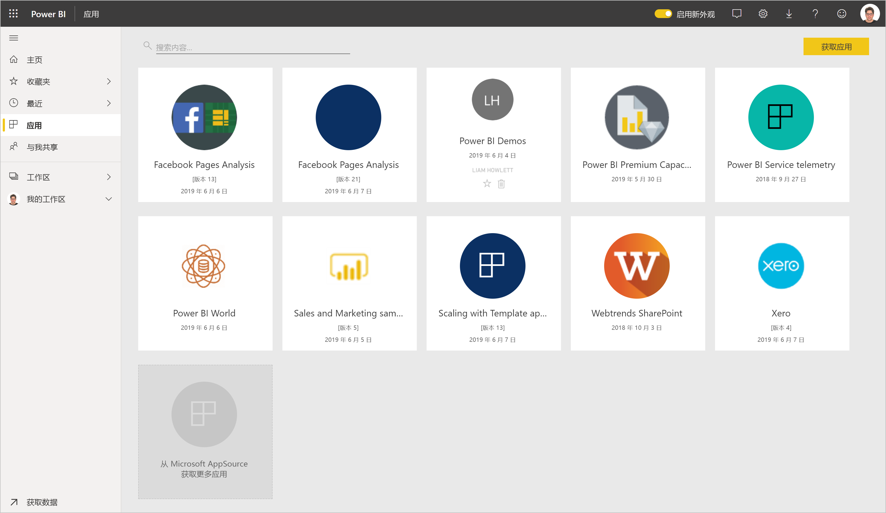
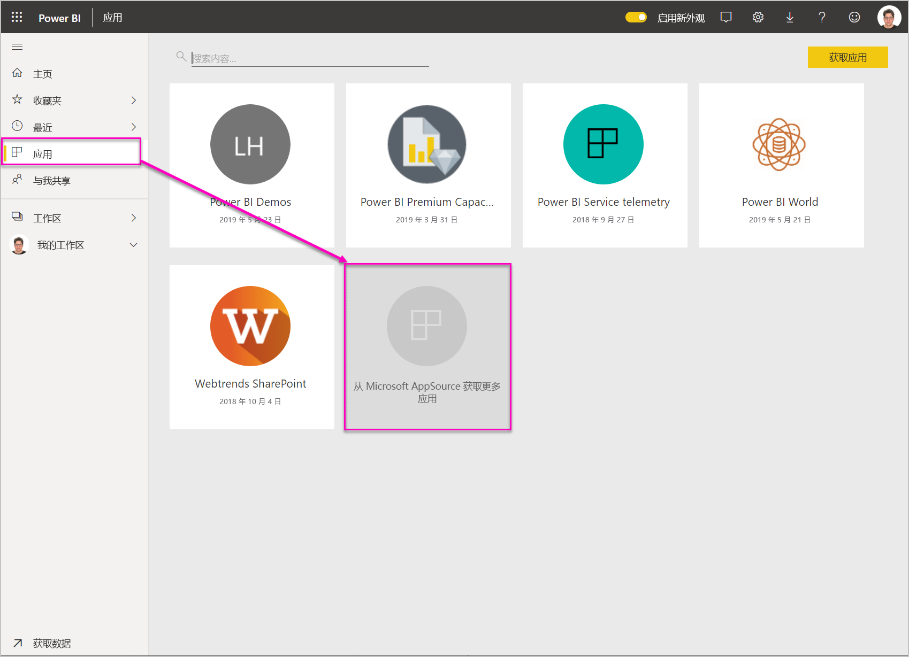
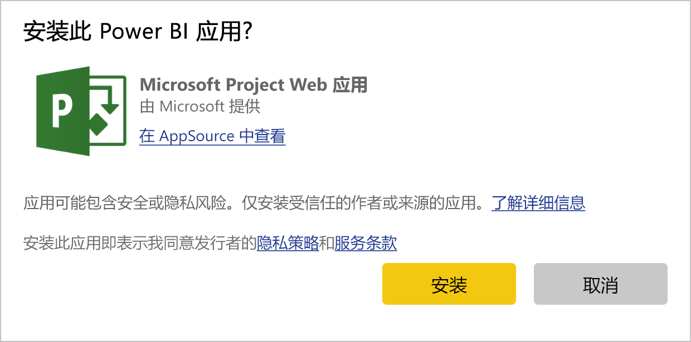
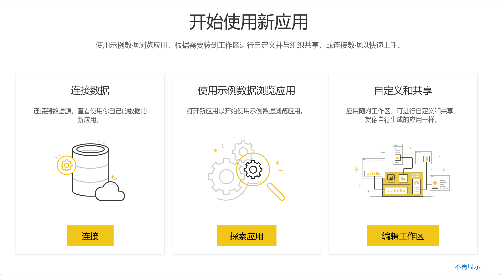
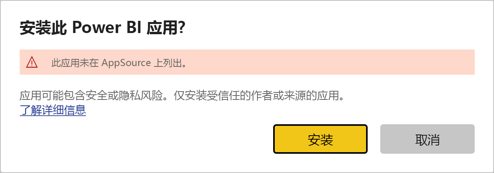
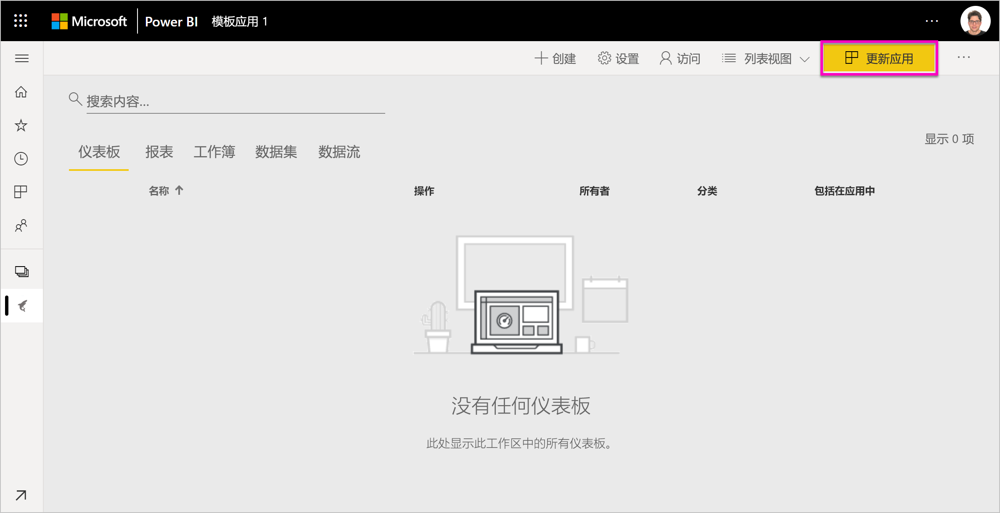
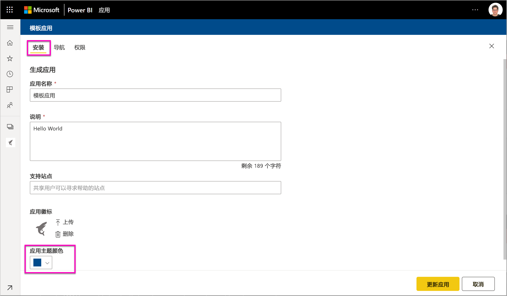

# 在组织中安装和分发模板应用 - Power BI

你是 Power BI 分析师吗？ 如果是，本文将向你介绍如何安装模板应用以连接到多个运行 Salesforce、Microsoft Dynamics 和 Google Analytics 等业务的服务  。 可以修改仪表板和报表来满足组织的需要，然后将其作为应用分发给同事  。 

如果你有兴趣创建自己分发的模板应用，请参阅[在 Power BI 中创建模板应用](service-template-apps-create.md)。 Power BI 合作伙伴几乎无需编码，即可构建 Power BI 应用，并将其部署到 Power BI 客户。 

## 先决条件  

以下是安装、自定义和分发模板应用的要求： 

- 一个 [Power BI Pro 许可证](service-self-service-signup-for-power-bi.md)
- 熟悉 [Power BI 的基本概念](service-basic-concepts.md)
- 来自模板应用创建者或 AppSource 的有效安装链接。 
- 安装模板应用的权限。 

## 安装模板应用

可能会收到指向模板应用的链接。 此外，可以在 AppSource 中搜索你感兴趣的内容。 无论哪种方式，在安装之后，都可以对其进行修改并将其分发给自己的组织。

### 从浏览器中搜索 AppSource

在浏览器中，选择此链接以打开筛选为 Power BI 应用的 AppSource：

- https://appsource.microsoft.com/marketplace/apps?product=power-bi

### 从 Power BI 服务中搜索 AppSource

1. 在 Power BI 服务的左侧导航窗格中，选择“应用” > “获取应用”   。

    

2. 在 AppSource 中，选择“应用”  。

    

3. 浏览或搜索该应用，然后选择“立即获取”  。

4. 在对话框中，选择“安装”  。

     如果拥有 Power BI Pro 许可证，则会安装该应用及其关联的应用工作区。 可以在关联的工作区中自定义应用。

    安装成功后，会看到新应用已就绪的通知。
4. 选择“转到应用”  。
5. 在“开始使用新应用”中，请选择以下三个选项之一  ：

    

    - **浏览应用**：基本示例数据浏览。 从这里开始，了解应用的外观。 
    - **连接数据**：将数据源从示例数据更改为自己的数据源。 可以重新定义数据集参数和数据源凭据。 请参阅模板应用提示文章中的[已知限制](service-template-apps-tips.md#known-limitations)。 
    - “转到工作区”（最高级选项）：可以进行应用生成器允许的任何更改  。

    或者跳过此对话框并直接通过左侧导航窗格中的“工作区”访问关联的工作区  。
    >[!NOTE]
    >安装模板应用，会同时安装组织应用和应用工作区   。 详细了解如何[在 Power BI 中分发应用](service-create-distribute-apps.md)。
 
6. 在与同事共享之前，需要连接到自己的数据。 可能还希望修改报表或仪表板，使其适用于组织。 还可以在此处添加其他报表或仪表板。

   如果选择未在 AppSource 上列出的应用的安装链接，将获得要求你确认所作选择的验证对话框。

   

   >[!NOTE]
   >要安装未在 AppSource 上列出的模板应用，需要从管理员权限进行请求。 有关详细信息，请参阅 Power BI [管理门户的模板应用设置](service-admin-portal.md#template-apps-settings)。

## 更新并分发应用

在为组织更新应用后，即可将其发布。 这些步骤与发布任何其他应用的步骤相同。

1. 完成自定义后，在工作区列表视图中选择右上角的“更新应用”  。  

    

2. 在“详细信息”中，可以修改说明和背景颜色  。

   

3. 在“内容”中，可以选择登录页面（仪表板或报表）  。

   

4. 在“访问”中，可向所选用户或整个组织授予访问权限  。  

   

5. 选择“更新应用”  。 

6. 成功发布后，可以复制链接并与被授予访问权限的任何人共享。 如果你与他们共享，他们也会在 AppSource 的“我的组织”标签上看到此内容  。

## 后续步骤 

[与同事一起在 Power BI 中创建工作区](service-create-workspaces.md)

 

 
