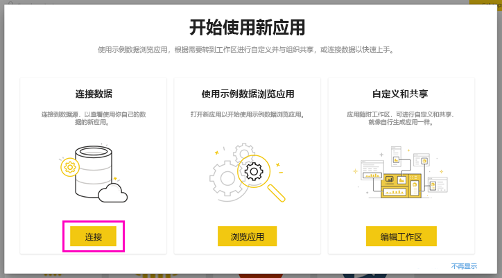
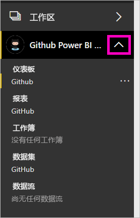

# 教程：使用 Power BI 连接到 GitHub 存储库
在本教程中，使用 Power BI 连接到 GitHub 服务中的真实数据，Power BI 即会自动创建仪表板和报表。 连接到 Power BI 内容公共存储库（也称为“存储库”），同时查看以下问题的答案  ：有多少人参与编辑 Power BI 公共内容？ 谁贡献最多？ 一周中哪天的贡献最大？ 以及其他问题。 

在本教程中，将完成以下步骤：

> [!div class="checklist"]
> * 如果还没有 GitHub 帐户，请注册一个帐户 
> * 登录 Power BI 帐户或进行注册（如果还没有）
> * 打开 Power BI 服务
> * 查找 GitHub 应用
> * 输入 Power BI 公共 GitHub 存储库的信息
> * 查看具有 GitHub 数据的仪表板和报表
> * 通过删除应用来清理资源

如果未注册 Power BI，请[免费注册](https://app.powerbi.com/signupredirect?pbi_source=web)后再进行操作。

## 先决条件

要完成本教程，需要一个 GitHub 帐户（如果还没有）。 

- 注册 [GitHub 帐户](https://docs.microsoft.com/contribute/get-started-setup-github)。

## 如何连接
1. 登录 Power BI 服务 (https://app.powerbi.com) 。 
2. 在左侧导航窗格中，选择“应用”，然后选择“获取应用”   。
   
    

3. 选择“应用”，然后在搜索框中键入 GitHub，并选择“立即获取”    。
   
    

4. 在“安装此 Power BI 应用?”中，选择“安装”   。
5. 在“新应用已就绪”中，选择“转到应用”   。
6. 在“开始使用新应用”中，选择“连接”   。

    

7. 输入该存储库的存储库名称和存储库所有者。 此存储库的 URL 为 https://github.com/MicrosoftDocs/powerbi-docs ，因此存储库所有者为 MicrosoftDocs，而存储库为 powerbi-docs     。 
   
    

5. 输入创建的 GitHub 凭据。 如果已在浏览器中登录到 GitHub，Power BI 可能会跳过此步骤。 

6. 对于“身份验证方法”，请选择“oAuth2”\>“登录”    。

7. 按照 GitHub 验证界面执行操作。 向 Power BI 授予访问 GitHub 数据的权限。
   
   之后，Power BI 即可连接到 GitHub 和数据。  数据会每天刷新一次。

8. Power BI 导入数据之后，将显示新 GitHub 工作区的内容。 
9. 选择左侧导航栏中工作区名称旁边的箭头。 将看到工作区包含仪表板和报表。 

    

10. 选择仪表板名称旁边的省略号 (...)，选择“重命名”，然后键入“GitHub 仪表板”   。
 
     

8. 选择“全局导航”图标将左侧导航窗格最小化，以获得更多空间。

    

10. 选择 GitHub 仪表板。
    
    GitHub 仪表板包含实时数据，因此看到的值可能有所不同。

    

    

## 提问

1. 将光标置于“询问数据相关问题”位置  。 Power BI 提供了“帮助入门的问题”  。 

1. 选择“有多少用户”  。
 
    

13. 在“有多少”和“用户”之间，键入“每个用户的拉取请求数”    。 

     Power BI 将创建一个条形图，显示每个用户的拉取请求数。

    

13. 选择固定将其固定到仪表板，然后选择“退出问答”  。

## 查看 GitHub 报表 

1. 在 GitHub 仪表板中，选择“按月显示拉取请求数”柱形图，打开相关报表  。

    

2. 在“按用户显示总拉取请求数”中选择一个用户名  。 在本例中，我们看到他们的大部分时间都是在二月。

    

3. 选择“打孔卡片”选项卡查看报表的下一页  。 
 
    

    显然，用户最常在星期二下午 3 点查看提交项  。

## 清理资源

现在，完成本教程后，可删除 GitHub 应用。 

1. 在左侧导航栏中选择“应用”  。
2. 将鼠标悬停在 GitHub 磁贴上，然后选择“删除”垃圾箱  。

    

## 后续步骤

在本教程中，已连接到 GitHub 公共存储库并已获取 Power BI 在仪表板和报表中进行格式化的数据。 你已通过浏览仪表板和报表回答了一些数据相关问题。 现在可深入了解如何连接到其他服务，例如 Salesforce、Microsoft Dynamics 和 Google Analytics。 
 
> [!div class="nextstepaction"]
> [连接到所使用的联机服务](service-connect-to-services.md)

