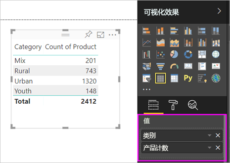
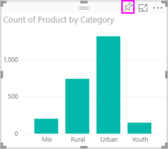

# 向 Power BI 报表添加可视化效果 - 第 1 部分

本文简要介绍如何在报表中创建可视化效果。 它适用于 Power BI 服务和 Power BI Desktop。 有关更高级的内容，请参阅[本系列的第 2 部分](power-bi-report-add-visualizations-ii.md)。 请观看 Amanda 的视频演示，她将介绍如何在报表画布上创建、编辑视觉对象并对其进行格式设置的一些不同方法。 然后使用[销售和市场营销示例](../sample-datasets.md)来创建自己的报表并进行体验。

<iframe width="560" height="315" src="https://www.youtube.com/embed/IkJda4O7oGs" frameborder="0" allowfullscreen></iframe>

## 打开报表并添加新页面

1. [在“编辑视图”中打开报表](../service-interact-with-a-report-in-editing-view.md)。

    本教程使用“[销售和市场营销示例](../sample-datasets.md)”。

1. 如果看不到“字段”  窗格，请选择箭头图标来打开它。

   

1. 向报表添加空白页。

## 将可视化效果添加到报表

1. 通过从“字段”窗格中选择字段来创建可视化效果。 

    从数值字段入手，如“销售事实”   > “销售额($)”  。 Power BI 将创建一个包含单个柱形的柱形图。

    

    也可以从分类字段入手，如“名称”  或“产品”  。 Power BI 会创建表，并将相应字段添加到“值”  井中。

    

    也可以从地理位置字段入手，如“地理位置”   > “城市”  。 Power BI 会结合必应地图创建地图可视化效果。

    

1. 创建可视化效果，然后更改其类型。 依次选择“产品”   > “类别”  ，再依次选择“产品”   > “产品数”  ，以将它们添加到“值”  井中。

   

1. 选择“堆积柱形图”  图标，将可视化效果更改为柱形图。

   

1. 在报表中创建可视化效果时，可以[将其固定到仪表板](../service-dashboard-pin-tile-from-report.md)。 若要固定可视化效果，请选择固定图标 。

   
  
## 后续步骤

 继续学习：

* [第 2 部分：向 Power BI 报表添加可视化效果](power-bi-report-add-visualizations-ii.md)

* 在报表中[与可视化效果交互](../consumer/end-user-reading-view.md)。

* [对可视化效果执行更多操作](power-bi-report-visualizations.md)。

* [保存报表](../service-report-save.md)。
